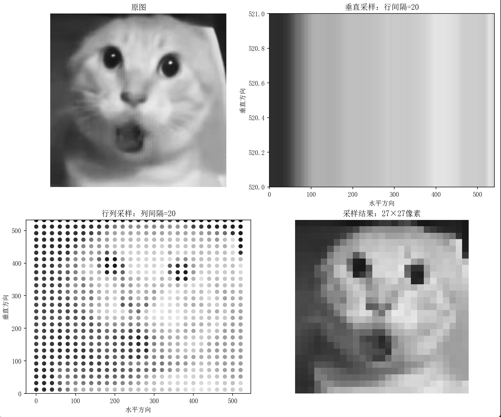
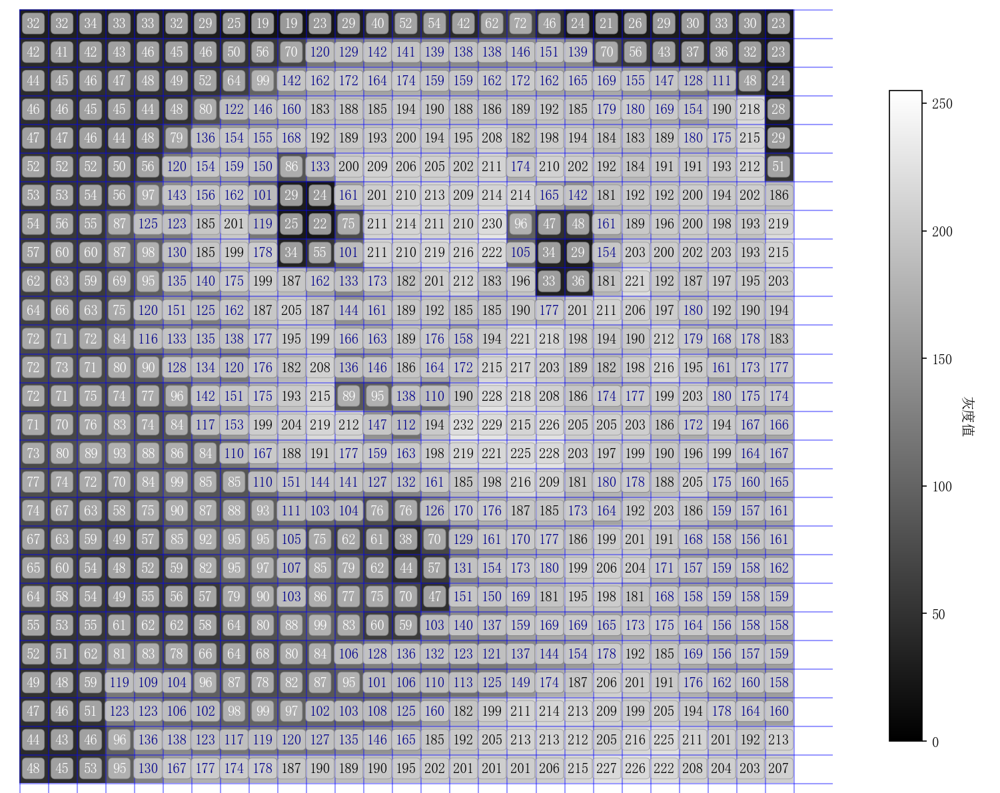
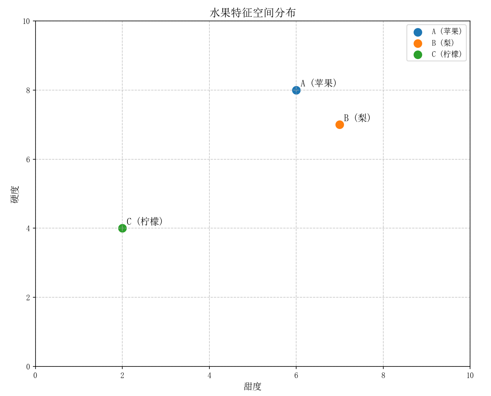
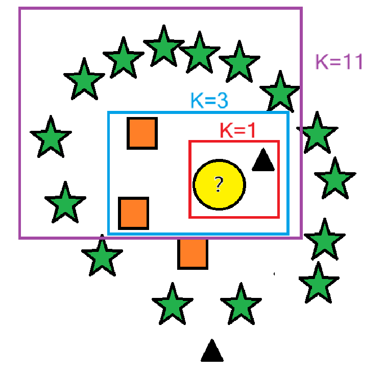
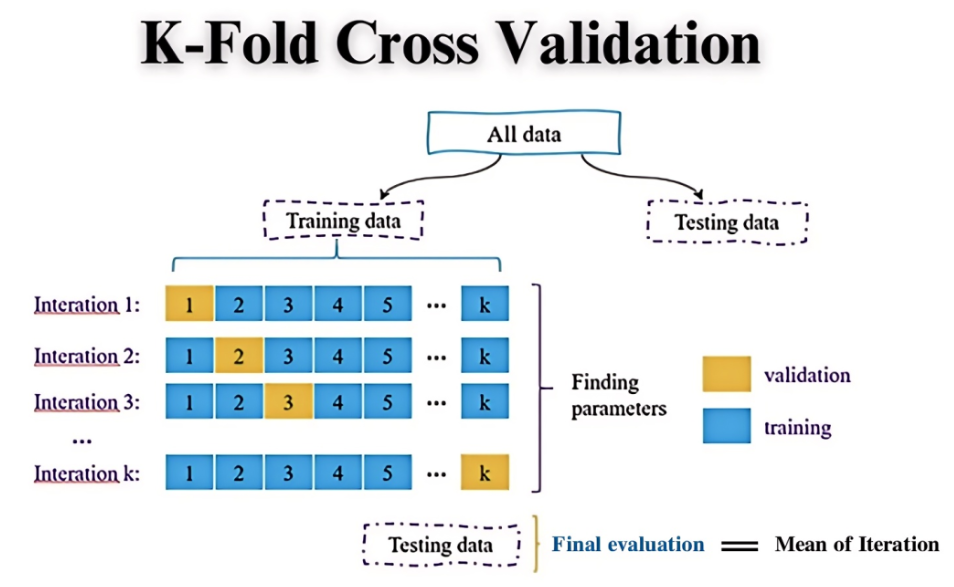
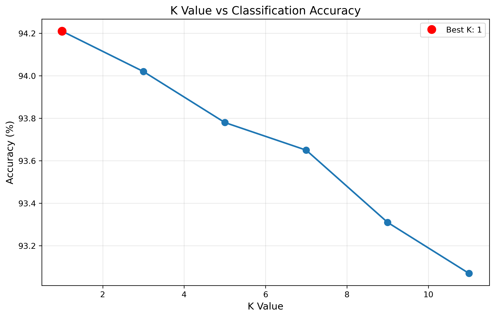
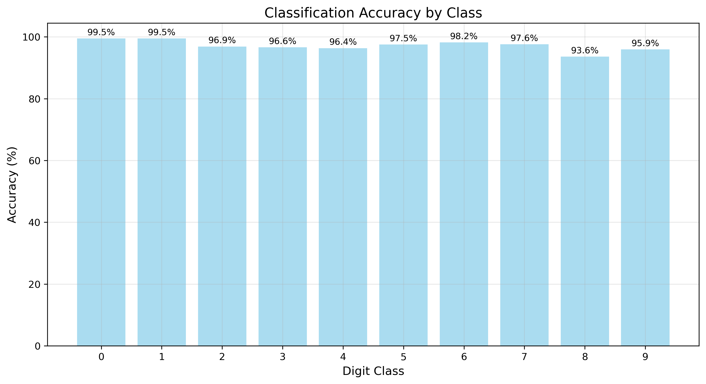
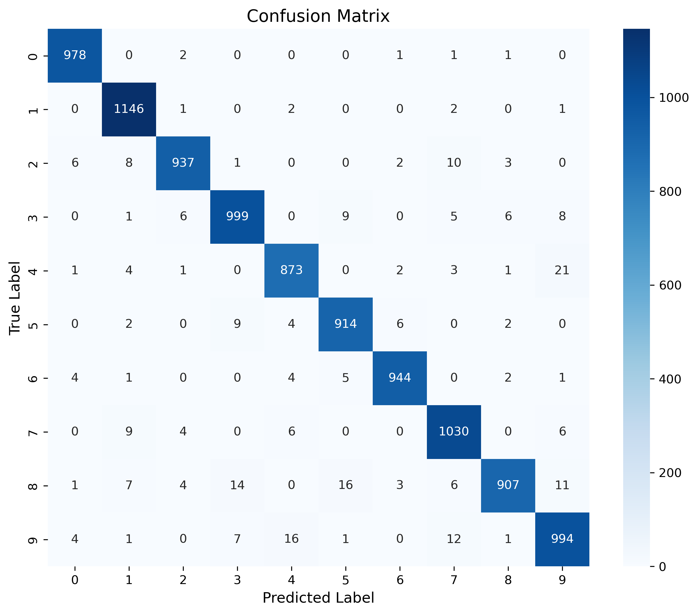
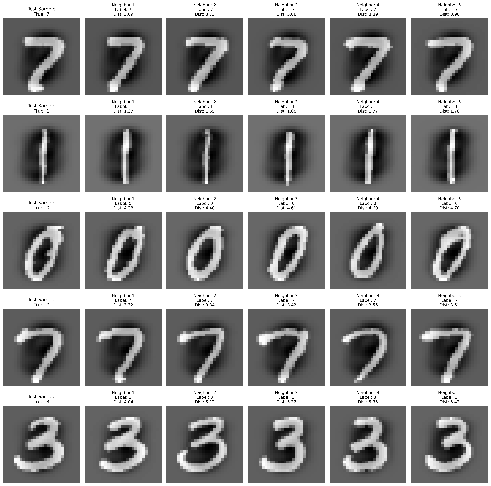

# 图像分类器--K近邻

## 引言和前置知识

KNN(K-Nearest Neighbor)算法，是最基础、最经典的机器学习算法之一，在分类、回归预测等许多领域有着广泛的应用。在本章节，我们将真正从零开始，彻底弄明白KNN算法的数学原理，并共同探讨该如何将其合理应用在图像的分类上。

在开始前，我们首先要了解一个重要的问题：计算机是怎么“看到”图像的？也就是说，一幅连续图像是怎么被计算机转化成可运算的数字形式的？

这个过程的关键就在于两个步骤：采样和量化。

计算机拿到连续图像之后，首先会对图像进行采样处理。采样处理通常遵循下列步骤：首先，沿垂直方向按一定的行间隔，从上到下顺序地对图像进行扫描，从而将二维的图像信息转换为一组行信号；接着，对每一行得到的这个一维信号，再沿水平方向按一定的间隔进行采样，最终得到遍布整幅图像的离散信号点，每一个信号点都包含了颜色、亮度等信息。这个过程的直接产出就是图像的分辨率（像素）。当我们说一幅图像的大小为M×N像素时，指的就是在水平方向采样了M个点，在垂直方向采样了N行。采样间隔越大，意味着在同样大小的原始图像上采集的像素点越少，图像质量就越差，表现为分辨率低、模糊甚至出现明显的马赛克效应。

<center>
    
    <br>
    <div style="color:orange; border-bottom: 1px solid #d9d9d9;
    display: inline-block;
    color: #999;
    padding: 2px;">图1.1 图像经过采样处理</div>
</center>

可以看出，采样操作本质上是在空间/时间+空间上的离散化过程，即用空间上部分采样点的信息代表图像。

经过采样，我们得到了图像空间结构上的离散点集，但每个点所携带的灰度或颜色信息仍然是一个连续的模拟量。这时，就进行第二步：量化。量化是把采样后所得的各像素的灰度值从模拟量转换到离散量的过程，它解决了“每个像素点该用哪个数字来表示”的问题。在量化过程中，连续的灰度值范围被划分成若干个离散的区间。对于一个落在区间$[Z_i,Z_{i+1}]$内的连续灰度值$Z$，它会被映射为一个特定的离散值$q_i$。很明显，这种直接映射会引入量化误差，其大小为$e=|Z-q_i|$。为了最小化这种误差并标准化表示，通常将模拟量量化为从0到255的256个等级，0代表最暗（纯黑），255代表最亮（纯白），数值由小到大对应着亮度从深到浅，颜色从黑到白的平滑过渡。对于彩色图片，只需把灰度值$Z$替换为一个三维数组$(z_1,z_2,z_3)$，来表示红、绿、蓝色强度的数值。

量化方法主要分为两种。最常用的是等间隔量化，它简单地将采样值的整个灰度范围均匀地分割成256等份并进行赋值，这种方法实现简单且计算高效。另一种是非等间隔量化，它会根据一幅图像具体灰度值分布的概率密度函数，按照使总体量化误差最小的原则来划分区间。在灰度值分布密集的区域，量化区间会划分得更细，以保留更多细节；在分布稀疏的区域，区间则较宽。这种方法虽然能有效减少量化误差，但计算更为复杂。

<center>
    
    <br>
    <div style="color:orange; border-bottom: 1px solid #d9d9d9;
    display: inline-block;
    color: #999;
    padding: 2px;">图1.2 对采样后的图片量化映射灰度值</div>
</center>

采样和量化后，一幅连续图像就转化为了数字矩阵的形式，计算机的所有运算都在这个数字矩阵的基础上展开：

$$ g=\begin{pmatrix}
g(0,0)&g(0,1)&\cdots&g(0,N-1)\\
g(1,0)&g(1,1)&\cdots&g(1,N-1)\\
\vdots&\vdots&\ddots&\vdots\\
g(M-1,0)&g(M-1,1)&\cdots&g(M-1,N-1)
\end{pmatrix} $$

矩阵中的每一个元素 $g(i, j)$ 都承载着特定的信息： 

坐标 $(i, j)$ 代表一个像素点在图像中的第 $i$ 行、第 $j$ 列 。   
数值 $g(i, j) $代表该位置的像素经过量化后得到的离散形式信息，例如刚才0-255的灰度值。  
对于彩色图片，我们可以用$g(i,j,n)$表示，其中$n=0,1,2$分别对应红、绿、蓝三个颜色通道，$g(i,j,n)$代表颜色通道$n$在坐标 $(i, j)$ 的强度，比如在彩色图片中，坐标为（3,4）的像素块颜色由$g(3,4,0),g(3,4,1),g(3,4,2)$共同决定。  
更进一步，对于动态图像，可以再增加时间维度$t$,用$g(i,j,n,t)$来表示。

至此，我们成功把原始图像转化成了计算机能理解的数字矩阵形式，下面我们就进入这一节的主题：KNN图像分类。

## 一.算法原理

### 1.1  核心思想

首先，我们用一句话来总结一下KNN的核心思想：如果一个未知样本周围的**K个最相似的邻居**大多属于某一类别，那么就认为该样本也属于这个类别。这就好比如果一个学生周围志趣相投的好朋友全喜欢打乒乓球，那么这个学生有很大概率也喜欢乒乓球。

### 1.2  距离度量

那么，具体该如何判断两个样本有多“相似”呢？我们通常使用**距离度量**来量化这种相似性，即比较两个样本点在特征空间内的距离，距离越小，样本间的相似程度越大。

以一个简单的例子说明，设定一个水果有甜度（0-10），硬度（0-10）两个特征，现在有三个样本：  
样本A（苹果）：甜度=6，硬度=8；  
样本B（雪梨）：甜度=7，硬度=7；  
样本C（柠檬）：甜度=2，硬度=4.  
则在“甜度”和“硬度”张成的特征空间中，这三个样本可以看作下图中的三个样本点，不难看出，苹果和梨的距离较近，比较相似。

<center>
    
    <br>
    <div style="color:orange; border-bottom: 1px solid #d9d9d9;
    display: inline-block;
    color: #999;
    padding: 2px;">图1.3 水果特征空间分布</div>
</center>

在计算距离时，我们一般选用最常用直观的欧氏距离（Euclidean distance）作为距离度量，即我们最熟悉的“两点间直线距离”。在$n$维特征空间中,对两个样本点$x_i=(x_i^{(1)},x_i^{(2)},... ,x_i^{(n)})^T,x_j=(x_j^{(1)},x_j^{(2)},... ,x_j^{(n)})^T$,欧氏距离$d$的定义为：

$$d(x_i,x_j)= \bigg(\sum_{l=1}^{n}|x_i^{(l)}-x_j^{(l)}|^2\bigg)^{\frac{1}{2}} $$

当然，还有其他度量方式，如曼哈顿距离（Manhattan distance）：

$$d_2(x_i,x_j)= \sum_{l=1}^{n}|x_i^{(l)}-x_j^{(l)}| $$

或者更一般的Minkowski距离：

$$d_3(x_i,x_j)= \bigg(\sum_{l=1}^{n}|x_i^{(l)}-x_j^{(l)}|^p\bigg)^{\frac{1}{p}} $$

当$p=1$时，它就是曼哈顿距离，$p=2$时，它就是欧氏距离。在后文实际处理图像时，我们要根据图像的特点来选择合适的度量方式。

在计算待分类样本与训练集中每一个样本的距离后，根据计算出的距离，从小到大进行排序，选取距离最小的前K个训练样本（即K个最近邻），统计这K个最近邻中各个类别出现的频率。将频率最高的类别（多数票）预测为待分类样本的类别。

### 1.3  K值选择
K值的选择对于K近邻的结果至关重要。  

采用较小的K值，意味着我们仅基于最邻近的少数点进行分类，能更好捕捉局部细节，但如果邻近点刚好是噪声，预测出错的概率就很大，即对噪声敏感。这使得模型变得更复杂，更容易发生过拟合，在训练集上表现突出，但由于学习了过多噪声和不必要的细节，在未知数据上应用时效果显著下降。  

采用较大的K值，意味着我们基于一个更大的邻域中的数据来进行分类。由于单个噪声点的影响被大大削弱，过拟合风险得以减少，转而容易偏向欠拟合。随着K值的增大，模型可能变得过于简单，从而忽略数据中一些有价值的局部模式，无法捕捉到真实的数据分布，导致在训练集和测试集上的表现都不佳。极端一点，如果K值等于整个训练集的大小，那么对于任何输入，模型都只会简单地预测训练集中数量最多的那个类别，完全忽略了训练集中的有效信息，失去了分类意义。  

举例说明，在图1.4的特征空间中，假设我们要预测中间问号的形状类别。

$K=1$时，模型只根据最近的三角（噪声点）判断，错误预测分类为三角；  
$K=3$时，模型根据2正方形、1三角判断，合理预测分类为正方形；  
$K=7,9,11...$时，由于总样本中五角星的数量最多，模型只会简单预测为五角星，忽略了周围较多正方形这一有效信息。

<center>
    
    <br>
    <div style="color:orange; border-bottom: 1px solid #d9d9d9;
    display: inline-block;
    color: #999;
    padding: 2px;">图1.4 K值的选择</div>
</center>


在实际应用中，我们一般取一个较小的奇数K值（防止平票），并用交叉验证（Cross-Validation）的方式来找到最优的K值。

交叉验证是什么意思？

具体而言，该过程始于将原始数据集随机划分为若干个互斥的子集（称为“折”）。随后，针对每一个待考察的K值，依次将每一折数据作为验证集，其余折作为训练集，在此基础上训练KNN模型并计算其在验证集上的性能指标（如分类准确率、F1值等）。完成所有轮次后，计算该K值下各轮性能指标的平均值，此平均值即为评估其泛化能力的可靠依据。最终，通过对所有候选K值的平均性能进行比较，选取表现最优的K值作为最终参数。

<center>
    
    <br>
    <div style="color:orange; border-bottom: 1px solid #d9d9d9;
    display: inline-block;
    color: #999;
    padding: 2px;">图1.5 K折交叉验证</div>
</center>

交叉验证有效性的根本原因在于其充分利用了有限的数据资源。通过多次循环与平均操作，它显著降低了因单次数据划分偶然性而导致的评估波动，使结果更具统计稳定性。同时，严格的“训练-验证”隔离机制确保了性能评估始终在未参与训练的数据上进行，有效防止了模型过拟合。


## 二.实际应用流程
### 2.1  图像预处理
在直接应用KNN算法前，必须进行预处理以符合数据格式，提高算法的准确率等等。常规的图像预处理包括以下部分：

​1） **​尺寸标准化​（Resizing）** ​：  

训练集中的所有图像必须具有相同的尺寸（例如，28x28像素）。这是因为KNN算法需要每个样本的特征向量具有相同的维度（长度）来计算距离。如果图像大小不一，它们的矩阵大小不同，对应的特征向量维度也不同，无法进行后续的距离度量。这一步通常通过缩放或裁剪完成。

2） **​ ​灰度化（可选）** ​​：  

如果原始图像是彩色的，并且颜色信息对于分类任务不是关键（例如，手写数字识别），通常将其转换为灰度图像。这能将一个样本从三个矩阵（RGB）简化为一个矩阵，显著减少后续特征向量的维度，降低计算复杂度。

3） **​​图像矩阵到特征向量的转换（Flattening）** ​：

KNN算法处理的是特征空间中的点，每个点用一个向量表示。因此，我们需要将先前二维的图像矩阵“展开”成一个一维的特征向量。例如，一个28x28的灰度图像矩阵可以转换成一个长度为784（28 * 28=784）的一维向量。这个向量的每一个元素就代表一个特征（即一个像素点的灰度值）。一个$M \times N$的矩阵就展开成一个长度为 $M \times N$的一维特征向量。

$$ \begin{pmatrix}
g(0,0)&g(0,1)&\cdots&g(0,N-1)\\
g(1,0)&g(1,1)&\cdots&g(1,N-1)\\
\vdots&\vdots&\ddots&\vdots\\
g(M-1,0)&g(M-1,1)&\cdots&g(M-1,N-1)
\end{pmatrix} \Rightarrow \left( g(0,0), g(0,1), \ldots, g(0,N-1), g(1,0), g(1,1), \ldots, g(1,N-1), \ldots, g(M-1,0), g(M-1,1), \ldots, g(M-1,N-1) \right) $$


4）**​​特征归一化（Normalization）** ​​：

Q:如果不归一化会发生什么？  

一个简单例子：假设现在有两个1x2矩阵展开成的特征向量，两个特征分别为“身高”“鞋码”，类别为“男”/“女”。  
$A=(182,43)$，类别为男；  
$B=(162,36)$,类别为女；  

现在有一个新样本$C=(170,44)$，我们来计算它与$A,B$的距离:  
$d(A,C)=\sqrt{(182-170)^2+(43-44)^2}=\sqrt{145}$  
$d(B,C)=\sqrt{(162-170)^2+(36-44)^2}=\sqrt{128}$  
可见，$C$与$B$的距离更近，按理应预测$C$为女。但是根据常识，鞋码44的人明明更可能是男性。  

这个错误是因为身高的取值范围是鞋码的数倍，量纲的不同导致了在距离计算时，第一项身高差异的影响远大于鞋码，这显然不合理。归一化的目的，就是为了统一​​分布​​，确保所有像素在计算距离时拥有相近的“话语权”。

由于图像像素值的范围通常是[0, 255]，如果直接使用原始像素值计算距离（如欧氏距离），仅仅数值波动大的无关像素点就可能会主导距离的计算结果。归一化的目的是将所有特征映射到相同的数值范围内（通常是[0, 1]或[-1, 1]），​让真正重要的像素主导分类决策，而将相对无关的像素视为噪声。

最值归一化是将特征映射到[0,1]区间的一种常用办法，：

$$X_{normalized}=\frac{X-X_{min}}{X_{max}-X_{min}}$$

### 2.2  确定参数

1）**选择距离度量**

对于绝大多数图像分类任务，​​欧氏距离是默认且最通用的选择​​。它衡量直线距离，直观地反映了整体差异。当图像数据已经经过预处理，且没有证据表明数据存在特定噪声或分布时，欧氏距离通常能提供可靠且稳定的性能。  

当图像数据中可能存在明显的​​非典型噪声或异常像素点时​​，​可以考虑选择曼哈顿距离。曼哈顿距离只是简单地将每个像素维度上的差异绝对值相加的特性使其对个别像素的剧烈波动（例如由传感器热噪声产生的极亮或极暗的孤立像素点）不那么敏感，从而可能获得更鲁棒的分类结果。它适用于处理直接从某些成像设备获取的、未经充分清洗的原始图像数据。  

除此之外，还有其他度量方式如余弦度量和马氏度量，这里先不讨论。

2）**确定K值**：
选择一个合适的K值。K值过小会使模型对噪声异常敏感，容易过拟合；K值过大则会使模型变得过于简单，可能使临近样本中包含太多其他类别的点，导致欠拟合。通常通过后面实验过程中的交叉验证来选择一个在验证集上表现最好的K值。

### 2.3  应用K近邻

输入：一个待分类的（测试）图像。它需要经过与训练集完全相同的预处理流程（尺寸标准化、灰度化、展平、归一化），变成一个一维特征向量。

计算距离：计算这个测试向量与训练集中每一个样本向量之间的距离。

寻找近邻：从计算出的所有距离中，找出距离最小的K个训练样本。

投票决策：统计这K个最近邻样本的类别标签，将出现次数最多的类别作为该测试图像的预测分类结果。

### 2.4  评估优化

最后，在测试集上评估KNN分类器的性能。常用的指标包括准确率（Accuracy）、精确率（Precision）、召回率（Recall）等。根据评估结果，可以回溯调整之前的步骤，如尝试不同的K值，检查预处理流程，归一化是否正确等。为了提升效率和准确率，可以考虑采用kd树等方式，进一步优化算法流程，这里不做更多介绍。

## 三.代码实现
明白算法原理和具体操作流程后，我们动手用python实现它，这也是
本项目的完整代码实现了基于KNN的手写数字识别系统，包含数据下载、预处理、模型训练、评估和可视化等完整流程。

### 3.1 项目结构

```
knn-mnist-classifier/
├── src/                          # 源代码目录
│   ├── download_mnist.py        # MNIST数据下载和预处理
│   ├── train_knn.py            # 模型训练和交叉验证
│   ├── evaluate.py             # 模型评估和性能分析
│   ├── demo.py                 # 演示和可视化
│   ├── knn.py                  # KNN核心算法实现
├── utils/                  # 工具函数
│   ├── data_helpers.py     # 数据加载和预处理
│   ├── metrics.py          # 评估指标计算
│   └── visualization.py    # 结果可视化
├── configs/
│   └── knn_config.yaml         # 配置文件
├── main.py                  # 一键运行脚本
├── requirements.txt            # 依赖包列表
└── README.md                   # 项目说明
```

### 3.2 核心算法实现

#### 3.2.1 KNN类实现

```python
class KNearestNeighbor(object):
    def __init__(self):
        self.X_train = None
        self.y_train = None
        self.best_k = None

    def train(self, X, y):
        """K-NN训练：仅存储训练数据"""
        self.X_train = X.astype(np.float64)
        self.y_train = y

    def compute_distances_no_loops(self, X):
        """无循环距离计算：使用矩阵运算优化性能"""
        # 欧氏距离平方公式: ||x-y||² = ||x||² - 2xy.T + ||y||²
        X_test_sq = np.sum(X**2, axis=1)[:, np.newaxis]
        X_train_sq = np.sum(self.X_train**2, axis=1)[np.newaxis, :]
        cross_term = X @ self.X_train.T
        dists_sq = X_test_sq + X_train_sq - 2 * cross_term
        return np.sqrt(np.maximum(dists_sq, 0))
```


传统的KNN实现使用双重循环计算距离，时间复杂度为O(n²)。我们采用矩阵运算优化，利用NumPy的广播机制实现高效计算，利用欧氏距离的展开形式：$d(x,y)^2 = \|x\|^2 - 2x·y^T + \|y\|^2$，相比直接循环实现，速度提升数十倍，同时支持分批处理，避免内存溢出。

#### 3.2.2 交叉验证实现

```python
def cross_validate(self, X_train, y_train, k_values, n_folds=5):
    """K折交叉验证选择最佳K值"""
    k_scores = {k: [] for k in k_values}
    
    for train_idx, val_idx in self.k_fold_split(len(X_train), n_folds):
        # 分割数据并计算距离矩阵
        dists = self.compute_distances_no_loops(X_val)
        
        for k in k_values:
            y_pred = self.predict_labels(dists, k=k)
            accuracy = np.mean(y_pred == y_val)
            k_scores[k].append(accuracy)
    
    # 选择平均准确率最高的K值
    best_k = max(k_scores.items(), key=lambda x: np.mean(x[1]))[0]
    return best_k, k_scores
```

### 3.3 数据处理流程

#### 3.3.1 数据下载和预处理

```python
def load_and_save_mnist(data_dir='../data'):
    """下载MNIST数据集并进行预处理"""
    # 1. 下载原始数据
    mnist = fetch_openml('mnist_784', version=1, as_frame=False, parser='liac-arff')
    X_data = mnist.data.astype(np.float32)
    y_data = mnist.target.astype(np.int8)
    
    # 2. 归一化：像素值从[0,255]缩放到[0,1]
    X_data /= 255.0
    
    # 3. 划分训练集和测试集
    X_train, X_test, y_train, y_test = train_test_split_numpy(
        X_data, y_data, test_size=10000/70000, random_state=42
    )
```

#### 3.3.2 特征工程

```python
def preprocess_data(X_train, y_train, X_test, y_test):
    """数据预处理：展平和均值归一化"""
    # 展平图像矩阵为特征向量
    X_train_flat = X_train.reshape(X_train.shape[0], -1)
    X_test_flat = X_test.reshape(X_test.shape[0], -1)
    
    # 均值归一化
    mean_image = np.mean(X_train_flat, axis=0)
    X_train_processed = X_train_flat - mean_image
    X_test_processed = X_test_flat - mean_image
    
    return X_train_processed, y_train, X_test_processed, y_test
```


为了方便分析和观察，项目提供了丰富的可视化功能，包括K值选择曲线图、混淆矩阵、类别准确率分布 、最近邻可视化示例。

### 3.4 运行方式

#### 3.4.1 一键运行
```bash
python main.py
```

#### 3.4.2 分步运行
```bash
# 1. 下载数据
python src/download_mnist.py

# 2. 训练模型
python src/train_knn.py

# 3. 评估模型
python src/evaluate.py

# 4. 运行演示
python src/demo.py
```

## 四、实验验证

### 4.1 实验设置

#### 4.1.1 数据集
 **数据集**：MNIST手写数字数据集  
 **训练集**：60,000张28×28灰度图像  
 **测试集**：10,000张28×28灰度图像  
 **类别数**：10类（数字0-9）  

#### 4.1.2 实验环境
 **硬件**：标准CPU环境  
 **软件**：Python 3.13, NumPy, Scikit-learn, Matplotlib  
 **参数设置**：K值范围[1, 3, 5, 7, 9, 11]，3折交叉验证  

### 4.2 K值选择实验

通过交叉验证确定最佳K值，实验结果如图4.1所示：

<center>
    
    <br>
    <div style="color:orange; border-bottom: 1px solid #d9d9d9;
    display: inline-block;
    color: #999;
    padding: 2px;">图4.1 各K值准确率</div>
</center>


**结果分析**：

| K值 | 平均准确率 | 趋势分析 |
|-----|------------|----------|
| 1   | 94.21%     | **最佳性能**，局部特征捕捉能力强 |
| 3   | 94.02%     | 性能轻微下降，开始平滑噪声 |
| 5   | 93.78%     | 明显下降趋势，可能过度平滑 |
| 7   | 93.65%     | 持续下降，模型趋于简单 |
| 9   | 93.31%     | 欠拟合迹象明显 |
| 11  | 93.07%     | 最差性能，模型过于简单 |


随着K值增大，准确率单调下降，这说明MNIST数据集中局部特征的重要性（通常在面对更一般的数据集时，K不会取这么小）。在这里我们直接根据交叉验证的结果，选择K=1作为最终模型参数。

### 4.3 模型性能评估

在10,000个测试样本上的最终评估结果：

#### 4.3.1 总体性能
**测试准确率**：97.22%（优于交叉验证结果）  
**训练数据形状**：(60000, 784)  
**测试数据形状**：(10000, 784)  

#### 4.3.2 各类别性能分析

**各类别详细表现**：

<center>
    
    <br>
    <div style="color:orange; border-bottom: 1px solid #d9d9d9;
    display: inline-block;
    color: #999;
    padding: 2px;">图4.2 各类别准确率</div>
</center>


| 数字 | 准确率 | 性能分析 |
|------|--------|----------|
| 0    | 99.5%  | **最优性能**，形状独特且稳定 |
| 1    | 99.5%  | **最优性能**，结构简单明确 |
| 6    | 98.2%  | 优秀，闭合结构特征明显 |
| 7    | 97.6%  | 良好，斜线特征易识别 |
| 4    | 97.5%  | 良好，交叉结构相对稳定 |
| 9    | 96.9%  | 中等，与4、7有相似特征 |
| 2    | 96.6%  | 中等，曲线变化较多 |
| 5    | 96.4%  | 中等，与3、8易混淆 |
| 3    | 95.9%  | 相对困难，与8相似度高 |
| 8    | 93.6%  | **最具挑战**，复杂度高且变化多样 |

### 4.4 错误分析

#### 4.4.1 混淆矩阵分析

<center>
    
    <br>
    <div style="color:orange; border-bottom: 1px solid #d9d9d9;
    display: inline-block;
    color: #999;
    padding: 2px;">图4.3 各类别准确率</div>
</center>

**主要可能错误模式分析**：

1. **8→3混淆**：11个样本被误分类  
原因：数字8下半部分与3相似  
特征：闭合结构不完整时易混淆  

2. **5→3混淆**：10个样本被误分类   
原因：上半部分曲线相似  
特征：书写连笔时区分困难  

3. **4→9混淆**：21个样本被误分类  
原因：开口方向相似  
特征：小角度书写的4与9形状接近

4. **2→7混淆**：10个样本被误分类  
原因：上部横线和斜线组合相似    
特征：书写风格影响较大

##### 4.4.2 最近邻可视化分析

<center>
    
    <br>
    <div style="color:orange; border-bottom: 1px solid #d9d9d9;
    display: inline-block;
    color: #999;
    padding: 2px;">图4.2 对测试样本找到的前5个邻居</div>
</center>


数字1的距离值最小，说明该类样本特征一致性高，在特征空间内聚集紧密；数字0和3的距离值在5个数字里较大，体现其复杂度和书写风格变化较多。这一步可以让我们了解模型对数字分类的具体“思考过程”，为进一步针对类别优化提供方向。


### 4.7 实验结论与改进

在上面的实验中，我们共同用python实现了KNN算法，在MNIST数据集上达到97.22%的准确率，证明了其在处理手写数字识别这种预处理良好数据中的有效性。实验过程中，可以发现K=1时模型获得最佳性能，体现出局部特征在数字识别中的极大重要性。同时，矩阵运算和分批处理也显著提升了计算效率。未来，处理更复杂或预处理相对较差的数据时，可以有如下改进方向：

**特征降维**：使用PCA等方法减少特征维度  
**距离加权**：根据距离远近对近邻投票进行加权  
**样本筛选**：移除噪声样本或使用原型选择方法  
**近似搜索**：使用KD-tree等数据结构加速最近邻搜索


## 五.总结
在本章，我们从计算机如何“看到”并数字化一幅图像开始，深入探讨了KNN算法的核心原理、关键参数的选择以及完整的应用流程。
总而言之，KNN为图像分类提供了一个强大而直观的基线方法。它作为惰性学习（lazy learning）算法，没有显式的训练阶段，所有计算都在预测时进行。虽然计算复杂度较高（尤其在大数据集上），且对数据质量和预处理流程非常敏感，但其原理简单、无需训练、自然支持多分类的特性，使其成为进行简单图像分类的完美工具。我们希望本章的内容可以帮助读者掌握KNN算法的数学基础和应用细节，更深刻地理解从一幅原始图像到最终分类结果之间，每一个数据处理步骤的意义与重要性！
