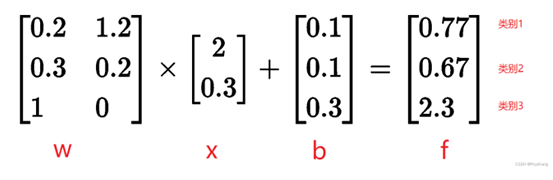
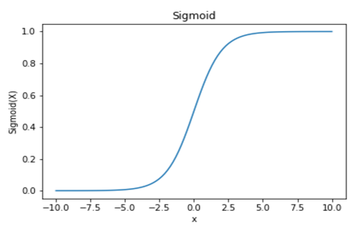
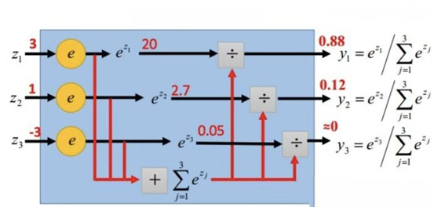
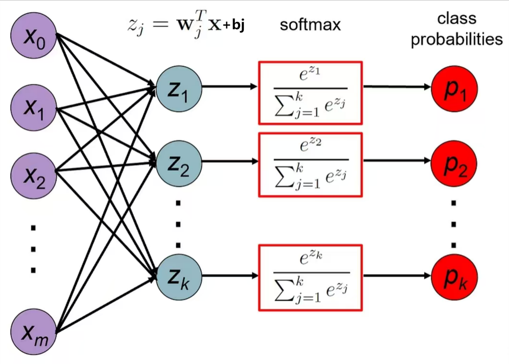
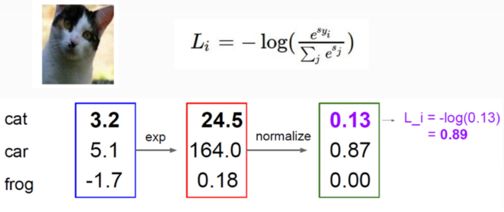
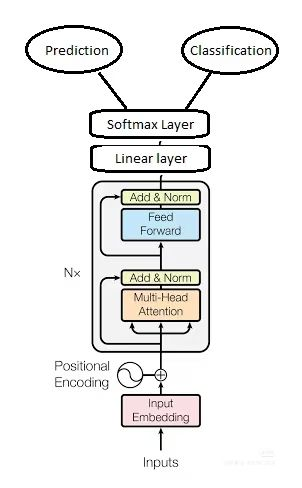

# Softmax分类器及交叉熵损失

## 引言

欢迎来到《纯Python"手搓"图像分类器》中的softmax分类器讲解。在本章，我们将从概率分布的朴素理解出发，层层剖析Softmax分类器的核心逻辑。它不仅是深度学习中多类别分类的基石，更是帮我们打通"原始分数"到"概率决策"的关键桥梁。Softmax分类器是一种"生成概率分布"的工具，它通过简洁的数学变换将模型输出的无序数值转化为可解释的类别概率，这种确定性的映射关系使其成为图像分类、文本识别等任务中最经典的输出层方案，帮助我们建立对"置信度量化"与"损失优化"的核心认知。

在机器学习与深度学习的分类任务中，模型的核心目标是将输入数据映射到离散的类别标签。例如，图像识别中判断一张图片是"猫""狗"还是"汽车"，文本分类中确定一段文字的情感是"积极""消极"还是"中性"。这类任务的关键挑战在于：如何将模型输出的连续数值（通常称为"logits"或"分数"）转化为具有明确概率意义的类别分布，同时设计合理的损失函数衡量预测结果与真实标签的差异，以指导模型参数优化。

Softmax分类器正是为解决这一问题而生的经典工具。它通过Softmax函数将原始分数转换为归一化的概率分布，再结合交叉熵损失函数量化预测误差，构成了端到端的分类框架。这一组合不仅具备良好的数学可解释性，还能高效地与反向传播算法结合，成为深度学习中多类别分类任务的基础组件，广泛应用于图像、文本、语音等领域。

## 初步介绍

什么是Softmax分类器？

简单来说，Softmax分类器是逻辑回归（Logistic Regression）在多类别分类问题上的自然推广。

逻辑回归：用于二分类，它将一个输入向量映射到一个介于0和1之间的概率值，表示属于正类的概率。

Softmax分类器：用于多分类（假设有K个类别），它将一个输入向量映射到一个包含K个元素的概率分布。每个元素的值介于0和1之间，且所有元素之和为1。

它的**核心思想**是：将模型输出的原始分数（Logits）转化为所有类别的概率分布，从而我们可以选择概率最大的类别作为预测结果。

## 算法原理

#### 线性变换

对于输入数据x（一个特征向量），我们为每个类别i计算一个原始得分 $z_i$ 

先通过 $z_i = W_i x + b_i$ 计算每个类别的"原始分数"（logits）。其中，x是输入特征，W是权重矩阵，b是偏置向量。 $z_i$ 即第i类的"原始分数"（logits），其值可正可负，不直接具备概率意义，但能反映输入x与第i类的"匹配程度"——数值越高，说明从线性变换的角度看，x越可能属于第i类。

<div align="center">
    
    <br>
    <div style="color:orange; border-bottom: 1px solid #d9d9d9;
    display: inline-block;
    color: #999;
    padding: 2px;">图1.1 线性层的计算流程</div>
</div>

这步其实就是普通的线性层（Linear Layer）。

#### Sigmoid函数和Softmax函数

Sigmoid函数可以将输入的一个实数映射到0-1区间上。从图中我们可以看到自变量X的取值范围为正无穷到负无穷的一切实数，Y的取值范围是从0到1的。那么任意的一个X1我们都可以得到一个在[0,1]上的Y1，也就是我们可以把所有的值都压缩到0到1这个区间内，结合之前的得分函数，一个输入对于每一个类别的得分X，我们都可以把这个得分映射到[0,1]区间内，也就是把我们的得分数值转成了相应的概率值。

Sigmoid的计算公式如下：

$$\sigma(x) = \frac{1}{1 + e^{-x}}$$

<div align="center">
    
    <br>
    <div style="color:orange; border-bottom: 1px solid #d9d9d9;
    display: inline-block;
    color: #999;
    padding: 2px;">图1.2 Sigmoid函数图</div>
</div>

Softmax函数又称归一化指数函数，是基于sigmoid二分类函数在多分类任务上的推广；在多分类网络中，常用Softmax作为最后一层进行分类。分子 $e^{z_i}$ 是对第i类的原始分数取自然指数，确保数值为正，且所有类别的概率之和为1。

Softmax的计算公式如下：

$$\sigma(z)_i = \frac{e^{z_i}}{\sum_{j=1}^{n}e^{z_j}} \quad \text{for } i = 1,2,\ldots,n $$

<div align="center">
    
    <br>
    <div style="color:orange; border-bottom: 1px solid #d9d9d9;
    display: inline-block;
    color: #999;
    padding: 2px;">图1.3 Softmax层计算流程</div>
</div>

这步其实就是Softmax层（Softmax Layer）。

softmax可以对线性层的输出做规范化校准：保证输出为非负且总和为1。因为如果直接将未规范化的输出看作概率，会存在2点问题：

1. 线性层的输出并没有限制每个神经元输出数字的总和为1；
2. 根据输入的不同，线性层的输出可能为负值。

#### Softmax分类器与交叉熵损失

简单的说，softmax函数会将输出结果缩小到0到1的一个值，并且所有值相加为1，使用softmax函数对前面线性分类求得分，所求得的得分值即为该类别的概率。因为我们需要他们之间的差异更大，这样我们就可以很轻松的分辨出来这个输入到底是什么。这个时候我们就引入交叉熵损失函数，来衡量分类的好坏。
<div align="center">
    
    <br>
    <div style="color:orange; border-bottom: 1px solid #d9d9d9;
    display: inline-block;
    color: #999;
    padding: 2px;">图2.1 交叉熵损失函数流程</div>
</div>
交叉熵损失衡量分类模型的性能，其输出是介于0和1之间的概率值。交叉熵损失随着预测概率与实际标签的偏离而增加。因此，当实际观察标签为1时预测的概率模型不好，并导致高损失值。cross-entropy一般再softmax函数求得结果后再用。

对于一个包含K个类别的分类任务，设样本的真实标签为向量 $t = [t_1,t_2,\ldots,t_K]$ （其中$t_i$表示样本属于第i类，其余 $t_j=0$ ），模型通过Softmax函数输出的预测概率分布为 $p = [p_1,p_2,\ldots,p_K]$ （ $p_i$ 为样本属于第i类的概率），且 $\sum_{i=1}^{K}p_i = 1$ ，则交叉熵损失公式为：

$$L_{CE} = -\sum_{i=1}^{n}t_i\log(p_i) = -\log(p_{\text{true}})$$

因为softmax求出结果在(0,1)之间，所以cross-entropy结果为负值，加负号使得损失为正。直观体现了预测偏差与损失的正相关，值越小，预测结果越精准，值越大反之。

接下来，我们举一个例子来阐述分类器最终损失值的计算逻辑：

<div align="center">
    
    <br>
    <div style="color:orange; border-bottom: 1px solid #d9d9d9;
    display: inline-block;
    color: #999;
    padding: 2px;">图2.2 Softmax分类器计算损失值流程</div>
</div>

计算步骤：

第一步：对应于一个输入计算出它属于每种类别的得分数值。
第二步：利用sigmoid函数把所有的得分值映射成一个概率值。
第三步：对最终正确分类所占的概率求一个log值再取负号

整个流程清晰呈现了从"原始得分→概率分布→损失计算"的完整逻辑，帮助理解多分类任务中Softmax和交叉熵损失的协同作用。此处损失为0.89，量化了模型预测与真实标签的差异。
<div align="center">
    
    <br>
    <div style="color:orange; border-bottom: 1px solid #d9d9d9;
    display: inline-block;
    color: #999;
    padding: 2px;">图2.3 Softmax总流程图</div>
</div>
## 项目简介

## 代码实现
# 实验一：在Fashion-MNIST数据集上测试
## 1. 数据集介绍
Fashion-MNIST 是一个用于图像分类任务的基准数据集，旨在替代传统 MNIST 手写数字数据集，更贴近真实世界的计算机视觉应用场景。Fashion-MNIST 由 60,000 个示例的训练集和 10,000 个示例的测试集组成。每个示例都是 28x28 的灰度图像，与 10 个类的标签相关联。每个训练和测试示例都分配给以下标签之一：
| 标签 | 描述     |
| ---- | -------- |
| 0    | T恤/上衣 |
| 1    | 裤子     |
| 2    | 套衫     |
| 3    | 连衣裙   |
| 4    | 外套     |
| 5    | 凉鞋     |
| 6    | 衬衫     |
| 7    | 运动鞋   |
| 8    | 袋       |
| 9    | 踝靴     |

数据集外观展示


这个数据集获取很简单，GitHub上就有，下载到本地后就可以在项目中运行了，具体处理步骤不再赘述。

## 2.结合算法数学逻辑书写代码

有了对数据集的基本了解就可以开始手撕了，为了阅读方便起见这里先给出一些数学公式的符号说明：
 $N$  — 当前批次样本数（batch size），训练集中总样本数记为  $N_{\text{train}}$ 。
 $D$ — 特征维度（图像展平成向量时 $D = 28 \times 28 = 784$ ）。
 $C$ — 类别数（Fashion-MNIST $C = 10$ ）。
矩阵/向量形状约定：
  $X \in \mathbb{R}^{N \times D}$ （每一个样本）
  $W \in \mathbb{R}^{D \times C}$ （权重）
  $b \in \mathbb{R}^{1 \times C}$ （偏置，广播到 $N \times C$ ）
  $S = XW + 1b \in \mathbb{R}^{N \times C}$ （logits / scores）（后面提到的 $s_{ij}$ 是里面的元素）
  $P \in \mathbb{R}^{N \times C}$ （softmax 概率，每行和为 1）
  $Y \in \{0,1\}^{N \times C}$ （one-hot 标签）
 
 先来看看代码主体部分的数学逻辑，我们先对权重矩阵以及偏置初始化一下：
```python
class SoftmaxClassifier:
    def __init__(self, input_dim, num_classes):
        self.W = np.random.normal(loc=0.0, scale=0.01, size=(input_dim, num_classes))
        self.b = np.zeros(shape=(1, num_classes))

```
这里选择一些较小的正态随机数比较常用，也可以避免数值溢出。

```python
    def softmax(self, scores):
        max_scores = np.max(scores, axis=1, keepdims=True)
        exp_scores = np.exp(scores - max_scores)
        return exp_scores / np.sum(exp_scores, axis=1, keepdims=True)

```
这个函数就定义了softmax的概率计算方式即：  
 $p_{i,j} = \frac{e^{s_{i,j}}}{\sum_{k=1}^{C} e^{s_{i,k}}}$ 

考虑到数值的稳定性不至于太大，我们可以做一个这样的变换：先减去行最大值 $m_i = \max_k s_{i,k}$ ，因为 $\frac{e^{s_{i,j}}}{\sum_{k} e^{s_{i,k}}} = \frac{e^{s_{i,j} - m_i}}{\sum_{k} e^{s_{i,k} - m_i}}$

最终返回的 $\text{probs}$ 即矩阵 $P$ $(N, C)$ ，每行和为 1。

```python
    def forward(self, X, y=None, reg=0.0):
        N = X.shape[0]
        scores = np.dot(X, self.W) + self.b
        probs = self.softmax(scores)

        if y is None:
            return probs, 0.0

        cross_entropy = -np.sum(y * np.log(probs + 1e-10)) / N
        reg_loss = 0.5 * reg * np.sum(self.W **2)
        total_loss = cross_entropy + reg_loss
        return probs, total_loss
    
    
    def backward(self, X, y, reg=0.0):
        N = X.shape[0]
        probs, _ = self.forward(X)
        dscores = (probs - y) / N
        dW = np.dot(X.T, dscores) + reg * self.W
        db = np.sum(dscores, axis=0, keepdims=True)
        return dW, db

    
```
这两个函数设计了前向传播和反向传播过程，是极为重要的两个过程，它的步骤是这样的：首先为了计算效率和内存考虑，选取一个batch的值作为一次前向加反向传播中同时处理的样本数，值通常为2的幂次如128.然后调用上面说过的线性映射方式，计算对于第 $i$ 个样本，第 $j$ 类的分数：
$s_{i,j} = \sum_{k=1}^{D} x_{i,k} W_{k,j} + b_j$

然后 $softamx$ 把刚才的logits转概率：

 $p_{i,j} = \frac{e^{s_{i,j} - m_i}}{\sum_{k=1}^{C} e^{s_{i,k} - m_i}}, \quad m_i = \max_k s_{i,k}$ 
 
然后计算交叉熵的损失（每个batch平均）：
 $L_{\text{CE}} = -\frac{1}{N} \sum_{i=1}^{N} \sum_{j=1}^{C} Y_{ij} \log p_{ij}$ 

以及一个L2正则项：  
$L_{\text{reg}} = \frac{\lambda}{2} \sum_{a,b} W_{ab}^2$

（为什么这里加了一个正则项呢，因为这里的特征太多了并且一个批次数据较少，是为了防止过拟合！）

总损失为他们两的和。
从这点上来看前向传播就是先把原始的像素通过线性映射到每一类的“分数”，然后softmax把分数归一化为概率，交叉熵就是把概率和真实标签比对并且量化误差。

然后是反向传播，我们要求 $\frac{\partial L}{\partial W}$ 和 $\frac{\partial L}{\partial b}$ 。因为损失表达式里 $W$ 与 $S$ 的关系是 $S = XW + 1b$ ，所以按链式法则：


对单个样本 $i$ 的交叉熵：
$$L^{(i)} = -\sum_{k=1}^{C} Y_{i,k} \log p_{i,k}, \quad p_{i,k} = \frac{e^{s_{i,k}}}{\sum_{m} e^{s_{i,m}}}$$

对 $s_{i,j}$ 求导（步骤）：
1. $\log p_{i,k} = s_{i,k} - \log \sum_{m} e^{s_{i,m}}$
2. $\frac{\partial \log p_{i,k}}{\partial s_{i,j}} = \delta_{jk} - \frac{e^{s_{i,j}}}{\sum_{m} e^{s_{i,m}}} = \delta_{jk} - p_{i,j}$
3. 因此
$$\frac{\partial L^{(i)}}{\partial s_{i,j}} = -\sum_{k} Y_{i,k} (\delta_{jk} - p_{i,j}) = -Y_{i,j} + p_{i,j} \sum_{k} Y_{i,k}$$

对于 one-hot 标签， $\sum_{k} Y_{i,k} = 1$  ，得到：

$$\frac{\partial L^{(i)}}{\partial s_{i,j}} = p_{i,j} - Y_{i,j}$$


批量（平均）则是把每个样本除以 $N$ ：
$$D = \frac{1}{N}(P - Y) \quad \text{}$$
这里 $D$ 的 shape 为 $N \times C$ 。
于是得到了损失对$S$的偏导。同理我们求出其他的偏导：

 从 $\partial L/\partial S$ 到 $\partial L/\partial W$ 与 $\partial L/\partial b$
因为 $S = XW + 1b$ ，对 $W$ 的导数（矩阵形式）：
$$\frac{\partial L}{\partial W} = X^{\top} \frac{\partial L}{\partial S} + \lambda W = X^{\top} D + \lambda W$$


对偏置 $b$ ：
$$\frac{\partial L}{\partial b} = \sum_{i=1}^{N} \frac{\partial L}{\partial s_{i,\cdot}} = \sum_{i=1}^{N} D_{i,\cdot}$$

即把 $D$ 按行求和。

更新规则（梯度下降）：
$$W \leftarrow W - \eta \nabla_W L, \quad b \leftarrow b - \eta \nabla_b L$$

所以从整个反向传播的过程来看，反向传播实际上提供了一个系统化可以复用的方式来计算这些导数避免繁琐重复的工作，他也解决了一个问题：如何把最终损失分配到各层以及各个权重上去？其实这些导数的值已经给出了答案，它告诉我们如果我微调某个权重，会怎么样去影响我们的损失。真正意义是解决 **“谁对错误负责、应该怎样调整”** 的问题。


有了这些个步骤，我们就可以开始写代码训练了：

```python
        def train(self, X_train, y_train, X_val, y_val, epochs=30, batch_size=128, lr=0.01, reg=0.001):
        N_train = X_train.shape[0]
        num_batches = max(1, N_train // batch_size)

        for epoch in range(epochs):
            shuffle_idx = np.random.permutation(N_train)
            X_shuffled = X_train[shuffle_idx]
            y_shuffled = y_train[shuffle_idx]

            total_loss = 0.0
            for batch in range(num_batches):
                start = batch * batch_size
                end = min(start + batch_size, N_train)
                X_batch = X_shuffled[start:end]
                y_batch = y_shuffled[start:end]

                _, batch_loss = self.forward(X_batch, y_batch, reg)
                total_loss += batch_loss

                dW, db = self.backward(X_batch, y_batch, reg)
                self.W -= lr * dW
                self.b -= lr * db

            if (epoch + 1) % 5 == 0:
                avg_loss = total_loss / num_batches
                val_acc = self.evaluate(X_val, y_val)
                print(f"Epoch {epoch+1}/{epochs} | Loss: {avg_loss:.4f} | Val Acc: {val_acc:.4f}")

        def predict(self, X):
            probs, _ = self.forward(X)
            return np.argmax(probs, axis=1)

        def evaluate(self, X, y):
            y_pred = self.predict(X)
            y_true = np.argmax(y, axis=1)
            return np.mean(y_pred == y_true)

```

简单来说代码就是对训练样本随机重排后，分批次输入到我们的计算网络中，不断调用之前写的函数，累计每一个batch的损失。并且在若干次参数更新后打印一次验证准确率和平均损失值。最后返回每行概率最大索引，输出预测为正确的比例。
# 实验二： 在鸢尾花数据集上测试
## 1.数据集介绍
### 鸢尾花数据集（Iris Dataset）介绍  

鸢尾花数据集是机器学习、统计学领域中最经典的入门级数据集之一，广泛用于分类算法的教学与验证，因简单直观、特征明确而成为初学者的首选案例。 
**来源**：由英国统计学家罗纳德·费希尔（Ronald Fisher）在1936年的论文《The use of multiple measurements in taxonomic problems》中首次提出，用于展示线性判别分析（LDA）的效果。数据组成如下：  
**样本数量**：共150个样本，无缺失值。  
**类别划分**：包含3种鸢尾花品种，每类50个样本，类别平衡：
  1. 山鸢尾（Iris setosa）  
  2. 变色鸢尾（Iris versicolor）  
  3. 维吉尼亚鸢尾（Iris virginica）  
  
**特征维度**：每个样本包含4个数值型特征（单位：厘米），描述花的形态特征：  
  1. 萼片长度（sepal length）  
  2. 萼片宽度（sepal width）  
  3. 花瓣长度（petal length）  
  4. 花瓣宽度（petal width）
  
  !(https://ai-studio-static-online.cdn.bcebos.com/feb179e5fef94a5c92ae5c746f04037f0c6077564b9a427190bf109c838e6583)

  这个数据集简单易处理：特征均为连续数值，无缺失或异常值，无需复杂预处理。  
  
  ## 2.算法设计
  算法逻辑同上面的实验这里不再赘述，鸢尾花数据集是一个csv文件，无非是更改数据的输入处理方式，我们关心算法在此数据集上的表现。
## 小结
在这两个数据集上的准确率都比较高，算法设计有效。但是显然在鸢尾花数据集上准确率更高。这是因为Fashion-MNIST 是图像数据，像素空间高度冗余且类别差异涉及局部形状与纹理，线性模型较难提取这些非线性局部特征。Iris 的特征本身就是设计来区分花的类（物理测量），更容易线性分割。
显然，作为多分类任务的核心算法，Softmax通过指数归一化将模型输出的原始分数转换为概率分布。以利用指数函数确保概率非负，再通过归一化保证各类别概率之和为1的核心原理，是的Softmax能将任意范围的分数转化为可解释的概率分布，与交叉熵损失完美配合提供清晰的梯度信号，且求导过程简洁高效，使其成为深度学习中较为理想的分类输出层方案。