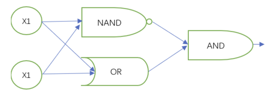
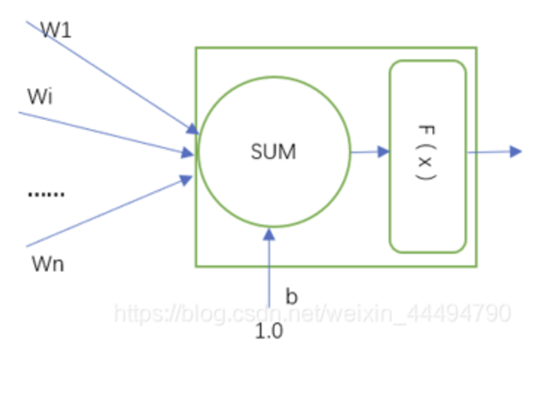
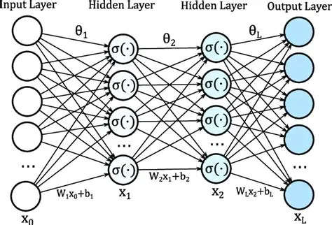

# 两层全连接神经网络

## 引言和前置知识

深度学习是机器学习最重要的子领域之一，而多层神经网络（Multilayer Neural Network，即Multilayer Perceptron, 简称MLP)又是深度学习中最基础最经典的网络结构。MLP由输入层，输出层以及多个隐藏层构成，而在隐藏层数定义为二的情况下我们便拥有的最基本的多层感知机形式，便是双层全连接神经网络。因此，为了对双层神经网络拥有更清晰深刻全面的认识，我们必须先了解多层神经网络的基本原理与信息传播过程。

<div align="center">
    
    <br>
    <div style="color:orange; border-bottom: 1px solid #d9d9d9;
    display: inline-block;
    color: #999;
    padding: 2px;">图1 感知机原理示意图</div>
</div>

在以往对KNN算法的前置介绍中，我们已经了解了对图片信息进行采样和量化的过程。以数学逻辑的方式模拟人脑间神经元之间的接受，加工，传递与保存的交互模式，则进一步构成了神经网络模型，使得学习与思考，解决问题的能力从生物抽象到机器神经元中。神经网络的起源便在于将生物的感官理解能力嵌入到机器结构中，让机器学习能够接受多个数据流信号并输出单一信号的感知机算法。

$$
z = w^T x + b = \sum_{i=1}^{n} w_i x_i + b
$$

$$
y = f(z) =
\begin{cases}
+1, & \text{if } z \ge 0 \\
-1, & \text{if } z < 0
\end{cases}
$$

感知机的基本功能在于将流信号处理成便于计算机操作的1/0信号。这在数学公式中体现为将数据的加权求和z与阈值进行对比并赋予1/0值，亦可以简化为sign函数。z求和公式中的w代表着不同节点的权重，一般会与相应输入数据的重要性呈正相关。

$$
w^T x + b = 0
$$

令z=0, 则方程本身表示着一个超平面，其中w是该平面的法向量，规定了平面的方向，而b是该平面的偏移量，规定了平面的位置。而感知机作为线性可分分类器，若缺乏偏移量b则要求分类分割面必须过原点，因此引入偏移量极大的解放了分类的灵活性和应用的广泛性。

神经元则在感知机的基础上引入了激活函数,使输出流的阈值更为多样化，更灵活地决定如何输出信号流。
<div align="center">
    
    <br>
    <div style="color:orange; border-bottom: 1px solid #d9d9d9;
    display: inline-block;
    color: #999;
    padding: 2px;">图2 机器学习神经元原理示意图</div>
</div>

```python
self.fc1 = LinearLayer(input_size, hidden_size, w1_scale)
self.relu = ReLU()
self.fc2 = LinearLayer(hidden_size, output_size, w2_scale)
self.softmax = Softmax()
self.loss_fn = CrossEntropyLoss()

self.params = {
    'W1': self.fc1.W,
    'b1': self.fc1.b,
    'W2': self.fc2.W,
    'b2': self.fc2.b
}
```

在这个例子中，我们在第一个全连接层fc1中采用了结构简单，较易于理解的ReLU函数作为第一隐藏层的非线性激活函数。当数据小于阈值0时全部输出0，否则输出原数据，即

$$
y=max(0,x)
$$

在搭建一个完整的神经网络过程中，我们还需要神经元之间传递信号的原理，将传递主体扩大到更为宏观的神经元层上。
<div align="center">
    
    <br>
    <div style="color:orange; border-bottom: 1px solid #d9d9d9;
    display: inline-block;
    color: #999;
    padding: 2px;">图3 完整的双层全连接神经网络</div>
</div>

假设数字化的输入信号为

$$
\begin{pmatrix}
x_1 \\
x_2
\end{pmatrix}
$$

而单一的输入结点全连接m个第n隐藏层的结点，则我们在第n隐藏层的权重矩阵为

$$
\begin{pmatrix}
w_{11}& w_{12} & ...w_{1m} \\
w_{21} & w_{22} & ....w_{2m} \\
\end{pmatrix}
$$

以及相应的偏置矩阵

$$
\begin{pmatrix}
b_1 & b_2 & ... \\
\end{pmatrix}
$$

则经过隐藏层后的第一个结点输出为W11*x1+W22*x2+...+b1，其余节点类比，再输入到下一个隐藏层。以此类推，最终会获得模型输出

$$
\begin{pmatrix}
y_1\\
y_2
\end{pmatrix}
$$

至此，我们已经了解了多层神经网络的基本原理，结构和信息流向，接下来我们可以详细的展开神经网络每一层的具体作用。

## 一、算法原理与网络架构

两层全连接神经网络（Two-Layer Net）在 Softmax 线性分类器（只有一层）的基础上，增加了一个**隐藏层 (Hidden Layer)** 和一个**非线性激活函数 (Non-linear Activation)**。

### 网络架构

我们的模型结构如下：
1.  **输入层 (Input Layer)**： $X$
2.  **全连接层 1 (FC1)**： $H_1 = XW_1 + b_1$
3.  **激活函数 (ReLU)**： $A_1 = \text{ReLU}(H_1)$
4.  **全连接层 2 (FC2)**： $S = A_1W_2 + b_2$ (输出最终的类别得分 Scores)
5.  **损失函数 (Loss)**： $L = \text{CrossEntropyLoss}(S, Y)$ (内部包含 Softmax)

### 符号与形状约定

为了清晰地将数学逻辑与代码对应起来，我们定义以下符号：
* $N$：批次大小 (batch size)，例如 `config['batch_size'] = 128`。
* $D_{in}$：输入特征维度 (Input Size)，例如 MNIST 为 784，CIFAR-10 为 3072。
* $H$：隐藏层大小 (Hidden Size)，例如 512。
* $C$：类别数 (Output Size)，例如 10。

**矩阵/向量形状：**
* 输入 $X \in \mathbb{R}^{N \times D_{in}}$
* 第一层权重 $W_1 \in \mathbb{R}^{D_{in} \times H}$
* 第一层偏置 $b_1 \in \mathbb{R}^{1 \times H}$
* 第一层输出 (pre-activation) $H_1 \in \mathbb{R}^{N \times H}$
* 第一层激活 (post-activation) $A_1 \in \mathbb{R}^{N \times H}$
* 第二层权重 $W_2 \in \mathbb{R}^{H \times C}$
* 第二层偏置 $b_2 \in \mathbb{R}^{1 \times C}$
* 输出得分 $S \in \mathbb{R}^{N \times C}$
* Softmax 概率 $P \in \mathbb{R}^{N \times C}$
* 真实标签 (One-hot) $Y \in \mathbb{R}^{N \times C}$
* 损失 $L \in \mathbb{R}$

## 输入层和预处理

### 预处理和数据增强

#### 数据预处理

在多层感知机及其他神经网络中，对第一个阶段输入层的输入数据的预处理是首要环节。由于输入层本质上是数值计算系统，因此在输入层前我们需要把数据转换成网络易于优化的数值形式。原始数据往往会出现量纲不一致（如表格中的两种元素数量级差异较大），范围过大或过小，以及含噪声或缺失值等一系列问题。因此，我们在preprocess代码文件中内置了数据预处理和数据增强函数。

针对数值范围过大影响梯度下降稳定性的问题，我们在preprocess_data数据预处理中将原始数据缩放到[0,1]区间：

```python
if standardize:
    mean = np.mean(x, axis=0)
    std = np.std(x, axis=0)
    x = (x - mean) / (std + 1e-8)
```

随后通过对每一个像素点独立计算$x' = \frac{x - \mu}{\sigma}$将数据标准化为均值为0，标准差为1的分布，在多层网络的梯度下降中加快收敛速度:

```python
if standardize:
    mean = np.mean(x, axis=0)
    std = np.std(x, axis=0)
    x = (x - mean) / (std + 1e-8)
```

最后再将多维图像转化为一维向量，便于全连接网络的输入:

```python
if x.ndim > 2:
    x = x.reshape(x.shape[0], -1)
```

至此便完成了对原始数据的预处理。

#### 数据增强

另外，我们还需要引入data_augmentation数据增强函数，在训练阶段人为扩增数据集，以提升模型对不同输入的泛化能力（即抗过拟合）。

```python
for x, y in zip(x_batch, y_batch):
    augmented_x.append(x)
    augmented_y.append(y)
```

这里我们在每一个batch中先保留原始样本数据。

```python
if len(x) == 3072:  # CIFAR-10形状
    x_reshaped = x.reshape(3, 32, 32).transpose(1, 2, 0)
    x_flipped = np.fliplr(x_reshaped).transpose(2, 0, 1).reshape(3072)
    augmented_x.append(x_flipped)
    augmented_y.append(y)
```

这里仅对 CIFAR-10 图像做水平翻转增强（MNIST 是灰度图，不需要）。如果原始 batch 有 128 张图片，则增强后约变成 256 张（包含原始 + 翻转样本）；这在训练阶段能显著提高模型的泛化能力。

### 输入层初始化

在神经网络中，每个神经元都有权重 w 和偏置 b,若将权重默认为0，则神经元计算结果没有差异，不存在学习过程，而若权重过大或过小则分别容易出现梯度爆炸或梯度消失的现象。

因此，在训练开始前，我们需要为这些参数赋一个初始值，这个过程称为参数初始化。因此，合理的初始化能让每层输入保持方差稳定，梯度在前后传播中不会过大或过小，且各个神经元的输出互不相同（打破对称性）。

以输入层为例：

$$
z_1 = w^T x_1 + b 
$$

我们希望：若输入 x1 的方差为 1；则输出z1方差也接近 1; 这样方差保持稳定，信号既不会爆炸，也不会消失。

这里我们对输入层进行相关定义，并用激活函数为ReLU的He初始化保持前向传播方差稳定。

```python
def __init__(self, input_size, hidden_size, output_size):
    ...
    w1_scale = np.sqrt(2.0 / input_size) 
```

输入层在这里进一步起到了判断输入数据合理性的作用，为整个神经网络的稳定性打下基础。

## 二、核心模块与代码实现

本项目严格遵循软件工程规范，将不同职责的代码分离到独立模块中。

### 项目结构

```
.
├── data/
│   ├── load_cifar.py       # 加载(和下载)CIFAR-10数据
│   ├── load_mnist.py       # 加载本地Fashion-MNIST/MNIST数据
│   └── preprocess.py     # 数据预处理与增强
│
├── src/
│   ├── layers/
│   │   ├── activation.py   # ReLU 和 Softmax 激活
│   │   └── linear.py       # 全连接层 (LinearLayer)
│   │
│   ├── utils/
│   │   ├── loss.py         # 交叉熵损失 (CrossEntropyLoss)
│   │   └── optimizer.py    # Adam 优化器
│   │
│   └── models/
│       └── two_layer_net.py  # 两层网络的核心类
│
└── main.py                 # 训练和评估的主入口
```

### 权重初始化

在 `two_layer_net.py` 中，我们吸取了教训，不再使用简单的 `np.random.randn`。
* **FC1 (接ReLU)**: 使用 **He 初始化**。$\text{scale} = \sqrt{2.0 / D_{in}}$
* **FC2 (接Softmax)**: 使用 **Xavier 初始化**。$\text{scale} = \sqrt{1.0 / H}$

```python
# src/models/two_layer_net.py
class TwoLayerFullyConnectedNet:
    def __init__(self, input_size, hidden_size, output_size):
        # ...
        # 第一层：使用He初始化
        w1_scale = np.sqrt(2.0 / input_size)
        # 第二层：使用Xavier初始化
        w2_scale = np.sqrt(1.0 / hidden_size)
        
        # 注意：这里的w1_scale和w2_scale被传入
        self.fc1 = LinearLayer(input_size, hidden_size, w1_scale)
        self.relu = ReLU()
        self.fc2 = LinearLayer(hidden_size, output_size, w2_scale)
        # ...
```

## 隐藏层

### 前向传播

前向传播起着数据从输入层流向输出层，逐层计算并传播，最终得到预测值的作用。具体过程则可划分为为输入数据经过第一层权重和偏置的线性变换，通过激活函数（如Sigmoid、ReLU）引入非线性，其输出作为第二层的输入，再次进行线性变换，最终在输出层（如使用Softmax）得到预测结果。

前向传播严格按照架构定义，将数据逐层传递。

$$
X \xrightarrow{\text{FC1}} H_1 \xrightarrow{\text{ReLU}} A_1 \xrightarrow{\text{FC2}} S \xrightarrow{\text{Loss}} L
$$

```python
# src/models/two_layer_net.py
def forward(self, x):
    # H_1 = XW_1 + b_1
    h1 = self.fc1.forward(x)
    # A_1 = ReLU(H_1)
    a1 = self.relu.forward(h1)
    # S = A_1 * W_2 + b_2
    scores = self.fc2.forward(a1)
    return scores

def train_step(self, x_batch, y_batch, optimizer):
    # 1. 前向传播
    scores = self.forward(x_batch)
    
    # 2. 计算损失
    loss = self.loss_fn.forward(scores, y_batch)
    
    # ... (反向传播)
```

在神经网络中，前向传播是从输入层出发，一层层计算输出的基本过程。结合先前定义可得出这一过程的信息流示意图:

```
输入 x
  ↓  (线性变换)
[全连接层 fc1] ————→ h1 = W1x + b1
  ↓  (激活函数)
[ReLU] ————————→ a1 = max(0, h1)
  ↓  (线性变换)
[全连接层 fc2] ————→ scores = W2a1 + b2
  ↓
输出 scores
```

这个流程的最终输出是输出层的未归一化结果。这样以来，前向传播的意义在于它是网络进行"推理"或"预测"的过程；其最终输出的预测值与真实标签之间的差异（由损失函数衡量）直接反映了模型当前参数下的性能好坏，为反向传播提供了计算依据。

在训练阶段，forward() 前向传播函数计算出的 scores 会传给Softmax 函数将 scores 转换为概率分布；同时也会传播给CrossEntropyLoss，与真实标签对比，计算损失。

### 反向传播

神经网络的完整闭环由"评估"和"学习"构成，而反向传播是神经网络学习的关键步骤。它的任务是根据损失函数的导数，反向计算各层参数的梯度，然后由优化器据此更新权重。

这是本章的核心。我们使用链式法则，将损失 $L$ 的梯度从后向前逐层计算。

**Step 1: 损失 -> 得分 (Scores)**
我们从 `CrossEntropyLoss` 的 `backward()` 开始。
* **数学原理**: Softmax 与交叉熵结合的导数有一个简洁的形式：$\frac{\partial L}{\partial S} = P - Y$ (其中 $P$ 是 Softmax 概率， $Y$ 是 one-hot 标签)。
* **代码实现**: `dscores = (probs - labels_one_hot) / batch_size`。
* **在 `train_step` 中调用**: `dscores = self.loss_fn.backward()`。

**Step 2: FC2 ( $S \leftarrow A_1$ )**
梯度 `dscores` (即 $\frac{\partial L}{\partial S}$) 进入 `fc2` 层。我们需要计算 $\frac{\partial L}{\partial W_2}$, $\frac{\partial L}{\partial b_2}$ 以及传给上一层的梯度 $\frac{\partial L}{\partial A_1}$。
* **数学原理**:
    * $S = A_1 W_2 + b_2$
    * $\frac{\partial L}{\partial W_2} = A_1^T \cdot \frac{\partial L}{\partial S} = A_1^T \cdot dscores$
    * $\frac{\partial L}{\partial b_2} = \sum \frac{\partial L}{\partial S} = \sum dscores$
    * $\frac{\partial L}{\partial A_1} = \frac{\partial L}{\partial S} \cdot W_2^T = dscores \cdot W_2^T$
* **代码实现**: `da1, dW2, db2 = self.fc2.backward(dscores)`。

**Step 3: ReLU ( $A_1 \leftarrow H_1$ )**
梯度 `da1` (即 $\frac{\partial L}{\partial A_1}$) 进入 `relu` 层。
* **数学原理**:
    * $A_1 = \max(0, H_1)$
    * ReLU的导数是阶跃函数：$\frac{\partial A_1}{\partial H_1} = \mathbb{I}(H_1 > 0)$ (即 $H_1 > 0$ 时为1，否则为0)。
    * $\frac{\partial L}{\partial H_1} = \frac{\partial L}{\partial A_1} \cdot \frac{\partial A_1}{\partial H_1} = da1 \cdot \mathbb{I}(H_1 > 0)$
* **代码实现**: `dh1 = self.relu.backward(da1)`。`dx = dout * (x > 0)`。

**Step 4: FC1 ( $H_1 \leftarrow X$ )**
梯度 `dh1` (即 $\frac{\partial L}{\partial H_1}$) 进入 `fc1` 层。我们需要计算 $\frac{\partial L}{\partial W_1}$ 和 $\frac{\partial L}{\partial b_1}$。
* **数学原理**:
    * $H_1 = X W_1 + b_1$
    * $\frac{\partial L}{\partial W_1} = X^T \cdot \frac{\partial L}{\partial H_1} = X^T \cdot dh1$
    * $\frac{\partial L}{\partial b_1} = \sum \frac{\partial L}{\partial H_1} = \sum dh1$
* **代码实现**: `dx, dW1, db1 = self.fc1.backward(dh1)`。

**`backward` 函数总览：**
```python
# src/models/two_layer_net.py
def backward(self, dscores):
    # Step 2: FC2
    da1, dW2, db2 = self.fc2.backward(dscores)
    # Step 3: ReLU
    dh1 = self.relu.backward(da1)
    # Step 4: FC1
    dx, dW1, db1 = self.fc1.backward(dh1)
    
    grads = {
        'W1': dW1, 'b1': db1,
        'W2': dW2, 'b2': db2
    }
    return grads
```

代码中的da1, dW2和db2负责在输出层计算输出梯度:

$$
\frac{\partial L}{\partial W_2} = a_1^T \frac{\partial L}{\partial \text{scores}}
$$

$$
\frac{\partial L}{\partial b_2} = \sum_i \frac{\partial L}{\partial \text{scores}_i}
$$

$$
\frac{\partial L}{\partial a_1} = \frac{\partial L}{\partial \text{scores}} W_2^T
$$

即在神经网络中，损失函数对输出层参数（如权重w1和偏置b1)以及输入激活 a1的偏导数。这一数据描述了损失变化对输出层参数变化的敏感程度，是使误差变小的输出层参数改动的重要参考，也是反向传播的起点。在分类过程中，输出梯度往往代表着预测分布与真实分布之间的差距。

反向传播接下来经过ReLU激活层梯度和输入层梯度信号倒流至前一层，汇总在grads字典中，方便优化器统一更新,形成完整的梯度流动过程:

```
损失 L
  ↑
[Softmax + Loss]
  ↑
dscores = ∂L/∂scores
  ↑
[fc2: W2, b2]
  ↑
da1 = ∂L/∂a1
  ↑
[ReLU]
  ↑
dh1 = ∂L/∂h1
  ↑
[fc1: W1, b1]
  ↑
dx = ∂L/∂x
```

这样，误差就以链式法则为核心从输出层反向流回输入层。它首先计算损失函数对输出层权重的梯度，然后将该误差归因地逐层反向传递，分别计算损失函数对每一层权重和偏置的梯度。

经过以上流程，反向传播的过程回答了"每个参数对总误差应负多少责任"的关键问题。通过计算出的梯度，优化器（如SGD）可以沿着梯度反方向更新每一层的权重和偏置，从而最小化损失函数。这是神经网络能够从数据中"学习"的根本机制。

不难看出，前向传播是模型的"评估"阶段，负责计算当前能力；反向传播是模型的"学习"阶段，负责根据评估结果指导参数优化。两者交替进行，共同驱动神经网络通过迭代逐步逼近最优解，实现对复杂函数的拟合。

## 模型迭代

### Train_Step 函数原理与实现

在神经网络的训练过程中，`train_step()` 函数承担着模型参数迭代优化与误差最小化的核心任务。该函数实现了单个小批量样本（mini-batch）的完整训练周期，主要包括四个阶段：前向传播（Forward Propagation）、损失计算（Loss Computation）、反向传播（Backward Propagation）以及参数更新（Parameter Update）。

```python
def train_step(self, x_batch, y_batch, optimizer):
    scores = self.forward(x_batch)
    loss = self.loss_fn.forward(scores, y_batch)
    dscores = self.loss_fn.backward()
    grads = self.backward(dscores)
    
    # 梯度裁剪，防止梯度爆炸
    grads = self._clip_gradients(grads, max_norm=5.0)
    
    self.params = optimizer.update(self.params, grads)
    self._update_layer_params()
    
    return loss
```

首先，在前向传播阶段，模型接收输入批次 $x_{\text{batch}}$，并依次通过各层的线性变换与非线性激活函数进行映射，最终得到输出结果 $\text{scores}$。随后，通过损失函数（例如交叉熵损失，Cross-Entropy Loss）计算预测结果与真实标签 $y_{\text{batch}}$ 之间的差异，得到当前批次的损失值 $L$，用于量化模型预测误差的大小。

$$
L = \text{Loss}(\hat{y}, y) = -\sum_i y_i \log(\hat{y}_i)
$$

在反向传播阶段，模型根据损失函数对输出层得分 $\text{scores}$ 的偏导数 $\frac{\partial L}{\partial \text{scores}}$ 逐层传播误差信号，计算各可学习参数（权重 $W$ 与偏置 $b$）的梯度。该过程遵循链式法则（Chain Rule），即每一层的梯度依赖于后一层的梯度及本层的激活函数导数。

为了防止深层网络训练过程中出现梯度爆炸（Gradient Explosion）等数值不稳定问题，`train_step()` 函数在参数更新前引入了梯度裁剪（Gradient Clipping）机制。当总体梯度范数超过设定阈值 $\text{max\_norm}$ 时，对梯度向量进行等比例缩放：

$$
g \leftarrow g \cdot \frac{\text{max\_norm}}{\|g\| + \varepsilon}
$$

该操作可有效限制参数更新步长，从而提升训练的稳定性。

随后，优化器（例如 Adam 或 SGD）根据学习率 $\eta$ 与计算得到的梯度值对参数进行迭代更新，实现参数在梯度方向上的优化。以随机梯度下降法（SGD）为例，其更新公式为：

$$
W \leftarrow W - \eta \frac{\partial L}{\partial W}
$$

其中，$\eta$ 表示学习率，$\frac{\partial L}{\partial W}$ 为损失函数对参数的梯度。

完成参数更新后，更新后的权重与偏置将被同步至各层结构中，以保证下一次迭代时模型使用最新的参数。如流程图所示，最终获得损失值。

```
输入 (x_batch, y_batch)
        │
        ▼
   [前向传播] ──> 预测 scores
        │
        ▼
   [计算损失] ──> loss = CrossEntropy(scores, y)
        │
        ▼
   [反向传播] ──> grads = ∂L/∂W
        │
        ▼
   [梯度裁剪] ──> 限制梯度范围
        │
        ▼
   [参数更新] ──> optimizer.update(params, grads)
        │
        ▼
   [返回损失值 loss]
```

综上所述，训练迭代函数作为神经网络训练过程中的核心优化单元，实现了从前向传播到参数更新的完整学习循环。该函数在每次迭代中完成"预测—评估—修正"的反馈机制，使模型能够不断减小预测误差，逐步提升在训练集与测试集上的泛化性能。

### 优化器与梯度裁剪

* **梯度裁剪**: 在 `train_step` 中，我们增加了梯度裁剪，防止梯度过大导致训练不稳定（梯度爆炸）。
    ```python
    grads = self._clip_gradients(grads, max_norm=5.0)
    ```
* **Adam 优化器**: 我们使用更高级的 `AdamOptimizer`，它结合了动量和 RMSProp 的优点，能更快、更稳定地收敛。
    ```python
    self.params = optimizer.update(self.params, grads)
    ```

## 梯度裁剪

在神经网络的训练过程中，梯度的数值规模对模型的稳定性具有重要影响。对于深层网络或循环神经网络（RNN）而言，梯度在反向传播中可能会出现指数级增长的现象，即所谓的梯度爆炸（Gradient Explosion）。该问题会导致参数更新步长过大，从而引起训练过程发散或损失值震荡。为缓解这一问题，本研究在模型训练中引入了梯度裁剪（Gradient Clipping）机制，其核心思想是限制整体梯度向量的范数，使其不超过预设阈值 $\text{max\_norm}$。

梯度裁剪函数的实现如下所示：

```python
def _clip_gradients(self, grads, max_norm=5.0):
    """梯度裁剪"""
    total_norm = 0
    for grad in grads.values():
        total_norm += np.sum(grad ** 2)
    total_norm = np.sqrt(total_norm)
    
    if total_norm > max_norm:
        clip_coef = max_norm / (total_norm + 1e-6)
        for key in grads:
            grads[key] *= clip_coef
                
    return grads
```

如上所示，函数首先计算所有梯度张量的平方和，并取平方根得到全局梯度的二范数（L2 norm）：

$$
\|g\| = \sqrt{\sum_i g_i^2}
$$

若该范数超过设定阈值 $\text{max\_norm}$，则计算缩放系数（clipping coefficient）：

$$
\text{clip\_coef} = \frac{\text{max\_norm}}{\|g\| + \varepsilon}
$$

并对所有梯度执行等比例缩放：
$$
g_i \leftarrow g_i \times \text{clip\_coef}
$$

其中，$\varepsilon$ 为防止除零错误的微小常数。

通过上述操作，可以保证所有梯度的全局范数满足：
$$
\|g\| \leq \text{max\_norm}
$$

该约束有效地抑制了反向传播过程中的梯度爆炸，从而防止参数更新过快导致的训练不稳定现象。此外，梯度裁剪还可间接提升优化器（如 Adam、RMSProp）在早期训练阶段的收敛性，使模型在较大学习率下仍能保持平稳收敛。

综上，梯度裁剪机制在深度网络训练中起到了重要的数值稳定化作用，其数学实质是对梯度向量施加一个球形约束（spherical constraint），即将其限制在半径为 $\text{max\_norm}$ 的超球体内。这一策略在防止训练发散、加速收敛及提高模型鲁棒性方面均具有显著效果。

## 输出预测值

在模型训练完成后，需要利用训练得到的参数对未知样本进行预测。为此，本研究实现了神经网络的预测函数 `predict()`，用于在推理阶段根据输入数据输出对应的类别标签。该函数的主要实现如下所示：

```python
def predict(self, x):
    scores = self.forward(x)
    probs = self.softmax.forward(scores)
    return np.argmax(probs, axis=1)
```

该函数首先调用 `forward()` 方法对输入样本 $x$ 进行前向传播，得到每个类别的未归一化得分向量 $\text{scores}$。该向量的计算过程可表示为：

$$
\text{scores} = W_2 \, f(W_1 x + b_1) + b_2
$$

其中，$f(\cdot)$ 表示隐藏层激活函数（例如 ReLU），$W_1, W_2$ 分别为第一层与第二层的权重矩阵，$b_1, b_2$ 为对应偏置项。

随后，模型通过 Softmax 函数将得分向量转换为概率分布，以确保所有类别的概率值非负且总和为 1：
$$
p_i = \frac{e^{\text{scores}_i}}{\sum_j e^{\text{scores}_j}}
$$

其中，$p_i$ 表示样本属于第 $i$ 类的预测概率。

最终，函数通过取概率最大值对应的索引（即 `np.argmax(probs, axis=1)`）作为预测类别标签：
$$
\hat{y} = \arg \max_i p_i
$$

综上，`predict()` 函数的数学表达式可概括为：
$$
\hat{y} = \arg \max
$$

该过程完整地实现了从输入特征向量到输出预测类别的映射，是模型在测试阶段进行分类决策的核心步骤。通过引入 Softmax 层，模型不仅可以输出最终预测标签，还能提供各类别的概率估计，从而支持置信度分析与多类别概率推理。

## 实验与结果分析

### 实验一：MNIST (Fashion-MNIST)
<div align="center">
    
    <br>
    <div style="color:orange; border-bottom: 1px solid #d9d9d9;
    display: inline-block;
    color: #999;
    padding: 2px;"></div>
</div>


-   **配置**: 隐藏层 256, 学习率 0.001, 10 Epochs, Batch 128。
-   **训练日志**:
    
        Epoch 1/10 完成:
          Loss: 0.5384, Train Acc: 0.8402, Test Acc: 0.8255
        ...
        Epoch 5/10 完成:
          Loss: 0.3007, Train Acc: 0.8980, Test Acc: 0.8815
        ...
        Epoch 10/10 完成:
          Loss: 0.2434, Train Acc: 0.9078, Test Acc: 0.8835
          最佳测试准确率: 0.8885
        
    
-   **最终准确率**:
    -   全量训练集准确率: **90.77%**
    -   全量测试集准确率: **87.54%**

### 实验二：CIFAR-10
<div align="center">
    
    <br>
    <div style="color:orange; border-bottom: 1px solid #d9d9d9;
    display: inline-block;
    color: #999;
    padding: 2px;"></div>
</div>


-   **配置**: 隐藏层 512, 学习率 0.001, 20 Epochs, Batch 128, 数据增强。
-   **训练日志**:
    
        Epoch 1/20 完成:
          Loss: 1.8634, Train Acc: 0.4740, Test Acc: 0.4600
        ...
        Epoch 10/20 完成:
          Loss: 1.1722, Train Acc: 0.6620, Test Acc: 0.5350
        ...
        Epoch 20/20 完成:
          Loss: 0.9259, Train Acc: 0.7750, Test Acc: 0.5170
          最佳测试准确率: 0.5560
        
    
-   **最终准确率**:
    -   全量训练集准确率: **75.54%**
    -   全量测试集准确率: **53.05%**

### 结果分析
<div align="center">
    
    <br>
    <div style="color:orange; border-bottom: 1px solid #d9d9d9;
    display: inline-block;
    color: #999;
    padding: 2px;"></div>
</div>


1.  **非线性的威力**: 在 MNIST/Fashion-MNIST 上，两层网络的准确率（约 87.5%）显著高于上一章的 Softmax 线性分类器。这证明了 `ReLU` 激活函数和隐藏层的加入，使模型能够学习数据中更复杂的非线性模式。
    
2.  **模型的局限 (过拟合)**: 在 CIFAR-10 上，两层网络的测试集准确率（约 53%）远不如 MNIST。更重要的是，训练集准确率（75.54%）远高于测试集准确率（53.05%），显示出**严重的过拟合**。
    
3.  **数据集特性对性能的影响**
    

**数据复杂度：**

-   MNIST：28×28 灰度图（784 维），类别为手写数字（特征简单、差异明显，如 "0" 和 "1" 形状区分度高）。
-   CIFAR-10：32×32 RGB 彩色图（3072 维），类别为自然图像（如飞机、猫、汽车等，特征复杂且易混淆）。

结论：简单数据（MNIST）更适合用浅层网络（如两层全连接）学习，而复杂数据（CIFAR-10）需要更强的特征提取能力。

**维度与冗余信息：**

-   CIFAR-10 的 3072 维包含大量冗余（如背景像素），全连接网络难以捕捉局部空间特征（如图像边缘、纹理），而 MNIST 的 784 维信息更紧凑，冗余少。
-   MNIST 数据更简单，训练效率更高，导致收敛速度更快。
-   模型对CIFAR-10 泛化能力差，导致训练 vs 测试准确率差距35%（严重过拟合）

5.  **问题分析**: 全连接网络在处理图像时，将 32x32x3 的图像展平为 3072 维向量。这**完全破坏了图像的空间结构**（例如，哪些像素是相邻的）。模型试图用巨大的 W1W\_1W1​ (3072×5123072 \\times 5123072×512) 矩阵来"记住"这些模式，导致了过拟合。

## 总结与启示

1.  **数据集复杂度决定模型选择：**
    
    -   简单图像任务（如 MNIST）：浅层网络（全连接）即可取得较好效果。
    -   复杂图像任务（如 CIFAR-10）：需使用卷积神经网络（CNN），其通过卷积层捕捉局部特征，池化层降低维度，更适合处理高维图像。
2.  **过拟合与数据特性强相关：**
    
    -   数据维度高、特征复杂时，简单模型易过拟合（如 CIFAR-10），需增加正则化（Dropout、L2）或数据增强。
    -   数据简单、特征明确时，模型泛化能力更好（如 MNIST）。
3.  **性能差距的本质：**
    
    -   33.5% 的准确率差异并非模型能力不足，而是全连接网络的结构特性（忽略空间相关性）与 CIFAR-10 的需求不匹配。
    -   若要提升 CIFAR-10 的性能，建议改用 CNN 架构（如 LeNet、ResNet），而 MNIST 的结果已验证两层全连接网络对简单图像任务的有效性。

学习双层全连接神经网络是从机器学习踏入深度学习子领域的基石，其意义在于深刻揭示神经网络最核心的工作机制。它完美地展示了模型如何通过"线性变换"与"非线性激活"的简单叠加，实现从原始输入到抽象特征的转换。理解其前向传播如何逐步计算得到预测结果，以及反向传播如何利用链式法则将误差梯度层层回传以更新权重，是掌握所有复杂神经网络（如CNN、RNN）的启蒙课。它让我们从本质上明白，深度学习并非神秘的黑箱，而是建立在严谨的数学计算和误差反馈优化之上。
<div align="center">
    
    <br>
    <div style="color:orange; border-bottom: 1px solid #d9d9d9;
    display: inline-block;
    color: #999;
    padding: 2px;">图4 如今多层神经网络在计算机视觉方面的广泛应用</div>
</div>


不仅如此，双层全连接神经网络是进一步理解"层次化特征学习"这一深度学习核心思想的微型实验室。第一层网络学习到的是相对底层的局部特征，而第二层则将这些底层特征组合成更复杂、更具判别性的高级特征。这个从简单到复杂的特征抽象过程，是所有深层网络强大表征能力的源泉。通过这个简洁的模型，我们能够直观地洞见多层架构为何能克服线性模型的局限，并具备逼近任意复杂函数的强大能力，从而为后续探索更庞大、更专精的现代网络架构奠定了坚实的理论与实践基础！

本章中，我们成功地"手搓"了一个完整的两层全连接神经网络。通过引入 ReLU 激活函数，模型摆脱了线性限制，展现了更强的拟合能力。

然而，CIFAR-10 上的实验有力地证明了全连接网络的根本缺陷：**它无法理解空间结构**。将图像展平处理，使其对平移、缩放等变换非常敏感，且极易过拟合。

这一局限性为我们的下一个模型——**卷积神经网络 (CNN)**——提供了充分的动机。

