## 卷积神经网络（CNN）
### 序言
书接上回，在上一章节，我们构建了全连接神经网络。但是，全连接网络由于都是“全连接”方式，所以$𝑤$和$𝑏$参数格外的多，这就使得训练过程中说要更新的参数权重非常多，整个网络训练的收敛会非常慢。于是本节继续构建卷积神经网络来解决这一问题。
#### CNN介绍
卷积神经网络的核心机制的灵感来源于动物的视觉系统：
1962 年，Hubel 和 Wiesel 通过猫的视觉皮层实验发现：1.视觉皮层的神经元只对局部区域的刺激响应（对应局部感受野）；2.不同神经元对不同方向的边缘、纹理等特征敏感（对应层级特征提取）；3.同类特征的检测机制可复用（对应权值共享）。
卷积神经网络（convolutional neural network, CNN）是一种专门用来处理具有类似网格结构的数据的神经网络。卷积网络是指那些至少在网络的一层中使用卷积运算来替代一般的矩阵乘法运算的神经网络。卷积网络通过一系列方法，成功将数据量庞大的图像识别问题不断降维，最终使其能够被训练。卷积神经网络是深度学习的核心架构之一，专门针对网格结构数据（如图像、语音、文本）设计，其核心优势是如下三大机制：
* 局部连接：每个神经元不再和上一层的所有神经元相连，而只和一小部分神经元相连。这样就减少了很多参数。
* 权值共享：一组连接可以共享同一个卷积核权重，而不是每个连接有一个不同的权重，这样又减少了很多参数。
* 下采样：对卷积层输出（如特征图）进行降维处理，通过聚合局部区域信息，减少空间尺寸（高度和宽度），同时保留关键特征。

这些操作高效提取了数据的层级特征，同时大幅减少模型参数。


#### CNN具体结构分析
一个完整的CNN一般有输入层，输入图片数据等；接下来是卷积层用来提取特征；然后是池化层来降低尺寸；最后是全连接层计算输出。下面将具体分析这几个部分。
##### 1.输入层(Input layer)
在这里把原始图像送进网络，通常进行预处理（归一化、减均值、除以标准差、可选的数据增强如翻转/裁剪）。比如:设 $H$ , $W$ , $C$分别代表图像高度宽度和通道数，则输入的图像张量形状为： $X \in \mathbb{R}^{H \times W \times G}.$
可以用三维矩阵代表一张图片。三维矩阵的长和宽代表了图像的大小，而三维矩阵的深度代表了图像的色彩通道。比如黑白图片的深度为1，而在RGB色彩模式下，图像的深度为3。
<div align="center">
    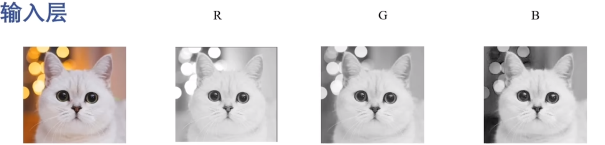
    <br>
    <em></em>
</div>

输入的时候就把对应图片的三个通道的矩阵进行输入即可。

<div align="center">
    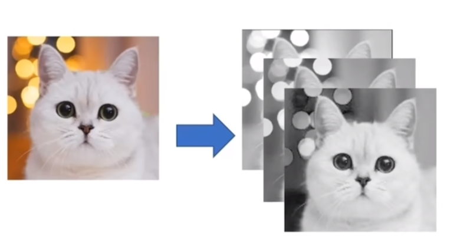
    <em></em>
</div>


##### 2.卷积层(Convolutional layer)
卷积层是 CNN 的核心，它的核心作用是用来**提取局部空间特征**（边缘、纹理、组合特征等）。

<div align="center">
    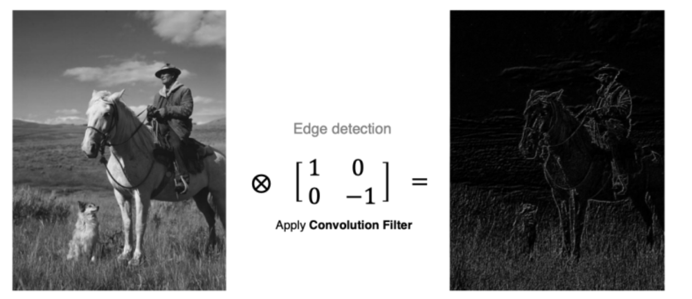
    <em>提取边缘特征示意图</em>
</div>

##### 卷积
卷积运算本质上就是在卷积核和输入数据的局部区域做点积.
<div align="center">
    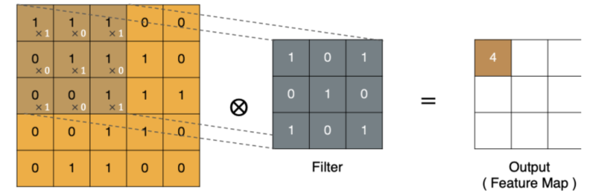
    <br>

</div>

<div align="center">
    
    <br>
    <em>卷积过程示意图</em>
</div>

从图中容易看到就是把卷积核“覆盖”到输入数据上，对应位置相乘再求和就得到输出矩阵左上角第一个值。
在上面的卷积过程中可以知道特征图比原始的图小了不少我们可以引入padding来保持不变。
<div align="center">
    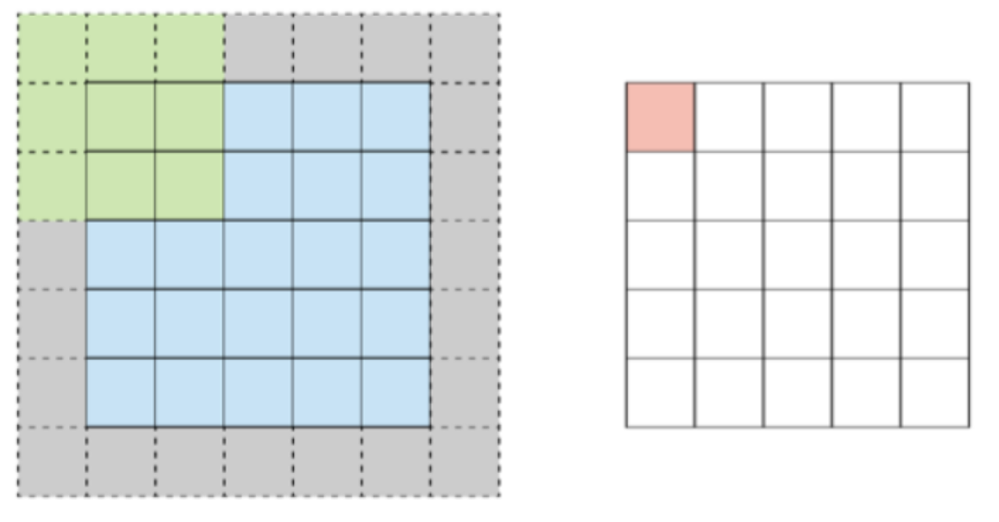
    <br>
    <em>padding＝1</em>
</div>
同时卷积过程还有一个步长（stride）的问题就是这个卷积核一次平移几个格子的问题。我们也可以对其进行设置。
<div align="center">
    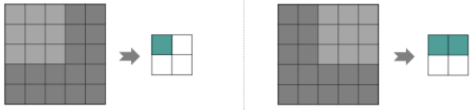
    <br>
    <em>stride＝2</em>
</div>

最后，还有两个问题。   
当图片多通道时怎么卷积？还有，需要提取多个特征值该怎么办？

答：我们对三个通道的矩阵都卷积后对应处的三处值求和即可（注意三个通道用的卷积核一样！）。同时当提取特征不止一个时，我们可以采取多个卷积核来实现分别提取。每个卷积核可以学习到不同特征。但是这时输出的特征图就有多个了。这两个问题的处理方式在下图中有很清晰的展示。

<div align="center">
    
    <br>
    <em>解决方法示意图</em>
</div>


下面进行实操环节！这里我以单通道（多通道就是在多个通道上累加即可）为例梳理整个过程计算便于理解。
设输入 $X$ 为二维，卷积核为 $W$ 大小为 $K×K$ ，偏置为 $b$ ，步幅为 $s$ ，填充为 $p$ 。则单个输出通道上的位置 $（i，j）$ 处输出为：

$$ Y[i,j] = \sum_{u=0}^{K-1} \sum_{v=0}^{K-1} \sum_{c=0}^{C-1} W[u,v,c] X[i\cdot s + u - p, j\cdot s + v - p, c] + b $$

那些越界的地方常常可选择按填充策略（常用零填充）处理。输出尺寸的公式如下：  

$$  H_{\text{out}} = \left\lfloor \frac{H + 2p - K}{s} \right\rfloor + 1, \quad W_{\text{out}} = \left\lfloor \frac{W + 2p - K}{s} \right\rfloor + 1. $$ 

可能你会对这长串的数字感到迷茫，下面我们具体举例来理解下其中奥秘。
我们输入一个５ｘ５矩阵来演示下：

$$  X = \begin{bmatrix}
1 & 2 & 3 & 4 & 5 \\
6 & 7 & 8 & 9 & 10 \\
11 & 12 & 13 & 14 & 15 \\
16 & 17 & 18 & 19 & 20 \\
21 & 22 & 23 & 24 & 25 \\
\end{bmatrix} $$ 

以及一个３×３的卷积核：

$$  W = \begin{bmatrix}
0 & 1 & 0 \\
1 & -4 & 1 \\
0 & 1 & 0 \\
\end{bmatrix}, \quad b = 0, \, s = 1, \, p = 0. $$ 

计算输出左上角位置 $（i，j）$对应 $X$ 的子块为：

$$  \begin{bmatrix}
1 & 2 & 3 \\
6 & 7 & 8 \\
11 & 12 & 13 \\
\end{bmatrix} $$ 

按照公式逐项计算：
- $1 \cdot 0 = 0$
- $2 \cdot 1 = 2$
- $3 \cdot 0 = 0$
- $6 \cdot 1 = 6$
- $7 \cdot (-4) = -28$
- $8 \cdot 1 = 8$
- $11 \cdot 0 = 0$
- $12 \cdot 1 = 12$
- $13 \cdot 0 = 0$
相加为０，所以输出位置值为０。其余位置计算类似，最终得到结果应为：

$$  \begin{bmatrix}
0 & 0 & 0 \\
0 & 0 & 0 \\
0 & 0 & 0 \\
\end{bmatrix} $$ 

（读者可以自行计算验证）

##### 3.池化层(Pooling layer)
池化层的主要作用是**通过减少特征图的尺寸来降低计算量**，并且可以提取出特征图的主要信息。它通常紧跟在卷积层之后，对卷积层输出的特征图进行下采样操作。下采样是一种减少数据维度的方法，可以有效地降低模型复杂度，提高模型的泛化能力。具体操作则是，基于局部相关性的思想，通过从局部相关的一组元素中进行采样或信息聚合，从而得到新的元素值。然而在cnn操作中通常要有多次池化操作，以实现尺寸缩减功能。
池化层的种类也有许多，一般有最大池化（Max Pooling）、平均池化（Average Pooling）以及全局池化（Global Pooling）等。下面将具体介绍。
我们先设设输入张量为 $X$ ，池化窗口大小为 $K_h\times K_w $ ，步幅 (stride) 为 $S$ ，填充为 $P$ 。

###### 1.最大池化（Max Pooling）
最大池化，选择每个区域（池化层的感受野）中的最大值作为输出。这种方法可以保留输入数据中最显著的特征，同时减少计算量。
<div align="center">
    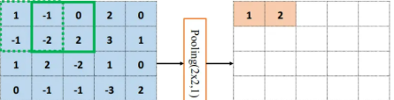
    <em></em>
</div>

<div align="center">
    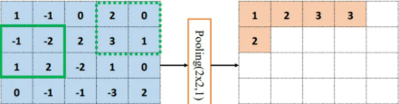
    <em>最大池化</em>
</div>
可以看到图片中的池化过程遵循如下计算规则：    

$$  Y_{i,j} = \max_{\substack{0 < m < K_h, \\ 0 < n < K_w}} X_{i \cdot s + m, j \cdot s + n} $$

通俗解释就是，绿色方框代表一个池化窗口，类似卷积过程也是把这个小窗口覆盖到图像矩阵上某一部分，这里直接取覆盖区域内数字的最大值顾名思义“最大池化”，接着就是把这个池化窗口向右拖动计算规则同上，到了边缘就换行继续重复第一行操作，这和卷积没什么两样,无非变化了计算规则。  

###### 2.平均池化（Average Pooling）
平均池化就是取每个区域（池化层的感受野）内的平均值作为输出。与最大池化相比，平均池化更加平滑，可以在一定程度上减少噪声。
相信你知道了最大池化的过程，平均池化的计算规则也能“以此类推”出来了吧！计算公式即：  

$$  Y_{i,j} = \frac{1}{K_h K_w} \sum_{m=0}^{K_h-1} \sum_{n=0}^{K_w-1} X_{i \cdot s + m, j \cdot s + n} $$


（当然这里都默认是零填充）
<div align="center">
    
    <em>平均池化</em>
</div>
显然就是对每个“绿色小框框”里的值求平均值作为输出，框中数字平均值应为-0.75，但是这里四舍五入取-1，是为了计算量减少，但是一般情况下为了保持精度，计算资源允许情况下都会保持原有的小数精确值。

###### 3.全局池化（Global Pooling）
全局池化，将整张特征图压缩成一个值，通常用于分类任务的最后一层。全局池化可以减少参数数量，提高模型的泛化性能。常见的全局池化包括全局最大池化（Global Max Pooling）和全局平均池化（Global Average Pooling）。
<div align="center">
    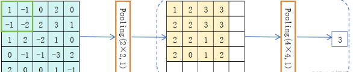
    <em>全局最大池化</em>
</div>

<div align="center">
    
    <em全局平均池化</em>
</div>
如图所见，全局最大池化或者平均池化计算方式无非就是把之前的“小窗”扩展到所谓的特征图“全局”，在“全局”上进行上述类似操作。全局最大池化或者平均池化都将每个通道的整个特征图缩减为一个值，这一般在分类任务最后一层才这么做。


##### 4.全连接层 (Fully Connected Layer)
上一节早已讨论过什么是全连接层，这里复习一下：全连接层由多个神经元组成，每个神经元都与前一层的所有神经元相连。因此，全连接层的参数数量通常很大，占整个网络参数的主要部分。每个神经元的输出可以表示为前一层神经元输出的加权和，再加上一个偏置项。然后，通过批量归一化和激活函数（如ReLU、Sigmoid等）对加权和进行非线性变换，以得到最终的输出。
<div align="center">
    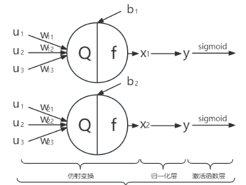
    <br>
    <em>全连接层示意图</em>
</div>


但是，全连接层在cnn中具体怎么用呢？
**答案是：全连接层的主要作用是对前面卷积层或池化层提取到的特征进行整合，并最终输出一个固定大小的向量。这个向量通常用于分类或回归任务的最终决策。通过全连接层的线性变换和激活函数，可以将前面层提取并降维的特征向量转换为一个更加抽象和高级的特征表示。**
<div align="center">
    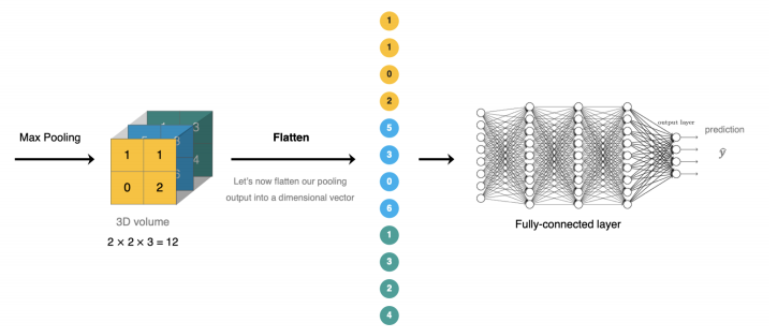
    <br>
    <em>CNN中全连接层工作示意图</em>
</div>

如图，容易发现在全连接层中会将特征图转换成⼀维向量送入到全连接层中进行分类或回归。
举个例子，假设我们经过了CNN多次卷积和池化后，得到了4×4×16的特征图。现在我们要这16个矩阵先展平为一维向量.也就是一共4×4×16=256个元素。
我们得到最终向量结构就是：[特征图1的16个像素, 特征图2的16个像素, ..., 特征图16的16个像素]。然后输入到FC1层中计算，假设有128个神经元。先定义一些变量：  

- 输入向量: $\mathbf{x}\in\mathbb{R}^{256\times 1}$  
- 权重矩阵: $\mathbf{W}_1\in\mathbb{R}^{128\times 256}$  
- 偏置向量: $\mathbf{b}_1\in\mathbb{R}^{128\times 1}$
- 输出向量: $\mathbf{z}_1\in\mathbb{R}^{128\times 1}$    

前向传播公式：

$$\mathbf{z}_1=\mathbf{W}_1\mathbf{x}+\mathbf{b}_1$$  

简化起见这里演示FC1层中第一个神经元的输出计算流程。
我们给出一些具体数值（数值都为假设的意在熟悉过程）来展示：

$$ 
\mathbf{x} = \begin{bmatrix}
0.8 \\
0.2 \\
-0.5 \\
0.3 \\
\vdots \\
0.1
\end{bmatrix}_{256 \times 1}
$$ 

$$ 
\mathbf{W}_1 = \begin{bmatrix}
0.1 & 0.2 & -0.3 & 0.4 & \cdots & 0.05 \\
-0.2 & 0.3 & 0.1 & -0.1 & \cdots & 0.2 \\
0.05 & -0.1 & 0.2 & 0.3 & \cdots & -0.05 \\
\vdots & \vdots & \vdots & \vdots & \ddots & \vdots
\end{bmatrix}_{128 \times 256}
$$ 

$$ 
\mathbf{b}_1 = \begin{bmatrix}
0.1 \\
-0.2 \\
0.05 \\
\vdots \\
0.3
\end{bmatrix}_{128 \times 1}
$$ 

然后带入计算公式得到第一个神经元输出：  

$$z_1^{(1)} = \sum_{j=1}^{256} W_1^{(1,j)} \cdot x_j + b_1^{(1)}$$  

$$ 
\begin{align*}
z_1^{(1)} &= (0.1 \times 0.8) + (0.2 \times 0.2) + (-0.3 \times -0.5) + (0.4 \times 0.3) + \cdots + (0.05 \times 0.1) + 0.1 \\
&= 0.08 + 0.04 + 0.15 + 0.12 + \cdots + 0.005 + 0.1
\end{align*}
$$   
并且假设最后的值为：  $ z_1^{(1)} = 1.25 $  
然后应用激活函数ReLU:  $$  a_1^{(1)} = \text{ReLU}(z_1^{(1)}) = \max(0, 1.25) = 1.25 $$   

对全连接层（FC1）的所有128个神经元重复此过程，假设激活后的输出向量为： 

$$ 
\mathbf{a}_1 = \text{ReLU}(\mathbf{z}_1) = \begin{bmatrix}
1.25 \\
0 \\
0.8 \\
\vdots \\
0.3
\end{bmatrix}_{128 \times 1}
$$ 

接着转到FC2层,对第二个全连接层FC2的详细计算如下：

依旧设定：
- 输入：  $\mathbf{a}_1\in\mathbb{R}^{128\times1}$ （来自FC1的输出）   
- 权重矩阵： $\mathbf{W}_2\in\mathbb{R}^{64\times128}$  
- 偏置向量： $\mathbf{b}_2\in\mathbb{R}^{64\times1}$  
- 输出： $\mathbf{z}_2\in\mathbb{R}^{64\times1}$      


$$\mathbf{z}_2 = \mathbf{W}_2 \mathbf{a}_1 + \mathbf{b}_2 $$

以FC2的第一个神经元为例：  

$$z_2^{(1)} = \sum_{j=1}^{128} W_2^{(1,j)} \cdot a_1^{(j)} + b_2^{(1)} $$

（由于FC1的第二个神经元输出为0，对应的权重 $ W_2^{(1,2)} $ 对结果无贡献）
假设计算结果：  
$z_2^{(1)} = 0.75 $

$$a_2^{(1)} = \text{ReLU}(0.75) = 0.75 $$

对FC2的所有64个神经元重复上述过程，最终激活输出:  $\mathbf {a}_2 = \text{ReLU}(\mathbf{z}_2) $   

接着就是到我们的输出层了，为了具象化意义假设我们是10分类问题（如手写数字识别0-9），输出层有10个神经元。
定义：  
- 输入：  $\mathbf{a}_2/in\mathbb{R}^{64\times1}$  （来自FC2的输出）
- 权重矩阵： $\mathbf{W}_3\in\mathbb{R}^{10\times64}$  
- 偏置向量： $\mathbf{b}_3\in\mathbb{R}^{10\times1}$
- 原始得分： $\mathbf{z}_3\in\mathbb{R}^{10\times1}$

$$\mathbf{z}_3=\mathbf{W}_3\mathbf{a}_2+\mathbf{b}_3$$


假设原始得分向量：  

$$\mathbf{z}_3=\begin{bmatrix} 2.1 \\ -0.5 \\ 1.8 \\ 0.3 \\ 3.2 \\ -1.1 \\ 0.7 \\ 1.2 \\ 0.9\\ 2.5 \end{bmatrix}$$ 

用Softmax转换（将原始得分转为概率分布）  
Softmax公式如下：  

$$ P(\text{class} i) = \frac{e^{z_3^{(i)}}}{\sum_{j=1}^{10} e^{z_3^{(j)}}}$$  

计算过程：  
1.计算指数：  
   $e^{2.1}≈8.17$ ,  $e^{-0.5}\approx0.61$ , $e^{1.8}\approx6.05$， $e^{0.3}\approx1.35$    
   $e^{3.2}\approx24.53$ , $e^{-1.1}\approx0.33$ , $e^{0.7}\approx2.01$ , $e^{1.2}\approx3.32$   
   $e^{0.9}\approx2.46$  , $e^{2.5}\approx12.18$  

2.计算分母（所有指数和）：  

   $$ \text{sum} = 8.17 + 0.61 + 6.05 + 1.35 + 24.53 + 0.33 + 2.01 + 3.32 + 2.46 + 12.18 = 65.01 $$  

3.计算每个类别的概率：  
类0： 

$$ P(\text{class } 0) = \frac{8.17}{65.01} ≈ 0.126 $$    

类4： 

$$ P(\text{class} 4) = \frac{24.53}{65.01} ≈ 0.377 $$ 

（最高概率，对应数字“4”）


最终输出概率:      
  
$$\mathbf{p} = [0.126, 0.009, 0.093, 0.021, 0.377, 0.005, 0.031, 0.051, 0.038, 0.187] $$  

意义：网络预测为数字“4”（概率最高，约37.7%）。

通过以上举例不难得知全连接层在CNN中的作用，可以概括为五点：
1.展平操作: 将卷积层输出的三维特征图转换为一维向量;
2.线性变换: 通过权重矩阵和偏置进行加权求和;
3.非线性激活: 应用ReLU等激活函数引入非线性;
4.特征组合: 多个全连接层逐步组合低级特征为高级抽象特征;
5.分类决策: 最后一层通过Softmax输出类别概率分布.

通俗来讲，全连接层的作用是将前面卷积层学到的分布式特征表示映射到最终的样本标记空间，完成从"看到什么特征"到"是什么物体"的转换。

# 项目实验：简化版卷积神经网络 (CNN)

## 模型架构（MINIST数据集）

本项目实现的CNN网络结构如下：

```
输入 (Input)
  ↓ (N, 1, 28, 28)  # N=批次大小，1=单通道（MNIST），28×28=图像尺寸
┌─────────────────────────────────────────────────────────────────┐
│ 第一卷积块（特征提取 + 降维）                                    │
│  ┌─────────────┐  ┌─────────────┐  ┌─────────────┐  ┌─────────────┐
│  │ Conv1       │  │ BatchNorm1  │  │ ReLU        │  │ MaxPool1    │
│  │ 1→16通道    │  │ 标准化      │  │ 非线性激活  │  │ 2×2池化     │
│  │ 3×3卷积核   │  │ (可学习γ/β) │  │             │  │ 步幅=2      │
│  │ 步幅=1, 填充=1│  │             │  │             │  │ 降维→14×14  │
│  └─────────────┘  └─────────────┘  └─────────────┘  └─────────────┘
│        ↓              ↓              ↓              ↓
│  (N,16,28,28)    (N,16,28,28)    (N,16,28,28)    (N,16,14,14)
└─────────────────────────────────────────────────────────────────┘
  ↓ (N, 16, 14, 14)
┌─────────────────────────────────────────────────────────────────┐
│ 第二卷积块（深层特征提取 + 降维）                                │
│  ┌─────────────┐  ┌─────────────┐  ┌─────────────┐  ┌─────────────┐
│  │ Conv2       │  │ BatchNorm2  │  │ ReLU        │  │ MaxPool2    │
│  │ 16→32通道   │  │ 标准化      │  │ 非线性激活  │  │ 2×2池化     │
│  │ 3×3卷积核   │  │ (可学习γ/β) │  │             │  │ 步幅=2      │
│  │ 步幅=1, 填充=1│  │             │  │             │  │ 降维→7×7    │
│  └─────────────┘  └─────────────┘  └─────────────┘  └─────────────┘
│        ↓              ↓              ↓              ↓
│  (N,32,14,14)    (N,32,14,14)    (N,32,14,14)    (N,32,7,7)
└─────────────────────────────────────────────────────────────────┘
  ↓ (N, 32, 7, 7) → 展平 (Flatten) → (N, 32×7×7=1568)  # 特征向量化
┌─────────────────────────────────────────────────────────────────┐
│ 全连接块（分类 + 正则化）                                        │
│  ┌─────────────┐  ┌─────────────┐  ┌─────────────┐  ┌─────────────┐
│  │ FC1         │  │ BatchNorm3  │  │ ReLU        │  │ Dropout     │
│  │ 1568→256维  │  │ 标准化      │  │ 非线性激活  │  │ 随机失活    │
│  │ 全连接层    │  │ (可学习γ/β) │  │             │  │ 训练模式：  │
│  │             │  │             │  │             │  │ 丢弃率=0.2  │
│  └─────────────┘  └─────────────┘  └─────────────┘  └─────────────┘
│        ↓              ↓              ↓              ↓
│  (N,256)        (N,256)        (N,256)        (N,256)  # 测试模式无变化
│  ┌─────────────┐
│  │ FC2         │  # 最终分类层
│  │ 256→10维    │  # 10=MNIST类别数（0-9）
│  │ 全连接层    │
│  └─────────────┘
│        ↓
│  (N, 10)  # 输出10类的预测分数（未经过Softmax）
└─────────────────────────────────────────────────────────────────┘
  ↓ (N, 10)
输出 (Scores) → 后续通过Softmax转换为类别概率，计算交叉熵损失
```

## 模型架构（CIFAR-10数据集）
```
输入 (Input)
 ↓ (N, 3, 32, 32)  # N=批次大小，3=RGB三通道（CIFAR-10），32×32=图像尺寸
┌─────────────────────────────────────────────────────────────────┐
│ 第一卷积块（特征提取 + 降维）                                    │
│ ┌──────────────────────────────┐ ┌──────────────────────────────┐
│ │ Conv1                        │ │ BatchNorm1                   │
│ │ 3→16通道                     │ │ 标准化                       │
│ │ 3×3卷积核                    │ │ (可学习γ/β)                  │
│ │ 步幅=1, 填充=1               │ │                              │
│ └──────────────────────────────┘ └──────────────────────────────┘
│         ↓                              ↓
│ (N,16,32,32)                     (N,16,32,32)
│ ┌──────────────────────────────┐ ┌──────────────────────────────┐
│ │ ReLU                          │ │ MaxPool1                     │
│ │ 非线性激活                    │ │ 2×2池化                      │
│ │                               │ │ 步幅=2                       │
│ │                               │ │ 降维→16×16                   │
│ └──────────────────────────────┘ └──────────────────────────────┘
│         ↓                              ↓
│ (N,16,32,32)                     (N,16,16,16)
└─────────────────────────────────────────────────────────────────┘
 ↓ (N, 16, 16, 16)
┌─────────────────────────────────────────────────────────────────┐
│ 第二卷积块（深层特征提取 + 降维）                                │
│ ┌──────────────────────────────┐ ┌──────────────────────────────┐
│ │ Conv2                        │ │ BatchNorm2                   │
│ │ 16→32通道                    │ │ 标准化                       │
│ │ 3×3卷积核                    │ │ (可学习γ/β)                  │
│ │ 步幅=1, 填充=1               │ │                              │
│ └──────────────────────────────┘ └──────────────────────────────┘
│         ↓                              ↓
│ (N,32,16,16)                     (N,32,16,16)
│ ┌──────────────────────────────┐ ┌──────────────────────────────┐
│ │ ReLU                          │ │ MaxPool2                     │
│ │ 非线性激活                    │ │ 2×2池化                      │
│ │                               │ │ 步幅=2                       │
│ │                               │ │ 降维→8×8                     │
│ └──────────────────────────────┘ └──────────────────────────────┘
│         ↓                              ↓
│ (N,32,16,16)                     (N,32,8,8)
└─────────────────────────────────────────────────────────────────┘
 ↓ (N, 32, 8, 8) → 展平 (Flatten) → (N, 32×8×8=2048)  # 特征向量化
┌─────────────────────────────────────────────────────────────────┐
│ 全连接块（分类 + 正则化）                                        │
│ ┌──────────────────────────────┐ ┌──────────────────────────────┐
│ │ FC1                          │ │ BatchNorm3                   │
│ │ 2048→128维                   │ │ 标准化                       │
│ │ 全连接层                     │ │ (可学习γ/β)                  │
│ │                              │ │                              │
│ └──────────────────────────────┘ └──────────────────────────────┘
│         ↓                              ↓
│ (N,128)                        (N,128)
│ ┌──────────────────────────────┐ ┌──────────────────────────────┐
│ │ ReLU                          │ │ Dropout                      │
│ │ 非线性激活                    │ │ 随机失活                     │
│ │                               │ │ 训练模式：丢弃率=0.3         │
│ │                               │ │ 测试模式：无变化             │
│ └──────────────────────────────┘ └──────────────────────────────┘
│         ↓                              ↓
│ (N,128)                        (N,128)
│ ┌──────────────────────────────┐
│ │ FC2                          │  # 最终分类层
│ │ 128→10维                     │  # 10=CIFAR-10类别数（飞机/汽车等）
│ │ 全连接层                     │
│ └──────────────────────────────┘
│         ↓
│ (N, 10)  # 输出10类的预测分数（未经过Softmax）
└─────────────────────────────────────────────────────────────────┘
 ↓ (N, 10)
输出 (Scores) → 后续通过Softmax转换为类别概率，计算交叉熵损失
```

## 模型代码（MINIST数据集）
```python
"""
卷积神经网络 (ImprovedCNN) - 纯Numpy实现
集成BatchNorm、Dropout、Adam优化器
用于MNIST手写数字分类
"""

import numpy as np
import pickle
from pathlib import Path

# ==================== CNN模型 ====================

class ImprovedCNN:
    """
    CNN模型
    集成BatchNorm、Dropout、Adam优化器
    
    网络结构:
    Conv(1->16) -> BN -> ReLU -> MaxPool -> 
    Conv(16->32) -> BN -> ReLU -> MaxPool -> 
    FC(1568->256) -> BN -> ReLU -> Dropout -> 
    FC(256->10)
    """
    
    def __init__(self, weight_decay=1e-4, dropout_rate=0.2):
        self.weight_decay = weight_decay
        self.dropout_rate = dropout_rate
        
        # 第一个卷积块
        self.conv1 = ConvLayer(1, 16, kernel_size=3, stride=1, padding=1)
        self.bn1 = BatchNormLayer(16)
        self.relu1 = ReLU()
        self.pool1 = MaxPoolLayer(pool_size=2, stride=2)
        
        # 第二个卷积块
        self.conv2 = ConvLayer(16, 32, kernel_size=3, stride=1, padding=1)
        self.bn2 = BatchNormLayer(32)
        self.relu2 = ReLU()
        self.pool2 = MaxPoolLayer(pool_size=2, stride=2)
        
        # 全连接层
        self.fc1 = FullyConnectedLayer(32 * 7 * 7, 256)
        self.bn3 = BatchNormLayer(256)
        self.relu3 = ReLU()
        self.dropout = DropoutLayer(dropout_rate)
        self.fc2 = FullyConnectedLayer(256, 10)
        
        # 可训练层（用于优化器）
        self.trainable_layers = [
            self.conv1, self.bn1, 
            self.conv2, self.bn2,
            self.fc1, self.bn3, 
            self.fc2
        ]
    
    def set_training_mode(self, training=True):
        """设置训练/测试模式"""
        for layer in [self.bn1, self.bn2, self.bn3, self.dropout]:
            layer.training = training
    
    def forward(self, x):
        """前向传播（训练模式）"""
        self.set_training_mode(True)
        
        # 第一个卷积块
        out = self.conv1.forward(x)
        out = self.bn1.forward(out)
        out = self.relu1.forward(out)
        out = self.pool1.forward(out)
        
        # 第二个卷积块
        out = self.conv2.forward(out)
        out = self.bn2.forward(out)
        out = self.relu2.forward(out)
        out = self.pool2.forward(out)
        
        # 展平
        batch_size = out.shape[0]
        out = out.reshape(batch_size, -1)
        
        # 全连接层
        out = self.fc1.forward(out)
        out = self.bn3.forward(out)
        out = self.relu3.forward(out)
        out = self.dropout.forward(out)
        scores = self.fc2.forward(out)
        
        return scores
    
    def forward_test(self, x):
        """前向传播（测试模式）"""
        self.set_training_mode(False)
        return self.forward(x)
    
    def backward(self, dscores):
        """反向传播"""
        # 全连接层反向
        dout = self.fc2.backward(dscores)
        dout = self.dropout.backward(dout)
        dout = self.relu3.backward(dout)
        dout = self.bn3.backward(dout)
        dout = self.fc1.backward(dout)
        
        # 重塑为卷积层输出形状
        dout = dout.reshape(-1, 32, 7, 7)
        
        # 第二个卷积块反向
        dout = self.pool2.backward(dout)
        dout = self.relu2.backward(dout)
        dout = self.bn2.backward(dout)
        dout = self.conv2.backward(dout)
        
        # 第一个卷积块反向
        dout = self.pool1.backward(dout)
        dout = self.relu1.backward(dout)
        dout = self.bn1.backward(dout)
        dout = self.conv1.backward(dout)
        
        return None  # 梯度已存储在各层中
    
  
```

## 模型代码（CIFAR-10数据集）
```python
class CIFAR10_CNN:
    """
    轻量级模型：牺牲一点理论上限，换取数倍的训练速度
    """
    def __init__(self, weight_decay=1e-4, dropout_rate=0.3):
        self.weight_decay = weight_decay
        
        # === 卷积块 1: 32x32 -> 16x16 ===
        # 输入 3 通道，输出 16 通道 (原版是 32)
        self.conv1 = ConvLayer(3, 16, kernel_size=3, stride=1, padding=1)
        self.bn1 = BatchNormLayer(16)
        self.relu1 = ReLU()
        self.pool1 = MaxPoolLayer(pool_size=2, stride=2)
        
        # === 卷积块 2: 16x16 -> 8x8 ===
        # 输入 16 通道，输出 32 通道 (原版是 64/128)
        self.conv2 = ConvLayer(16, 32, kernel_size=3, stride=1, padding=1)
        self.bn2 = BatchNormLayer(32)
        self.relu2 = ReLU()
        self.pool2 = MaxPoolLayer(pool_size=2, stride=2)
        
        # === 全连接层 ===
        # 展平后尺寸: 32通道 * 8高 * 8宽 = 2048
        self.fc1 = FullyConnectedLayer(32 * 8 * 8, 128) # 隐层缩小到 128
        self.bn3 = BatchNormLayer(128)
        self.relu3 = ReLU()
        self.dropout = DropoutLayer(dropout_rate)
        
        self.fc2 = FullyConnectedLayer(128, 10)
        
        # 可训练层列表
        self.trainable_layers = [
            self.conv1, self.bn1,
            self.conv2, self.bn2,
            self.fc1, self.bn3,
            self.fc2
        ]
    
    def forward(self, x):
        # 训练模式前向传播
        for layer in [self.bn1, self.bn2, self.bn3, self.dropout]:
            layer.training = True
            
        out = self.conv1.forward(x)
        out = self.bn1.forward(out)
        out = self.relu1.forward(out)
        out = self.pool1.forward(out)
        
        out = self.conv2.forward(out)
        out = self.bn2.forward(out)
        out = self.relu2.forward(out)
        out = self.pool2.forward(out)
        
        batch_size = out.shape[0]
        out = out.reshape(batch_size, -1)
        
        out = self.fc1.forward(out)
        out = self.bn3.forward(out)
        out = self.relu3.forward(out)
        out = self.dropout.forward(out)
        scores = self.fc2.forward(out)
        
        return scores
    
    def forward_test(self, x):
        # 测试模式前向传播
        for layer in [self.bn1, self.bn2, self.bn3, self.dropout]:
            layer.training = False
        return self.forward(x)
    
    def backward(self, dscores):
        # 反向传播
        dout = self.fc2.backward(dscores)
        dout = self.dropout.backward(dout)
        dout = self.relu3.backward(dout)
        dout = self.bn3.backward(dout)
        dout = self.fc1.backward(dout)
        
        dout = dout.reshape(-1, 32, 8, 8)
        
        dout = self.pool2.backward(dout)
        dout = self.relu2.backward(dout)
        dout = self.bn2.backward(dout)
        dout = self.conv2.backward(dout)
        
        dout = self.pool1.backward(dout)
        dout = self.relu1.backward(dout)
        dout = self.bn1.backward(dout)
        dout = self.conv1.backward(dout)
        
        return None

```

## 核心组件实现

### 1. 卷积层 (ConvLayer)
- **功能**: 提取图像的局部特征
- **关键实现**:
  - 使用滑动窗口进行卷积计算
  - 支持padding和stride参数
  - He初始化权重
  - 实现前向传播和反向传播
```python
class ConvLayer:
    """卷积层实现"""
    
    def __init__(self, in_channels, out_channels, kernel_size=3, stride=1, padding=1):
        self.in_channels = in_channels
        self.out_channels = out_channels
        self.kernel_size = kernel_size
        self.stride = stride
        self.padding = padding
        
        # He初始化
        self.weights = np.random.randn(out_channels, in_channels, kernel_size, kernel_size) * \
                       np.sqrt(2.0 / (in_channels * kernel_size * kernel_size))
        self.biases = np.zeros(out_channels)
        
        # 梯度缓存
        self.dweights = None
        self.dbiases = None
        self.cache = None
        
    def forward(self, x):
        batch_size, in_channels, H, W = x.shape
        out_H = (H + 2 * self.padding - self.kernel_size) // self.stride + 1
        out_W = (W + 2 * self.padding - self.kernel_size) // self.stride + 1
        
        x_padded = np.pad(x, ((0, 0), (0, 0), (self.padding, self.padding), 
                              (self.padding, self.padding)), mode='constant')
        out = np.zeros((batch_size, self.out_channels, out_H, out_W))
        
        for i in range(out_H):
            for j in range(out_W):
                h_start = i * self.stride
                h_end = h_start + self.kernel_size
                w_start = j * self.stride
                w_end = w_start + self.kernel_size
                
                x_slice = x_padded[:, :, h_start:h_end, w_start:w_end]
                for k in range(self.out_channels):
                    out[:, k, i, j] = np.sum(x_slice * self.weights[k], axis=(1, 2, 3)) + self.biases[k]
        
        self.cache = (x, x_padded)
        return out
    
    def backward(self, dout):
        x, x_padded = self.cache
        batch_size, in_channels, H, W = x.shape
        _, out_channels, out_H, out_W = dout.shape
        
        dx_padded = np.zeros_like(x_padded)
        self.dweights = np.zeros_like(self.weights)
        self.dbiases = np.zeros_like(self.biases)
        
        for i in range(out_H):
            for j in range(out_W):
                h_start = i * self.stride
                h_end = h_start + self.kernel_size
                w_start = j * self.stride
                w_end = w_start + self.kernel_size
                
                x_slice = x_padded[:, :, h_start:h_end, w_start:w_end]
                
                for k in range(out_channels):
                    self.dweights[k] += np.sum(x_slice * dout[:, k, i, j][:, None, None, None], axis=0)
                    self.dbiases[k] += np.sum(dout[:, k, i, j])
                    dx_padded[:, :, h_start:h_end, w_start:w_end] += \
                        self.weights[k] * dout[:, k, i, j][:, None, None, None]
        
        if self.padding > 0:
            dx = dx_padded[:, :, self.padding:-self.padding, self.padding:-self.padding]
        else:
            dx = dx_padded
        
        return dx
```
这段ConvLayer代码以嵌套循环实现卷积层核心逻辑：前向传播通过 padding 和滑动窗口完成卷积运算生成特征图；反向传播基于缓存数据计算权重、偏置梯度及输入梯度；采用 He 初始化保障训练，通过参数共享和局部连接体现卷积本质。

### 2. 最大池化层 (MaxPoolLayer)
- **功能**: 降低特征图维度，增强特征不变性
- **关键实现**:
  - 选择池化窗口内的最大值
  - 反向传播时只对最大值位置传递梯度
```python
class MaxPoolLayer:
    """最大池化层"""
    
    def __init__(self, pool_size=2, stride=2):
        self.pool_size = pool_size
        self.stride = stride
        self.cache = None
    
    def forward(self, x):
        batch_size, channels, H, W = x.shape
        out_H = (H - self.pool_size) // self.stride + 1
        out_W = (W - self.pool_size) // self.stride + 1
        out = np.zeros((batch_size, channels, out_H, out_W))
        
        for i in range(out_H):
            for j in range(out_W):
                h_start = i * self.stride
                h_end = h_start + self.pool_size
                w_start = j * self.stride
                w_end = w_start + self.pool_size
                
                x_slice = x[:, :, h_start:h_end, w_start:w_end]
                out[:, :, i, j] = np.max(x_slice, axis=(2, 3))
        
        self.cache = x
        return out
    
    def backward(self, dout):
        x = self.cache
        batch_size, channels, H, W = x.shape
        _, _, out_H, out_W = dout.shape
        dx = np.zeros_like(x)
        
        for i in range(out_H):
            for j in range(out_W):
                h_start = i * self.stride
                h_end = h_start + self.pool_size
                w_start = j * self.stride
                w_end = w_start + self.pool_size
                
                x_slice = x[:, :, h_start:h_end, w_start:w_end]
                
                for b in range(batch_size):
                    for c in range(channels):
                        slice_2d = x_slice[b, c]
                        max_val = np.max(slice_2d)
                        mask = (slice_2d == max_val)
                        dx[b, c, h_start:h_end, w_start:w_end] += mask * dout[b, c, i, j]
        
        return dx
```

这段MaxPoolLayer代码以嵌套循环实现最大池化层核心逻辑：前向传播通过滑动窗口提取输入切片并取最大值生成降采样特征图；反向传播借助缓存的输入数据，通过掩码定位最大值位置，将上游梯度仅传递至原最大值处，其余位置梯度为 0；通过池化操作实现特征降维与计算量缩减，展示了池化层 “保留关键特征 + 降低维度” 的核心作用。

### 3. ReLU激活函数
- **功能**: 引入非线性，加速训练
- **公式**: `f(x) = max(0, x)`
```python
class ReLU:
    """ReLU激活函数"""
    
    def __init__(self):
        self.cache = None
    
    def forward(self, x):
        self.cache = x
        return np.maximum(0, x)
    
    def backward(self, dout):
        x = self.cache
        dx = dout * (x > 0)
        return dx
```
这段ReLU代码实现了 ReLU 激活函数的核心逻辑：前向传播通过np.maximum(0, x)保留正值、抑制负值，引入非线性变换。

### 4. 全连接层 (FullyConnectedLayer)
- **功能**: 学习特征的高级组合
- **关键实现**:
  - 矩阵乘法: `y = Wx + b`
  - He初始化权重
```python
class FullyConnectedLayer:
    """全连接层"""
    
    def __init__(self, input_size, output_size):
        self.input_size = input_size
        self.output_size = output_size
        
        # He初始化
        self.weights = np.random.randn(input_size, output_size) * np.sqrt(2.0 / input_size)
        self.biases = np.zeros(output_size)
        
        # 梯度缓存
        self.dweights = None
        self.dbiases = None
        self.cache = None
    
    def forward(self, x):
        self.cache = x
        return np.dot(x, self.weights) + self.biases
    
    def backward(self, dout):
        x = self.cache
        
        self.dweights = np.dot(x.T, dout)
        self.dbiases = np.sum(dout, axis=0)
        dx = np.dot(dout, self.weights.T)
        
        return dx
```
这段FullyConnectedLayer代码实现了全连接层的核心逻辑：前向传播将输入展平后与权重矩阵相乘并叠加偏置，完成特征的线性变换；反向传播基于缓存的输入计算权重梯度、偏置梯度，并通过权重转置与上游梯度的点积得到输入梯度；采用 He 初始化保证训练稳定性，通过全局连接实现特征的整合与映射。

### 5. Softmax分类器
- **功能**: 将输出转换为概率分布
- **损失函数**: 交叉熵损失
```python
def softmax(x):
    """Softmax函数"""
    exp_x = np.exp(x - np.max(x, axis=1, keepdims=True))
    return exp_x / np.sum(exp_x, axis=1, keepdims=True)


def cross_entropy_loss(scores, labels, weight_decay=0, model=None):
    """
    交叉熵损失 + L2正则化
    """
    batch_size = scores.shape[0]
    probs = softmax(scores)
    
    # 交叉熵损失
    correct_log_probs = -np.log(probs[range(batch_size), labels] + 1e-8)
    data_loss = np.sum(correct_log_probs) / batch_size
    
    # L2正则化
    reg_loss = 0
    if weight_decay > 0 and model is not None:
        for layer in [model.conv1, model.conv2, model.fc1, model.fc2]:
            if hasattr(layer, 'weights'):
                reg_loss += 0.5 * weight_decay * np.sum(layer.weights ** 2)
    
    loss = data_loss + reg_loss
    
    # 梯度
    dscores = probs.copy()
    dscores[range(batch_size), labels] -= 1
    dscores /= batch_size
    
    return loss, dscores
```
这段代码实现了 Softmax 分类与交叉熵损失的核心逻辑：softmax函数通过指数变换和归一化将得分转化为概率分布；cross_entropy_loss先计算真实标签对应的负对数似然损失，叠加 L2 正则化抑制过拟合，同时直接推导损失对得分的梯度；完成了分类任务的损失计算，并提供高效的梯度推导。

## 数据集

**一、MNIST手写数字数据集**
- **训练集**: 60,000张28×28灰度图像
- **测试集**: 10,000张28×28灰度图像
- **类别**: 0-9共10个数字
数据统计:
训练集大小: 60000
测试集大小: 10000
图像尺寸: (28, 28)
标签范围: 0 - 9


<div align="center">
    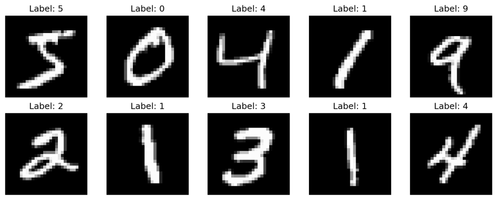
    <br>
    <em>MNIST样本</em>
</div>


下载数据集代码
```python
"""
MNIST数据加载器
自动下载并加载MNIST数据集
"""

import numpy as np
import gzip
import os
from pathlib import Path
import urllib.request


def download_mnist(data_dir='data'):
    """
    下载MNIST数据集

    参数:
        data_dir: 数据保存目录
    """
    base_url = 'https://storage.googleapis.com/cvdf-datasets/mnist/'
    files = [
        'train-images-idx3-ubyte.gz',
        'train-labels-idx1-ubyte.gz',
        't10k-images-idx3-ubyte.gz',
        't10k-labels-idx1-ubyte.gz'
    ]

    data_path = Path(data_dir)
    data_path.mkdir(exist_ok=True)

    print("下载MNIST数据集...")
    for filename in files:
        filepath = data_path / filename
        if not filepath.exists():
            print(f"正在下载 {filename}...")
            try:
                urllib.request.urlretrieve(base_url + filename, filepath)
                print(f"{filename} 下载完成")
            except Exception as e:
                print(f"下载 {filename} 失败: {e}")
                print("请手动下载MNIST数据集并放置到 data/ 目录")
                raise
        else:
            print(f"{filename} 已存在")
```
**二、CIFAR-10 数据集**
- **训练集**: 50,000张32×32彩色图像
- **测试集**: 10,000张32×32彩色图像
- **类别**: 0-9共10个类别（飞机、汽车、鸟、猫、鹿、狗、青蛙、马、船、卡车）
数据统计:
训练集大小: 50000
测试集大小: 10000
图像尺寸: (32, 32, 3)
标签范围: 0 - 9
类别分布:
  类别 0 (飞机): 5000 个样本
  类别 1 (汽车): 5000 个样本
  类别 2 (鸟): 5000 个样本
  类别 3 (猫): 5000 个样本
  类别 4 (鹿): 5000 个样本
  类别 5 (狗): 5000 个样本
  类别 6 (青蛙): 5000 个样本
  类别 7 (马): 5000 个样本
  类别 8 (船): 5000 个样本
  类别 9 (卡车): 5000 个样本


<div align="center">
    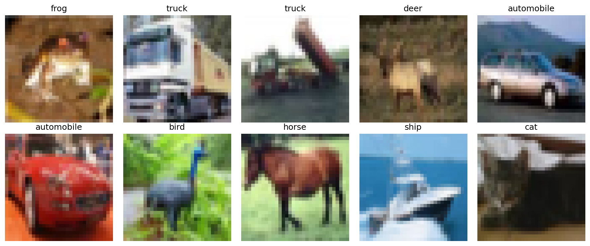
    <br>
    <em>CIFAR-10样本</em>
</div>


下载数据集代码
```python
"""
CIFAR-10数据加载器
自动下载并加载CIFAR-10数据集
"""

import numpy as np
import pickle
import os
from pathlib import Path
import urllib.request
import tarfile


def download_cifar10(data_dir='data'):
    """
    下载CIFAR-10数据集
    
    参数:
        data_dir: 数据保存目录
    """
    url = 'https://www.cs.toronto.edu/~kriz/cifar-10-python.tar.gz'
    filename = 'cifar-10-python.tar.gz'
    
    data_path = Path(data_dir)
    data_path.mkdir(exist_ok=True)
    
    filepath = data_path / filename
    extract_path = data_path / 'cifar-10-batches-py'
    
    # 检查是否已经下载和解压
    if extract_path.exists():
        print("CIFAR-10数据集已存在")
        return
    
    # 下载
    if not filepath.exists():
        print(f"开始下载CIFAR-10数据集 (大小: ~170MB)...")
        print("这可能需要几分钟...")
        try:
            urllib.request.urlretrieve(url, filepath)
            print("下载完成!")
        except Exception as e:
            print(f"下载失败: {e}")
            print("请手动下载CIFAR-10数据集:")
            print(f"  URL: {url}")
            print(f"  保存到: {filepath}")
            raise
    
    # 解压
    print("正在解压...")
    with tarfile.open(filepath, 'r:gz') as tar:
        tar.extractall(data_path)
    print("解压完成!")


```


##  CNN模型核心创新点

### 1. Batch Normalization (批量归一化)

**作用**:
- 加速训练收敛
- 允许使用更大的学习率
- 减少对参数初始化的依赖
- 提供轻微的正则化效果

**实现位置**:
```python
Conv -> BatchNorm -> ReLU -> Pool
FC -> BatchNorm -> ReLU
```

**数学原理**:
```
# 训练时
μ = mean(x)           # 批次均值
σ² = var(x)           # 批次方差
x̂ = (x - μ) / √(σ² + ε)  # 归一化
y = γ * x̂ + β         # 缩放和平移

# 测试时使用移动平均
x̂ = (x - running_mean) / √(running_var + ε)
y = γ * x̂ + β
```

**关键代码**:
```python
class BatchNormLayer:
    def forward(self, x):
        if self.training:
            mean = np.mean(x, axis=0)
            var = np.var(x, axis=0)
            x_norm = (x - mean) / np.sqrt(var + self.eps)
            out = self.gamma * x_norm + self.beta
            # 更新移动平均
            self.running_mean = self.momentum * self.running_mean + (1 - self.momentum) * mean
            self.running_var = self.momentum * self.running_var + (1 - self.momentum) * var
        else:
            x_norm = (x - self.running_mean) / np.sqrt(self.running_var + self.eps)
            out = self.gamma * x_norm + self.beta
        return out
```
通过批次内的统计归一化稳定输入分布，缓解梯度消失，加速网络训练并提升泛化性。
### 2. Dropout (随机失活)

**作用**:
- 防止过拟合
- 相当于集成多个子网络
- 提升模型泛化能力

**实现位置**:
```python
FC1 -> ReLU -> Dropout(0.2) -> FC2
```

**数学原理**:
```
# 训练时
mask = random(0,1) > dropout_rate
out = x * mask / (1 - dropout_rate)  # Inverted Dropout

# 测试时
out = x  # 不应用dropout
```

**关键代码**:
```python
class DropoutLayer:
    def forward(self, x):
        if self.training:
            self.mask = np.random.rand(*x.shape) > self.dropout_rate
            return x * self.mask / (1 - self.dropout_rate)
        else:
            return x
```
训练时按 dropout_rate 屏蔽部分神经元，对保留的神经元输出做缩放补偿，通过随机失活神经元减少过拟合，提升模型泛化能力。
### 3. Adam优化器

**优势对比SGD**:
- 自适应学习率
- 结合动量和RMSprop的优点
- 更快收敛
- 对超参数不敏感

**数学原理**:

```

# 一阶动量（梯度的指数移动平均）
m_t = β₁ * m_{t-1} + (1 - β₁) * g_t

# 二阶动量（梯度平方的指数移动平均）
v_t = β₂ * v_{t-1} + (1 - β₂) * g_t²

# 偏差修正
m̂_t = m_t / (1 - β₁^t)
v̂_t = v_t / (1 - β₂^t)

# 参数更新
θ_t = θ_{t-1} - α * m̂_t / (√v̂_t + ε)

```

**关键代码**:
```python
class AdamOptimizer:
    def update(self, layers, grads):
        self.t += 1
        for i, layer in enumerate(layers):
            # 更新一阶动量
            self.m[f'w_{i}'] = self.beta1 * self.m[f'w_{i}'] + (1 - self.beta1) * layer.dweights
            # 更新二阶动量
            self.v[f'w_{i}'] = self.beta2 * self.v[f'w_{i}'] + (1 - self.beta2) * (layer.dweights ** 2)
            # 偏差修正
            m_hat = self.m[f'w_{i}'] / (1 - self.beta1 ** self.t)
            v_hat = self.v[f'w_{i}'] / (1 - self.beta2 ** self.t)
            # 更新参数
            layer.weights -= self.learning_rate * m_hat / (np.sqrt(v_hat) + self.eps)
```
融合了动量法的加速特性与 RMSprop 的自适应学习率优势，高效优化网络参数。
### 4. L2正则化

**作用**:
- 防止权重过大
- 提升泛化能力
- 平滑决策边界

**实现方式**:
```python
# 损失函数
loss = cross_entropy_loss + 0.5 * weight_decay * Σ(w²)

# 梯度中自动包含正则化项
dw = dw_ce + weight_decay * w
```
在损失函数中叠加权重平方和的惩罚项，使模型倾向于选择更小的权重；反向传播时梯度自动包含权重的线性惩罚项，约束权重增长；通过抑制权重幅值降低模型复杂度，缓解过拟合，让决策边界更平滑，最终提升模型泛化能力。
### 5. 网络结构优化


**改进版**:
```
Conv(1->16) -> BN -> ReLU -> Pool -> 
Conv(16->32) -> BN -> ReLU -> Pool -> 
FC(1568->256) -> BN -> ReLU -> Dropout -> 
FC(256->10)
```

**改进点**:
- 每层后添加BatchNorm (训练稳定)
- 添加Dropout (防止过拟合)

## 实验结果
### 实验一（MINIST数据集）
### 训练CNN模型
CNN - MNIST手写数字分类  
集成: BatchNorm + Dropout + Adam优化器  
初始化改进版CNN模型...  
使用 10000 个训练样本, 2000 个测试样本  
开始训练: 10 个epoch, 每个epoch 156 个batch  


Epoch 1 完成 (耗时: 899.78秒)  训练损失: 0.3147, 训练准确率: 91.74%  测试准确率: 95.45%  
Epoch 2 完成 (耗时: 647.77秒)  训练损失: 0.1163, 训练准确率: 97.80%  测试准确率: 96.40%  
Epoch 3 完成 (耗时: 486.84秒)  训练损失: 0.0805, 训练准确率: 98.93%  测试准确率: 97.00%  
Epoch 4 完成 (耗时: 482.11秒)  训练损失: 0.0611, 训练准确率: 99.62%  测试准确率: 97.60%  
Epoch 5 完成 (耗时: 480.31秒)  训练损失: 0.0540, 训练准确率: 99.72%  测试准确率: 97.35%  
Epoch 6 完成 (耗时: 482.76秒)  训练损失: 0.0494, 训练准确率: 99.86%  测试准确率: 97.30%  
Epoch 7 完成 (耗时: 483.45秒)  训练损失: 0.0455, 训练准确率: 99.93%  测试准确率: 97.60%  
Epoch 8 完成 (耗时: 482.08秒)  训练损失: 0.0450, 训练准确率: 99.93%  测试准确率: 97.70%  
Epoch 9 完成 (耗时: 481.30秒)  训练损失: 0.0460, 训练准确率: 99.89%  测试准确率: 97.30%  
Epoch 10 完成 (耗时: 482.02秒)  训练损失: 0.0462, 训练准确率: 99.94%  测试准确率: 97.20%   
训练完成!  
最佳测试准确率: 97.70%  
最终测试准确率: 97.20%  
模型已保存到: models\improved_cnn_final.pkl  

<div align="center">
    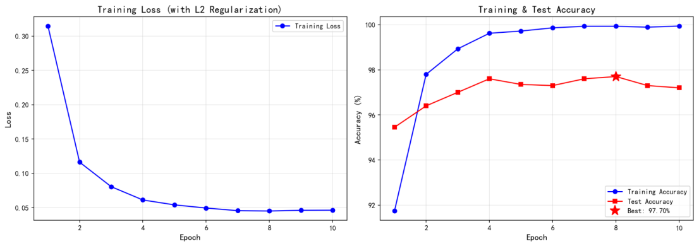
    <br>
    <em>(a)损失函数曲线  (b)训练与测试准确率</em>
</div>

### CNN模型评估
加载MNIST测试数据...  
加载训练集...  
加载测试集...  
训练集: (60000, 28, 28), 标签: (60000,)  
测试集: (10000, 28, 28), 标签: (10000,)  
使用 2000 个测试样本  

加载模型: models/best_improved_cnn.pkl  
改进版模型已从 models/best_improved_cnn.pkl 加载  

在测试集上进行预测...  

总体测试准确率: 97.90%  

各类别性能:  

| 数字 | 样本数 | 正确数 | 准确率   |
|------|--------|--------|----------|
| 0    | 175    | 174    | 99.43%   |
| 1    | 234    | 232    | 99.15%   |
| 2    | 219    | 212    | 96.80%   |
| 3    | 207    | 204    | 98.55%   |
| 4    | 217    | 213    | 98.16%   |
| 5    | 179    | 174    | 97.21%   |
| 6    | 178    | 175    | 98.31%   |
| 7    | 205    | 199    | 97.07%   |
| 8    | 192    | 187    | 97.40%   |
| 9    | 194    | 188    | 96.91%   |

生成预测结果可视化...
预测结果可视化已保存到 results/improved_predictions.png
<div align="center">
    
    <br>
    <em>预测结果概览</em>
</div>

计算混淆矩阵...
混淆矩阵已保存到 results/improved_confusion_matrix.png
<div align="center">
    
    <br>
<em>MNIST-混淆矩阵</em>
</div>

进行错误分析...
错误分类样本数: 48 / 2000 (2.40%)
错误分析已保存到 results/improved_error_analysis.png

<div align="center">
    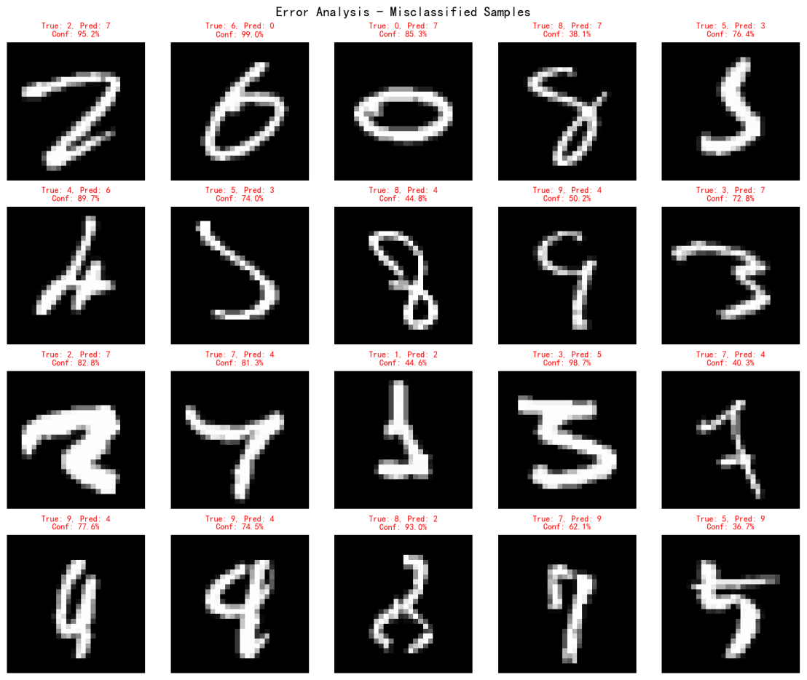
    <br>
<em>错误分析</em>
</div>


评估完成!

总结：实验使用10000个训练样本、2000个测试样本进行10个epoch训练，最终模型在测试集上达成97.90%的总体准确率，最佳测试准确率达97.70%。训练过程中，训练损失从0.3147逐步降至0.0462，训练准确率提升至99.94%，且测试准确率稳定在95%以上，体现出模型良好的收敛性与泛化能力。类别性能方面，数字0、1、3的准确率均超99%，各类别准确率最低为96.80%（数字2），整体分类效果均衡；错误分析显示仅2.40%的样本被误分类，混淆矩阵与可视化结果进一步验证了模型对各类手写数字的精准识别能力，证明BatchNorm、Dropout的正则化作用与Adam优化器的高效更新机制有效抑制了过拟合，提升了模型的鲁棒性。

### 实验二
### 训练CNN模型（CIFAR-10数据集）

CIFAR-10 并行训练 (Data Parallelism)
并行核心数: 4

加载CIFAR-10训练集...  
加载CIFAR-10测试集...  
训练集: (50000, 3, 32, 32), 标签: (50000,)  
测试集: (10000, 3, 32, 32), 标签: (10000,)  
训练样本: 20000, 测试样本: 1000  
正在初始化进程池 (4 核心)...  
Epoch [1/15] Batch [150/156] Loss: 1.6692 Acc: 46.88%  
Epoch 1 耗时: 303.20s | Train Acc: 41.92% | Test Acc: 48.70%  
Epoch [2/15] Batch [150/156] Loss: 1.5332 Acc: 57.03%  
Epoch 2 耗时: 1416.18s | Train Acc: 54.16% | Test Acc: 57.60%  
Epoch [3/15] Batch [150/156] Loss: 1.3758 Acc: 58.59%  
Epoch 3 耗时: 1310.69s | Train Acc: 59.66% | Test Acc: 59.40%  
Epoch [4/15] Batch [150/156] Loss: 1.3367 Acc: 59.38%  
Epoch 4 耗时: 1506.38s | Train Acc: 62.87% | Test Acc: 62.50%  
Epoch [5/15] Batch [150/156] Loss: 1.4843 Acc: 64.06%  
Epoch 5 耗时: 1324.01s | Train Acc: 65.23% | Test Acc: 61.90%  
Epoch [6/15] Batch [150/156] Loss: 1.3670 Acc: 64.06%  
Epoch 6 耗时: 1715.16s | Train Acc: 67.51% | Test Acc: 62.50%  
Epoch [7/15] Batch [150/156] Loss: 1.2205 Acc: 70.31%  
Epoch 7 耗时: 1556.30s | Train Acc: 68.25% | Test Acc: 62.70%  
Epoch [8/15] Batch [150/156] Loss: 1.1809 Acc: 68.75%  
Epoch 8 耗时: 1313.53s | Train Acc: 69.48% | Test Acc: 63.40%  
Epoch [9/15] Batch [150/156] Loss: 1.3604 Acc: 63.28%  
Epoch 9 耗时: 1316.78s | Train Acc: 71.22% | Test Acc: 64.80%  
Epoch [10/15] Batch [150/156] Loss: 1.2721 Acc: 70.31%  
Epoch 10 耗时: 1296.31s | Train Acc: 72.38% | Test Acc: 64.80%  
Epoch [11/15] Batch [150/156] Loss: 1.1200 Acc: 75.78%  
Epoch 11 耗时: 1317.28s | Train Acc: 73.30% | Test Acc: 64.70%  
Epoch [12/15] Batch [150/156] Loss: 1.1872 Acc: 75.78%  
Epoch 12 耗时: 1303.07s | Train Acc: 75.92% | Test Acc: 68.30%  
Epoch [13/15] Batch [150/156] Loss: 0.9981 Acc: 81.25%  
Epoch 13 耗时: 1602.46s | Train Acc: 76.98% | Test Acc: 67.20%  
Epoch [14/15] Batch [150/156] Loss: 1.0920 Acc: 68.75%  
Epoch 14 耗时: 2188.02s | Train Acc: 77.33% | Test Acc: 66.50%  
Epoch [15/15] Batch [150/156] Loss: 1.0806 Acc: 76.56%  
Epoch 15 耗时: 2132.82s | Train Acc: 77.58% | Test Acc: 68.10%  
最佳测试准确率：68.30%  
最终测试准确率：68.10%  
并行训练完成！  
模型已保存到 models\cifar10_cnn_parallel.pkl

<div align="center">
    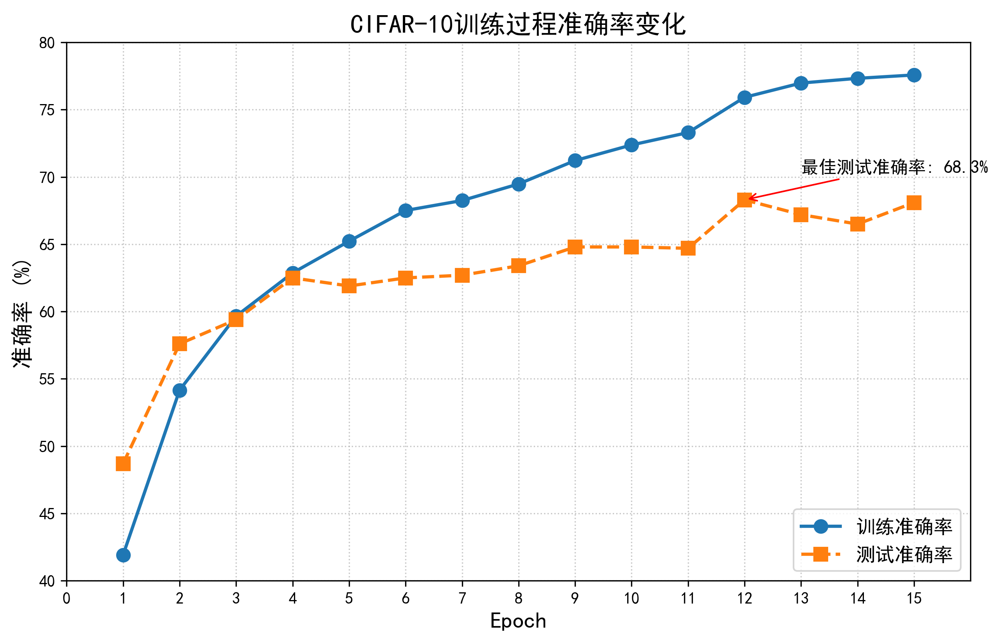
    <br>
<em>训练过程准确率变化</em>
</div>


### CNN模型评估

加载模型: models\cifar10_cnn_parallel.pkl  
加载测试数据...  
加载CIFAR-10训练集...  
加载CIFAR-10测试集...  
训练集: (50000, 3, 32, 32), 标签: (50000,)  
测试集: (10000, 3, 32, 32), 标签: (10000,)  
评估样本数: 10000  
模型已从 models\cifar10_cnn_parallel.pkl 加载  
正在进行预测...  

最终测试准确率: 65.99% <<<  

正在生成可视化图表...  
预测结果图已保存到: results\cifar10_predictions.png  

<div align="center">
    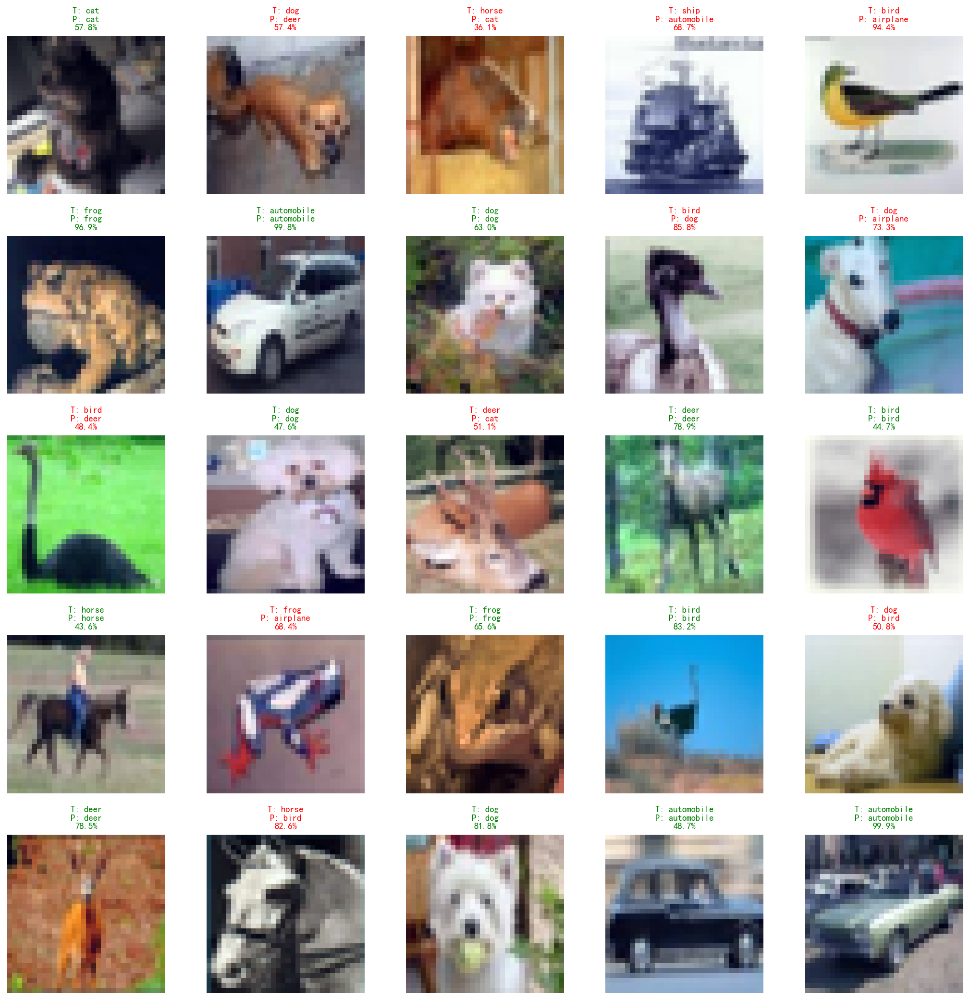
    <br>
<em>预测结果概览</em>
</div>

混淆矩阵图已保存到: results\cifar10_confusion_matrix.png
<div align="center">
    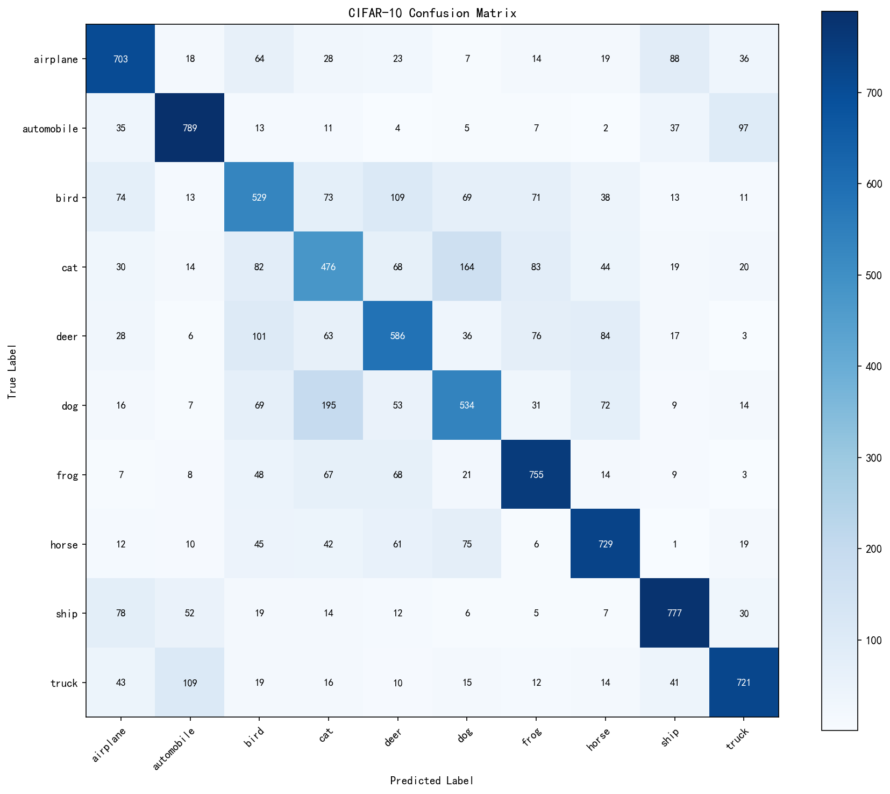
    <br>
<em>CIFAR10混淆矩阵</em>
</div>

[分析]

 最容易混淆的类别对 (Top 10):
| 真实类别   | 预测类别   | 混淆次数 |
|------------|------------|----------|
| dog        | cat        | 195      |
| cat        | dog        | 164      |
| truck      | automobile | 109      |
| bird       | deer       | 109      |
| deer       | bird       | 101      |
| automobile | truck      | 97       |
| airplane   | ship       | 88       |
| deer       | horse      | 84       |
| cat        | frog       | 83       |
| cat        | bird       | 82       |

错误分类样本数: 3401 / 10000 (34.01%)

<div align="center">
    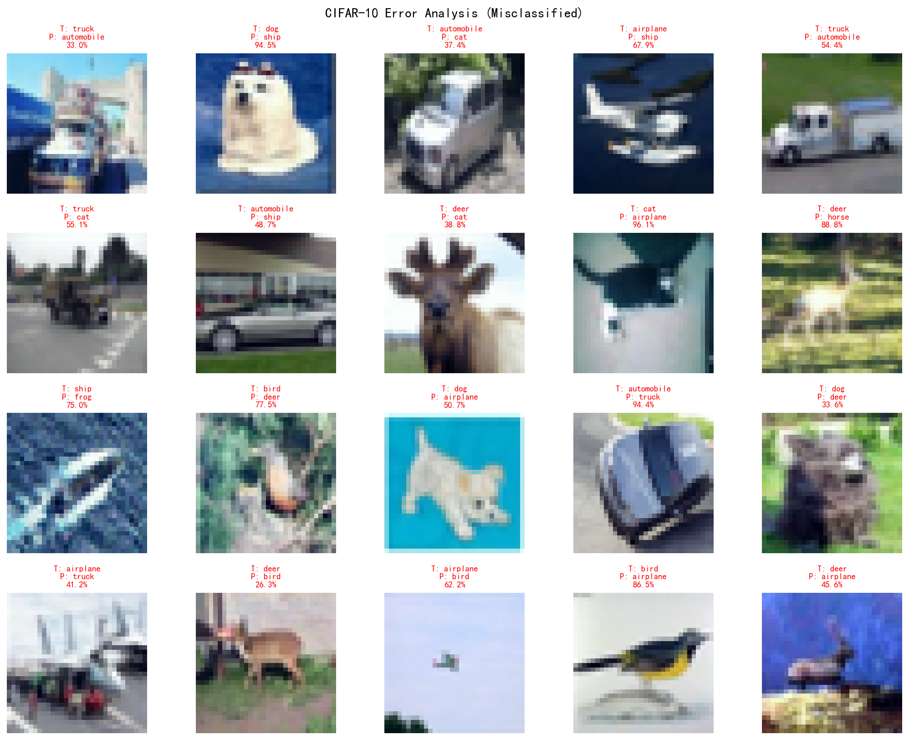
    <br>
<em>错误分类</em>
</div>


总结：实验二基于 CIFAR-10 数据集采用 4 核心并行训练 CNN 模型，使用 20000 个训练样本和 1000 个测试样本完成 15 个 epoch 训练。训练过程中，训练准确率从 41.92% 逐步提升至 77.58%，测试准确率最终稳定在 65.99%（最高达 68.30%），体现模型在训练集上的拟合能力持续增强，但训练后期训练准确率与测试准确率差距扩大，呈现轻微过拟合特征。混淆矩阵分析显示，模型对外观相似类别易混淆，整体错误分类率为 34.01%。并行训练机制有效利用计算资源完成训练任务，模型在 CIFAR-10 数据集上展现出基本分类能力，但在类别区分精度和泛化性能上仍有优化空间，后续可通过数据增强、网络结构改进或正则化策略进一步提升模型性能。

# 总结

卷积神经网络（CNN）是一种深受生物学启发的深度学习模型，其核心在于利用卷积核（滤波器）在输入数据（如图像）上进行滑动窗口式的局部特征提取。通过局部连接、权值共享和池化操作这三大利器，CNN能够有效捕获数据中的空间层次结构信息——例如，从图像的边缘、纹理到更复杂的物体部件和整体形状。这种机制不仅显著降低了模型的参数数量，提升了计算效率，也使其对平移、缩放等变化具有一定的不变性，因此在图像识别、目标检测等计算机视觉任务中取得了里程碑式的成功。  
然而，CNN 在处理序列数据时存在天然局限 —— 无法有效捕捉数据的时序依赖关系。而循环神经网络（RNN）通过其独特的循环结构，能够利用历史信息辅助当前决策，在序列建模任务中具备不可替代的优势。下次我们将深入探讨 RNN 的核心原理、结构设计与训练技巧，对比 CNN 与 RNN 的适用场景差异，并通过实际案例展现 RNN 在序列数据处理中的应用价值。


