# 循环神经网络(Recurrent Neural Network)
## 一、前言
经过前几个阶段的学习，我们来到了教材目前的最后一章。在这里，我们先做个简短的总结。

在先前计算机视觉的演进历程中，我们共同见证了模型从简单的模式匹配逐渐进化为具备深度特征提取能力的复杂系统。最初，KNN算法代表了一种最朴素的“谁近听谁”思路，它通过计算测试样本与所有训练样本的距离来进行分类，虽然简单直接，却面临着巨大的存储开销，且由于缺乏真正的参数学习过程，它对图像的平移和光照等导致“距离”的变化极其敏感。

为了摆脱对原始数据的依赖，第二章的Softmax线性分类器引入了参数化学习的概念，将海量的图像信息压缩进一组权重矩阵中，通过线性映射来衡量类别得分，实现了从“死记硬背”到“规律总结”的飞跃。然而，线性模型在面对图像这种高度非线性的数据时，往往只能捕捉到浅层的色彩或轮廓分布，难以处理复杂的视觉逻辑。

在此基础上，为了提升模型的表达能力，第三章的两层全连接神经网络应运而生，它通过引入隐藏层和非线性激活函数，理论上具备了拟合任意复杂函数的能力。但全连接层由于需要将二维图像“拉直”为一维向量，不可避免地破坏了图像的空间结构信息，且随着输入分辨率的提升，庞大的参数量导致了严重的计算负担与过拟合风险。

针对图像的空间特性，第四章的卷积神经网络（CNN）通过局部感受野和权值共享机制，极大地优化了特征提取的效率。它能够模拟人类视觉系统，从底层边缘逐渐抽象出高层语义特征，并在保持平移不变性的同时大幅减少了参数量，成为了静态图像处理的经典标杆，在今天仍有着广泛应用。

然而，上述所有算法都基于一个共同的假设：输入数据是静态且相互独立的。在处理视频序列、动作识别或文本处理等具有“时间”或“前后文”属性的任务时，CNN往往只能看到孤立的瞬间，而无法理解事物随时间演变的逻辑。为了打破这种“瞬时性”的限制，将视觉识别从“空间维度”拓展到“时间维度”，我们需要一种具备记忆能力的结构——这就是本章要讨论的循环神经网络（RNN）。它通过在网络中引入循环连接，使得模型能够保留历史状态，从而第一次让神经网络拥有了处理序列依赖和动态信息的能力。

<div align="center">
    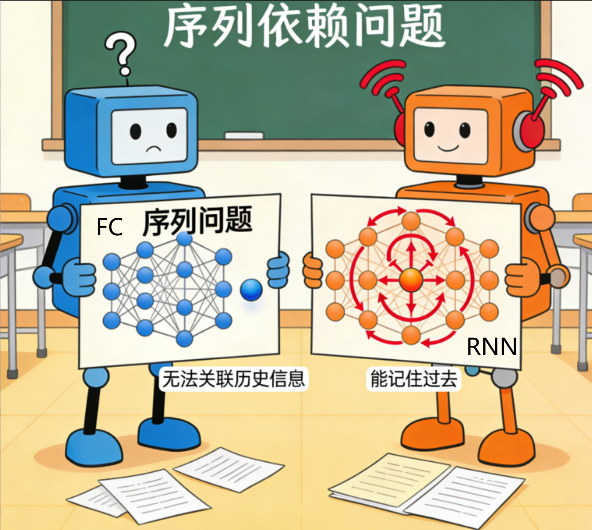
    <br>
    <div style="color:orange; border-bottom: 1px solid #d9d9d9;
    display: inline-block;
    color: #999;
    padding: 2px;"></div>
</div>

RNN之所以被称为循环神经网络，是因为一个序列当前的输出与前面的输出也有关。具体的表现形式为网络会对前面的信息进行记忆并应用于当前输出的计算中，即**隐藏层之间的节点不再无连接而是有连接的**，并且隐藏层的输入不仅包括输入层的输出还包括上一时刻隐藏层的输出。本章将带领大家基于先贤的关键论文深入理解20世纪的人们怎么看待和处理"记忆缺陷"问题，并随即介绍RNN的数学原理、结构组成，并亲手搭建一个RNN模型来在一些经典的数据集上展开测试！


## 二、RNN的历史奠基（感兴趣可自主研读）
早在1982年和1986年：John Hopfield 和 Michael I. Jordan 分别提出了Hopfield网络以及Jordan网络。前者是一种循环连接的网络，能够存储记忆模式（如数字图像），并通过能量最小化来“回忆”完整的模式。虽然它主要用于联想记忆，而非处理一般序列，但其循环反馈的结构对后来的RNN产生了直接影响。而后者提出了一个初具雏形的循环神经网络，在这个网络中，输出层会反馈到隐藏层，使得网络的下一个输出能依赖于之前的输出，适合用于控制序列生成。但是这些仍然和今天的RNN有一定差距。直到1990年，Jeffrey Elman 提出了著名的Elman网络(或称“Simple RNN”)。这是今天我们最常提到的“经典RNN”结构的原型。它的关键创新在于增加了“上下文单元” ，这些单元会记录隐藏层在上一时刻的状态，并将其作为下一时刻的输入的一部分。这使得网络内部拥有了对过去的短期记忆。

因此，我们把目光聚焦于1990 年 Jeffrey L. Elman 在《Cognitive Science》发表的论文——**《Finding Structure in Time》**。

文章主要通过简单循环网络(SRN)实现时间的隐式表示(利用递归连接将隐藏单元状态反馈至上下文单元，使网络具备动态记忆)，规避了传统时间空间表示的诸多缺陷；通过时序 XOR、字母序列、单词边界识别、词汇类别发现这4个核心模拟实验，证明该网络能从时间序列中学习结构，形成兼具任务需求与记忆需求的内部表示，不仅能捕捉序列的相对时间关系，还能自动发现词汇类别、词边界等语言相关结构，且记忆与任务处理密不可分，为连接主义模型处理时序行为（如语言）提供了重要思路。

在介绍Elman的实验之前我们先看看论文中Elman改进后的SRN是什么样的：
下图是Elman在论文中引用的Jordan的循环网络架构图：


<div align="center">
    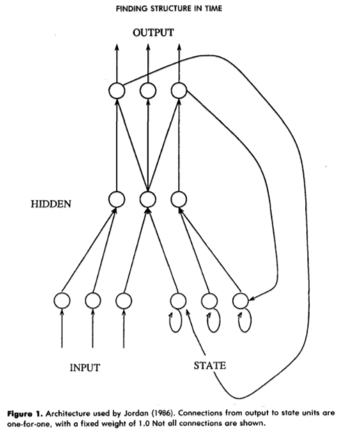
    <br>
    <div style="color:orange; border-bottom: 1px solid #d9d9d9;
    display: inline-block;
    color: #999;
    padding: 2px;">Jordan循环网络架构图</div>
</div>

在论文中，Elman认可了Jordan网络通过输出层→状态单元(State Units)的递归连接，让网络能 “关联静态模式(如‘计划’)与序列化输出模式(如‘动作序列’)，他认为这样的网络通过递归连接让网络的隐藏单元能 “看到自身之前的输出”，从而使后续行为受历史响应影响,这是连接主义模型实现 “动态记忆” 的核心突破，为解决 “时间隐式表示” 问题提供了关键思路。

同时，Elman指出Jordan网络的核心局限在于 “记忆依赖输出层历史，而非内部表示历史”，这使其在捕捉复杂时序结构(如语言的词类、词边界)时灵活性不足。为此，Elman从记忆单元来源、交互范围、记忆侧重点三个维度对Jordan网络进行改进，最终形成Elman的SRN架构。他做出以下改进：


<div align="center">
    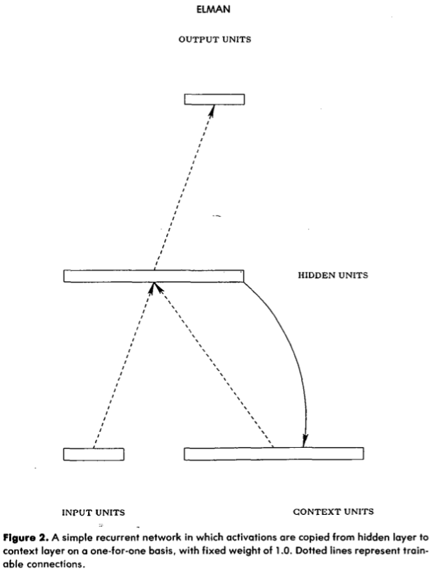
    <br>
    <div style="color:orange; border-bottom: 1px solid #d9d9d9;
    display: inline-block;
    color: #999;
    padding: 2px;">Elman架构</div>
</div>

从图中我们看到一个不同点：Jordan 网络的记忆**绑定 “输出结果”**，而 Elman SRN 的记忆**绑定 “内部表示”**。

Elman的 “隐藏层反馈” 让记忆直接关联 “内部表示”——**隐藏层是 “当前输入 + 历史记忆” 的整合体**，其激活模式本身就蕴含时序规律（如 “看到‘man’后，隐藏层激活模式已包含‘人类名词’的类别信息”），这使其能更高效地归纳抽象时序结构（如从词序中自动聚类名词 / 动词）。正如他在原文中强调的：**“the internal representations which develop thus reflect task demands in the context of prior internal states”**（内部表示的形成会结合任务需求与先前内部状态）—— 这正是改进后 SRN 的核心优势与之前Jordan网络的最大不同点。


我们继续分析他在论文中的第二个实验(Structure in Letter Sequencesa):
Elman在实验中构建了这样的序列：首先，将 3 个辅音（b、d、g）随机组合，得到一个 1000 字母的序列；然后，按照以下规则替换每个辅音：b→ba，d→dii，g→guuu。  
在这种替换作用下，初始序列形式(如 dbgbddg…)会生成加工后的序列(如 diibaguuubadiidiiguuu…)。  
加工后的序列满足以下特性：半随机的，辅音随机出现，但遵循给定辅音后，元音的种类和数量是固定的。为了增加复杂度，Elman扩展了前面XOR模拟中使用的基础网络以适配6比特输入向量：包含6个输入单元、20个隐藏单元、6个输出单元和20个上下文单元。因为刚才提到的每个字母在文中还都对应一个6比特（6维）向量，对应关系如图：

<div align="center">
    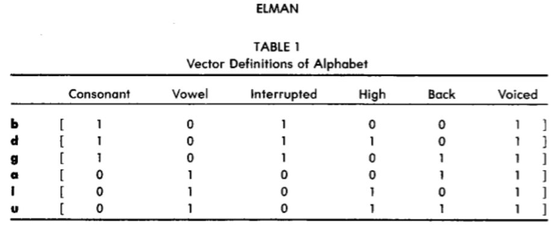
    <br>
    <div style="color:orange; border-bottom: 1px solid #d9d9d9;
    display: inline-block;
    color: #999;
    padding: 2px;">每个字母对应的向量</div>
</div>

训练过程中，他们将每个 6 比特输入向量按序列逐一输入，而网络的任务则是预测下一个输入（序列是循环的，即最后一个模式之后接第一个模式）。网络在该序列上训练了 200 轮，之后在另一个遵循相同规则但初始随机化不同的序列上测试。

我们直接看实验结果：

<div align="center">
    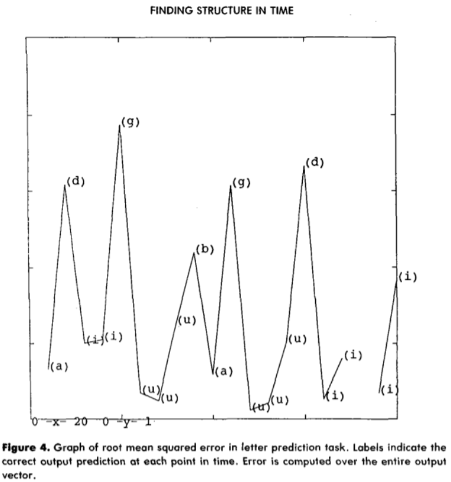
    <br>
    <div style="color:orange; border-bottom: 1px solid #d9d9d9;
    display: inline-block;
    color: #999;
    padding: 2px;">实验结果</div>
</div>

这个横轴表示的是时间步，纵轴是“整个6比特向量” 的均方根误差，我们可以发现里面是峰谷交替的，并且峰值往往是那些辅音bdg,而谷值是那些替换规则里的a,i,u这些。由于先前提到，从序列构建中辅音是随机的而替换规则里的字母是相对固定的，因此本图实际上也直观展示了 “误差高低与预测目标(辅音/元音)的对应关系”。

再看结果图：

<div align="center">
    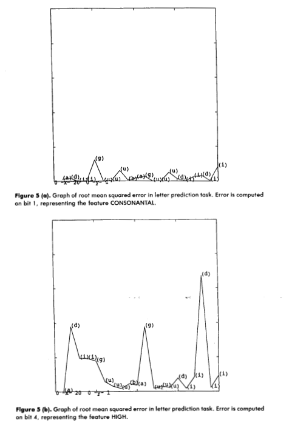
    <br>
    <div style="color:orange; border-bottom: 1px solid #d9d9d9;
    display: inline-block;
    color: #999;
    padding: 2px;">实验结果</div>
</div>

会发现5(a)图中误差始终处于较低的位置原因是:因所有辅音的“辅音特征”值相同，网络能预测 “辅音即将出现”（即使不知道具体是哪个辅音），而5(b)图中误差始终处于较高位置，因为不同辅音的 “高音特征” 值不同，网络无法预测随机辅音的该特征。

从该实验得知，在Elman的SRN架构中，即使输入是 “多维度、变长、半随机” 的序列，网络仍能捕捉 “辅音→元音” 的结构化规则；即网络能够捕捉其中随机化与非随机化的成分。因此长程、复杂的序列依赖若存在结构(如本实验中辅音→元音的固定规则)，反而会让学习**更简单**(而非更困难)。这也说明了Elman的SRN架构中的**上下文单元**让网络能关联 “前序辅音→后续元音” 的**长程依赖**。

通过这个实验，我们得出了上下文单元(隐藏状态反馈)是处理长程时序依赖的关键这一结论,也验证了多维度向量表示的变长时序序列**可通过循环网络有效建模**，这正是RNN的重要理论基础。


## 三、现代RNN结构介绍
相信有了刚才的了解，你对RNN的思路已经有了概念，它的结构与全连接网络差别不大，都是输入层-隐藏层-输出层的结构，不同的是，RNN多了一个循环--在隐藏层上的循环。具体来说，**模型隐藏层上一时间步产生的结果,能够作为当下时间步输入的一部分对当下时间步的输出产生影响。**
下图直观展示了这一点：


<div align="center">
    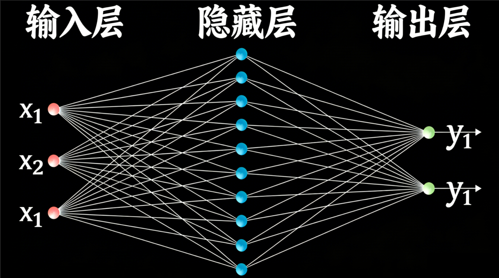
    <br>
    <div style="color:orange; border-bottom: 1px solid #d9d9d9;
    display: inline-block;
    color: #999;
    padding: 2px;">全连接网络示意图</div>
</div>

<div align="center">
    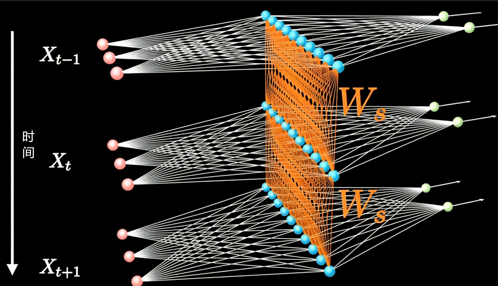
    <br>
    <div style="color:orange; border-bottom: 1px solid #d9d9d9;
    display: inline-block;
    color: #999;
    padding: 2px;">循环神经网络示意图</div>
</div>


既然我们已经了解了这个结构，那么接下来我们就来看看每一层的作用：

首先，输入层充当了信息的入口，它在每一个特定的时刻接收序列中的一个元素（如一个单词的向量或视频的一帧图像），并将其转化为模型可理解的特征表达。

随后，这些输入特征被送入RNN最为核心的隐藏层，这里是模型发挥“记忆”功能的场所。不同于传统网络，隐藏层不仅处理当前的输入，还会同时调取上一时刻保留下来的“隐藏状态”，通过权值矩阵将过去与现在的信号进行线性融合，并利用激活函数（通常是tanh或ReLU）进行非线性映射。这个过程本质上是在不断更新模型的内部记忆，使得当前时刻的输出能够建立在对历史信息的理解之上。

最后，更新后的隐藏状态被传递至输出层，经过特定的权重变换后生成当前时刻的预测结果，例如在翻译任务中预测下一个单词的概率分布。整个流程环环相扣：隐藏层在输出结果的同时，也将当前的记忆状态传递给下一时刻，从而实现了信息在时间轴上的持续流转与积累，构成了处理序列数据的完整闭环。

按照输入输出的对应数量不同，现有架构可以分为以下几种：一对一、一对多、多对一、多对多，其中多对多分为两种。  
1.单个神经网络，即一对一。  
2.单一输入转为序列输出，即一对多。这类RNN可以处理图片，然后输出图片的描述信息等。  
3.序列输入转为单个输出，即多对一。多用在电影评价分析。  
4.编码解码(Seq2Seq)结构。seq2seq的应用的范围非常广泛，语言翻译，文本摘要，阅读理解，对话生成等。  
5.输入输出等长序列。这类限制比较大，常见的应用有作诗机器人等。  


<div align="center">
    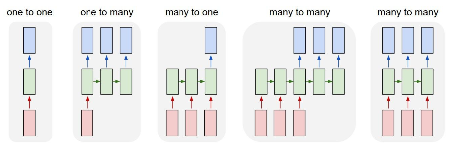
    <br>
    <div style="color:orange; border-bottom: 1px solid #d9d9d9;
    display: inline-block;
    color: #999;
    padding: 2px;">不同RNN结构示意图</div>
</div>


了解了RNN的宏观结构后，让我们更进一步，深入探究RNN的内部构造，从数学上彻底理解RNN是怎样实现“记忆”这一功能的。

### 四、RNN优势与内部构造

现在让我们考虑一个简单的序列分类任务: 判断一个任意长度的二进制序列中，"1"出现的次数是否为偶数。

我们会发现，对于这个看似简单的任务，前四章的算法竟然都无法给出满意的回答。这可以归结为它们逃不过三个主要局限性：**输入维度、特征独立性和全局感知**。

1. 维度：
前四种算法在设计之初，通常都要求输入向量的维度是固定的，无法处理“变长”数据。如果现有的二进制序列一会儿是 8 位，一会儿是 32 位，这些算法就无法直接处理。我们当然可以预设一个最大长度，并对短序列进行填充。但即使这样，模型也只是把序列看作一个“静态的平面”，而不是一个“流动的过程”。

2. 特征独立性（上下文）：
奇偶校验本质上是一个高维的 异或（XOR）问题。在线性代数中，异或问题是典型的“线性不可分”问题。我们知道Softmax 会尝试给每个位置分配一个权重。可在奇偶校验中，第一个位置是“1”到底对结果有什么贡献？这完全取决于后面有多少个“1”。由于 Softmax 认为各个输入特征是相互独立的，它无法表达这种“输入与输入之间高度相互依赖”的逻辑。

3. 结构僵化：
两层全连接网络（MLP）虽然可以引入非线性来强行拟合固定长度的奇偶校验，但它是一种“暴力破解”，没有“计数器”的概念。它必须通过海量的参数去硬生生记住每一种可能的组合（例如 $001, 010, 100 \dots$ ）。如果把序列长度增加一位，原本学到的模型就彻底作废，必须从头开始训练，无法像 RNN 那样学习到一个通用的“翻转逻辑”。

4. 陷入局部盲区：
第四章CNN 是一个强大的模型，但它在这里遇到了困难。卷积核通常只关注局部窗口（如 3 或 5 个相邻的位），而奇偶校验是一个全局性质。第 1 位的一个翻转，会直接改变最终的分类结果。CNN 擅长捕捉局部模式（比如“有没有出现 111”），但不擅长统计全局跨度的总数。虽然加深层数可以扩大感受野，但相比于 RNN 的“一个循环核走天下”，CNN 的处理方式既笨重又不直观。

在这个任务中，RNN 的目标是学习到一个“翻转逻辑”：每当看到“1”时，改变当前状态；看到“0”时，保持当前状态。下面我们一起来看看RNN是如何通过刚才的结构解决这个问题的。

### 1.输入层

在每一时刻 $t$，输入层接收序列中的一个比特 $x_t \in \{0, 1\}$ 。  
（在更复杂的视觉任务中，这通常是经过卷积提取的特征向量，但在本例中，它就是最原始的信号，作为触发状态改变的外部信息。）

### 2.隐藏层

隐藏层是 RNN 的灵魂，负责“记忆”的存放与更新，它维护着一个随时间变化的隐藏状态 $h_t$ 。在这个任务中，$h_t$ 的物理意义可以理解为“到目前为止 1 数量的奇偶性”。

在时刻 $t$，隐藏状态的更新公式为：

$$h_t = \sigma(W_{xh} x_t + W_{hh} h_{t-1} + b_h)$$

其中，$\sigma$ 是非线性激活函数（如 $\tanh$ 或 $\text{ReLU}$）， $W_{xh}$ 和 $W_{hh}$ 分别对应外部输入和先前记忆的权重矩阵。
在这一步，模型通过学习得到的权重 $W_{xh}$ 和 $W_{hh}$ 来实现逻辑控制。例如，当 $x_t = 0$ 时，权重会使得 $h_t$ 尽可能保持与 $h_{t-1}$ 一致；而当 $x_t = 1$ 时，输入权重 $W_{xh}$ 与循环权重 $W_{hh}$ 共同作用，使 $h_t$ 在数值空间内发生“翻转”（例如从正值变为负值）。这种运算在每一个时刻发生，保证了下一时刻的隐藏状态既与前一时刻的隐藏状态（记忆）有关，还吸取了外部信息。

算法的关键点在于，无论序列多长，这一套 $W_{xh}$ 和 $W_{hh}$ 是**始终不变的**。这意味着模型学到的是一套通用的“翻转规则”，使得它能够处理我们希望的“任意长”序列，而不是针对特定位置的死记硬背。这也是它在处理序列相关任务时和前四章的本质差异。

### 3.输出层

当整个序列处理完毕后，我们通常只关心最后一个时刻的隐藏状态 $h_T$，因为它累积了全序列的信息。输出层负责将这个内部记忆翻译成最终的分类结果。

输出结果 $y$ 的计算公式为：

$$y = \text{Softmax}(W_{hy} h_T + b_y)$$

输出层通过线性变换 $W_{hy}$，将隐藏层中代表“偶数状态”和“奇数状态”的特征值映射到类别空间。最终， $\text{Softmax}$ 函数给出序列属于“偶数类”或“奇数类”的概率分布。如果 $y$ 对应的偶数索引概率更高，模型便会做出判断。

<div align="center">
    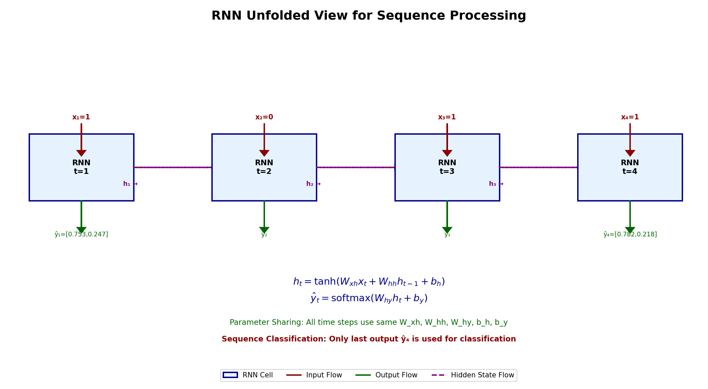
    <br>
    <div style="color:orange; border-bottom: 1px solid #d9d9d9;
    display: inline-block;
    color: #999;
    padding: 2px;">奇偶性判断示例网络图</div>
</div>


### 4.随时间反向传播（BPTT）

在理解了 RNN 的前向计算流程后，一个核心问题随之而来：模型是如何学会这套通用的“翻转逻辑”的？ 我们如何告诉 $W_{xh}$ 和 $W_{hh}$ ，当看到新输入的“1”时应该改变状态，而看到“0”时保持不动？这就涉及到了神经网络训练的灵魂——随时间反向传播。

我们在之前的全连接网络或 CNN 中学习了标准的反向传播--因为误差（Loss）的传递是空间上的（从后一层传回前一层）。然而，由于 RNN 具有循环结构，其误差的传播不仅要在层与层之间进行，还要在时间维度上向过去回溯。这种特殊的训练算法被称为随时间反向传播（Backpropagation Through Time, BPTT）。

<div align="center">
    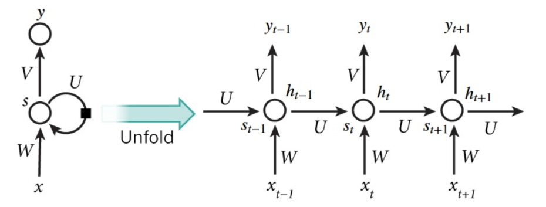
    <br>
    <div style="color:orange; border-bottom: 1px solid #d9d9d9;
    display: inline-block;
    color: #999;
    padding: 2px;">随时间反向传播</div>
</div>


为了计算梯度，我们可以将 RNN 沿着时间轴“展开”（Unroll）。想象一下，一个处理长度为 $T$ 的序列的 RNN，可以看作是一个层数为 $T$ 的深层神经网络，且每一层都共享同一组权重。当我们得到最终时刻的损失函数 $\mathcal{L}$ 后，梯度会沿着时间轴从 $T$ 时刻反向传导至 $t=1$ 时刻。在这个过程中，每一个时刻产生的梯度都会累加到共享的权重矩阵上。


以隐藏层权重 $W_{hh}$ 为例，根据链式法则，损失函数对它的梯度涉及到隐藏状态对前一状态的偏导：

$$\frac{\partial \mathcal{L}}{\partial W_{hh}} = \sum_{t=1}^{T} \frac{\partial \mathcal{L}}{\partial y_t} \cdot \frac{\partial y_t}{\partial h_t} \cdot \left( \prod_{k=i+1}^{t} \frac{\partial h_k}{\partial h_{k-1}} \right) \cdot \frac{\partial h_i}{\partial W_{hh}}$$

我们注意公式中那个连乘项 $\prod \frac{\partial h_k}{\partial h_{k-1}}$，它是理解 RNN 训练难点的关键。由于 $\frac{\partial h_k}{\partial h_{k-1}}$ 与权重矩阵 $W_{hh}$ 密切相关，随着序列长度 $T$ 的增加，这个连乘项会表现出指数级的特性，这就引出了训练中我们熟悉的经典难题--梯度消失和梯度爆炸。

### 5.训练中的难题

#### 梯度消失

**原因** ：如果权重 $W_{hh}$ 较小（或者激活函数的导数小于 1），在链式法则的连乘作用下，传回到初始时刻的梯度值会呈指数级衰减。  
**后果** ：网络末端的损失函数无法有效更新序列开头的权重。对于模型来说，它只能记住“最近看到的几个数”，而丢失了长远的记忆。

#### 梯度爆炸 

**原因** ：如果权重 $W_{hh}$ 较大，梯度值会随着连乘指数级增长。  
**后果** ：权重更新步长过大，导致模型参数在训练过程中剧烈震荡，甚至出现 NaN（数值溢出），使训练彻底崩溃。

<div align="center">
    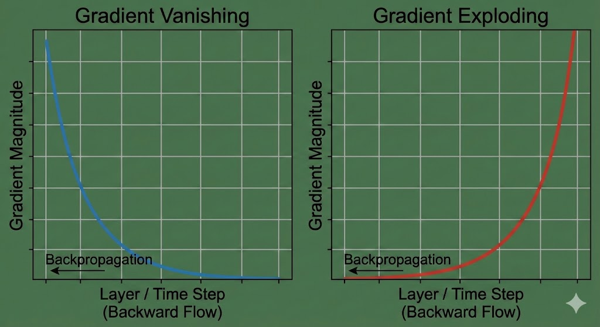
    <br>
    <div style="color:orange; border-bottom: 1px solid #d9d9d9;
    display: inline-block;
    color: #999;
    padding: 2px;">梯度消失和爆炸</div>
</div>

#### 解决措施

为了解决这些问题，研究者们提出了多种优化方案，这些方案在计算机视觉的序列任务中已成为标配，这里不过多介绍：

1.梯度裁剪  
我们之前接触过此方法，这是一种简单粗暴但极其有效的处理梯度爆炸的思路。当梯度的模长超过一个阈值时，强行将其缩小。这确保了即便梯度再大，更新步长也不会失控。

2.长短期记忆网络 (LSTM) 与 门控循环单元 (GRU)：  
这是解决梯度消失的主流方案。它们通过引入“门控机制（Gating Mechanism）”（如遗忘门、输入门等），在隐藏层中开辟了一条“高速公路”。
核心逻辑：门控机制允许信息有选择地通过，而不是通过反复的矩阵相乘。在数学上，这使得梯度的导数可以在很长一段时间内保持接近 1，从而让模型具备了真正的“长时记忆”。


## 五、动手搭建RNN进行实验

在深入了解RNN的架构和原理之后，我们将动手搭建一个RNN模型，在本章的实验部分，我们将采用经典的 Tiny Shakespeare 数据集——一段包含约 100 万字符的莎士比亚剧作汇编。

或许你会问：在一本关于计算机视觉的教材中，为什么要研究文本生成？其实，选择这个数据集有以下原因：

在之前的章节中，我们处理的是静态的像素矩阵（如 MNIST 或 CIFAR-10）。而要理解 RNN，核心在于理解 **“时序依赖”**。而文本正是时间序列最纯粹的形式：每一个字符的出现都依赖于前文的语境。在计算机视觉的视角下，视频不过是时间轴上连续的图像帧。 当 RNN 学会了预测“下一个字符是什么”时，它本质上就学会了建模这种“概率转移逻辑”。这种逻辑迁移到 CV 领域，就是预测“下一帧动作是什么”或“这个物体移动的轨迹是什么”。Tiny Shakespeare 让我们能在一个更纯粹、无噪声的环境下观察 RNN 如何通过隐藏状态（Hidden State）捕捉这种跨越时间的依赖关系。


### 1.实验数据集介绍

**数据集来源**：[https://github.com/karpathy/char-rnn/blob/master/data/tinyshakespeare/input.txt](http://)

该数据来源于Karpathy的char-rnn项目，这是一个用Lua/Torch实现的字符级循环神经网络项目，由**Andrej Karpathy**（OpenAI前研究科学家，现特斯拉AI高级总监）在2015年创建，是字符级语言模型的经典实现，也是深度学习文本生成领域的里程碑。数据集内容是**莎士比亚戏剧和诗歌的汇编**，文档大小大约为1MB，有40000行左右。

<div align="center">
    
    <br>
    <div style="color:orange; border-bottom: 1px solid #d9d9d9;
    display: inline-block;
    color: #999;
    padding: 2px;">莎士比亚数据集部分展示</div>
</div>


### 2.数据预处理

#### 2.1 字符映射
**首先，我们的第一步就是字符的映射，这和之前论文中Elman的操作很类似:**

```python
with open(filepath, 'r', encoding='utf-8') as f:
    text = f.read()  

# 构建字符集
chars = sorted(list(set(text)))
# set(text): 获取文本中所有唯一字符
# list(): 转换为列表
# sorted(): 按Unicode码点排序
# eg: "hello world" -> {' ', 'd', 'e', 'h', 'l', 'o', 'r', 'w'}
#        排序后 -> [' ', 'd', 'e', 'h', 'l', 'o', 'r', 'w']

vocab_size = len(chars)  # 词汇表大小

# 创建双向映射字典
char_to_ix = {ch: i for i, ch in enumerate(chars)}
ix_to_char = {i: ch for i, ch in enumerate(chars)}
# eg:
# char_to_ix = {' ': 0, 'd': 1, 'e': 2, 'h': 3, 'l': 4, 'o': 5, 'r': 6, 'w': 7}
# ix_to_char = {0: ' ', 1: 'd', 2: 'e', 3: 'h', 4: 'l', 5: 'o', 6: 'r', 7: 'w'}
```
### 2.2 序列生成
**用滑动窗口的方法进行序列生成来得到训练序列对:**

```python
# 假设 text = "hello world", seq_length = 3
# 滑动过程（窗口大小3，步长1）：

# i=0: text[0:3]="hel", text[1:4]="ell"
input_seq = [char_to_ix['h'], char_to_ix['e'], char_to_ix['l']]  # [3,2,4]
target_seq = [char_to_ix['e'], char_to_ix['l'], char_to_ix['l']] # [2,4,4]

# i=1: text[1:4]="ell", text[2:5]="llo"
input_seq = [char_to_ix['e'], char_to_ix['l'], char_to_ix['l']]  # [2,4,4]
target_seq = [char_to_ix['l'], char_to_ix['l'], char_to_ix['o']] # [4,4,5]

# i=2: text[2:5]="llo", text[3:6]="lo "
input_seq = [char_to_ix['l'], char_to_ix['l'], char_to_ix['o']]  # [4,4,5]
target_seq = [char_to_ix['l'], char_to_ix['o'], char_to_ix[' ']] # [4,5,0]

# ...继续滑动直到文本末尾
```
我们输入前N个字符(seq_length个),我们的目标是接下来的N个字符(对应每个输入字符的下一个字符),也就是为了每个时间步预测下一个字符。

### 2.3 数据集划分

```python

np.random.seed(random_seed)

# 总样本数
n_samples = len(inputs)  

# 生成随机排列的索引
indices = np.random.permutation(n_samples)

# 计算划分点
split_idx = int(n_samples * train_split) 

# 划分索引
train_indices = indices[:split_idx]   # 前...个随机索引
val_indices = indices[split_idx:]     # 后...个随机索引

# 根据索引获取数据
train_inputs = [inputs[i] for i in train_indices]
train_targets = [targets[i] for i in train_indices]


```
### 2.4 创建批次

```python

# 计算批次数量（向上取整）
n_batches = (n_samples + batch_size - 1) // batch_size
# (a + b - 1) // b 是向上取整除法

# 创建批次
for i in range(n_batches):
    start_idx = i * batch_size
    end_idx = min((i + 1) * batch_size, n_samples)
    # 最后一个批次可能不满batch_size
    
    batch_inputs = inputs[start_idx:end_idx]
    batch_targets = targets[start_idx:end_idx]
    
    batches.append((batch_inputs, batch_targets))
    
```

让我们举个例子直观说明一下这些代码是怎么处理数据集的：

假设原始文本为: "hello world" (11个字符)

**Step1：字符映射**
```PYTHON
字符集: [' ', 'd', 'e', 'h', 'l', 'o', 'r', 'w'] (8个字符)  
索引: h=3, e=2, l=4, o=5, ' '=0, w=7, o=5, r=6, l=4, d=1
```
**Step2：序列化 (seq_length=3)**

输入序列数: 11-3 = 8个序列
```PYTHON
inputs[0]: [3,2,4]  # "hel"  
targets[0]: [2,4,4] # "ell"  
...
inputs[7]: [4,1,?]  # 最后一个（实际没有第12个字符）
```
**Step3：批次化 (batch_size=2)**

批次数量: 8/2 = 4个批次
批次0: 2个序列 * 3个时间步
批次1: 2个序列 * 3个时间步
...

至此我们的数据预处理结束了，数据大概经历了如下演变：
```PYTHON
1.文本文件 (1,000,000字符)
    
2.字符集 (65个唯一字符)  # 莎士比亚数据
    
3.序列对 (999,975个序列)  # 序列长度=25
    
4.划分后 (900,000训练 + 99,975验证)
    
5.批次数据 (28,125个批次 × 32序列/批次)
    
6.张量形状: [批次大小, 序列长度] = [32, 25]
```
### 3. 基础RNN模型搭建

#### 3.1 前向传播实现
1.进行one-hot编码:

对于每个字符索引 $i_t$ 转换为one-hot向量： $x_t = {onehot}(i_t) \in \mathbb{R}^{V \times 1}$  

```python
for t in range(len(inputs)):
    # 输入的one-hot编码
    xs[t] = np.zeros((self.vocab_size, 1))  # 创建V×1的零向量
    xs[t][inputs[t]] = 1                    # 在第i_t位置设为1                  
```


其中 

$${x}_t[j] = \begin{cases} 1 & \text{if } j = i_t \\ 
0 & \text{otherwise} \end{cases}$$

这样解决了网络输入是连续值，但字符是离散的问题。

2.隐藏状态更新
```python
hs[t] = np.tanh(np.dot(self.Wxh, xs[t]) + np.dot(self.Whh, hs[t-1]) + self.bh)
```

隐藏状态使用tanh激活函数:

$${h}_t = \tanh(W_{xh}{x}_t + W_{hh}{x}_{t-1} + {b}_h)$$

分布计算如下：

（1）输入转换: ${a}_ t = W_{xh}{x}_t \in \mathbb{R}^{H \times 1}$

（2）循环连接: ${b}_ t = W_{hh}{h}_{t-1} \in \mathbb{R}^{H \times 1}$

（3）总和: ${z}_t = {a}_t + {b}_t +{b}_h \in \mathbb{R}^{H \times 1}$

（4）激活: ${h}_t = \tanh({z}_t) \in \mathbb{R}^{H \times 1}$


3.输出层
```python
ys[t] = np.dot(self.Why, hs[t]) + self.by
```
$${y}_ t = W_{hy}{h}_t + {b}_y \in \mathbb{R}^{V \times 1}$$


4.概率分布
```python
ps[t] = self.softmax(ys[t])

# softmax方法实现
def softmax(self, x):
    exp_x = np.exp(x - np.max(x))  #
    return exp_x / np.sum(exp_x)
```

使用 softmax函数将输出转换为概率分布：

$${p}_t = \text{softmax}({y}_t) = \frac{\exp({y}_t)}{\sum_{j=1}^{V} \exp({y}_t[j])}$$

其中 $p_t[k]$ 表示下一个字符是第k个字符的概率。

5.损失函数计算
```python
def loss(self, ps, targets):
    loss = 0
    for t in range(len(targets)):
        # 加1e-8防止log(0)导致数值问题
        loss += -np.log(ps[t][targets[t], 0] + 1e-8)
    return loss
```

交叉熵损失：

对于序列中的每个时间步 $t$ ,损失为：

$$L_t = -\log {p}_t[{target}_t]$$

其中 $target_t$ 是时间步 $t$ 的真实下一个字符索引.

总损失(对序列求和)：

$$L = \sum_{t=0}^{T-1} L_t = -\sum_{t=0}^{T-1} \log {p}_t[\text{target}_t]$$

#### 3.2 反向传播实现

1.输出层梯度
```python
# 输出层梯度（交叉熵损失的梯度）
dy = np.copy(ps[t])          # dy = p_t
dy[targets[t]] -= 1          # dy[target_t] = p_t[target_t] - 1
```

对于交叉熵损失，输出层梯度有简洁形式： $\frac{\partial L_t}{\partial {y}_t} = {p}_t - {onehot}({target}_t)$


2.参数梯度计算
```python
# 输出层权重梯度
dWhy += np.dot(dy, hs[t].T)  # Σ_t dy_t h_t^T
dby += dy                     # Σ_t dy_t
```

输出层参数：

$$\frac{\partial L}{\partial W_{hy}} = \sum_{t=0}^{T-1} \frac{\partial L_t}{\partial {y}_ t} \cdot {h}_ t^T = \sum_{t=0}^{T-1} d{y}_t \cdot {h}_t^T$$

$$\frac{\partial L}{\partial {b}_ y} = \sum_{t=0}^{T-1} \frac{\partial L_t}{\partial {y}_ t} = \sum_{t=0}^{T-1} d{y}_t$$


隐藏层梯度：

```python
# 隐藏层梯度（来自输出层和下一时间步）
dh = np.dot(self.Why.T, dy) + dhnext  # W_hy^T dy_t + dh_next
# tanh的导数: (1 - tanh^2(x))
dhraw = (1 - hs[t] * hs[t]) * dh  # dh_t ⊙ (1 - h_t^2)
# 偏置梯度
dbh += dhraw  # Σ_t dh_raw

# 输入到隐藏层权重梯度
dWxh += np.dot(dhraw, xs[t].T)  # Σ_t dh_raw x_t^T

# 隐藏层到隐藏层权重梯度
dWhh += np.dot(dhraw, hs[t-1].T)  # Σ_t dh_raw h_{t-1}^T

# 传递到前一时间步的梯度
dhnext = np.dot(self.Whh.T, dhraw)  # W_hh^T dh_raw
```

1.隐藏层接收来自两个方向的梯度：  

输出层: $W_{hy}^T \cdot d{y}_ t$    
下一个时间步: $d{h}_{\text{next}}$ （通过循环连接）

$$d{h}_ t = \frac{\partial L}{\partial {h}_ t} = W_{hy}^T \cdot d{y}_ t + d{h}_{\text{next}}$$

2.tanh激活函数的梯度:

设 ${z}_ t = W_{xh}{x}_ t + W_{hh}{h}_{t-1} + {b}_h$ ，则:

$\frac{\partial {h}_t}{\partial {z}_t} = 1 - {h}_t^2$（因为 ${h}_t = \tanh({z}_t), \tanh'(x) = 1 - \tanh^2(x)$）

$d{h}_{\text{raw}} = \frac{\partial L}{\partial {z}_t} = d{h}_t \odot (1 - {h}_t^2)$

其中 $\odot$ 表示逐元素乘法。

3.输入层和循环层参数梯度:

$$\frac{\partial L}{\partial W_{xh}} = \sum_{t=0}^{T-1} d{h}_{\text{raw}} \cdot {x}_t^T$$

$$\frac{\partial L}{\partial W_{hh}} = \sum_{t=0}^{T-1} d{h}_{\text{raw}} \cdot {h}_{t-1}^T$$

$$\frac{\partial L}{\partial {b}_h} = \sum_{t=0}^{T-1} d{h}_{\text{raw}}$$

4.传递给前一时间步的梯度:

$$d{h}_ {\text{next}} = \frac{\partial L}{\partial {h}_ {t-1}} = W_{hh}^T \cdot d{h}_{\text{raw}}$$


#### 3.3 梯度裁剪

```python
# 梯度裁剪，防止梯度爆炸
for dparam in [dWxh, dWhh, dWhy, dbh, dby]:
    np.clip(dparam, -5, 5, out=dparam)
```

为防止梯度爆炸，使用梯度裁剪：

$$dparam = \begin{cases} -5 & \text{if } dparam < -5 \\
5 & \text{if } dparam > 5 \\ 
dparam & \text{otherwise} 
\end{cases}$$


#### 3.4 优化器（Adagrad）

Adagrad自适应调整每个参数的学习率：

1.记忆变量更新：
```python
mem += dparam * dparam  # mem = mem + (dparam)^2
```

$\text{memory} \leftarrow \text{memory} + (dparam)^2$

对每个参数的梯度平方进行累积。


2.参数更新：
```python
param += -self.learning_rate * dparam / np.sqrt(mem + 1e-8)
```

$\text{param} \leftarrow \text{param} - \frac{\eta}{\sqrt{\text{mem}} + \epsilon} \cdot dparam$

其中：$\eta$ : 初始学习率（learning_rate）
$\epsilon 
= 10^{-8}$: 防止除以0的小常数


至此我们的simple-RNN模型大致建立完毕。下面便开始训练和评估部分。

### 4.RNN训练与评估
刚才介绍完了主要的simple-RNN模型组件和对应的代码，接下来看看训练和评估中的关键步骤吧。
#### 4.1 RNN训练
1.首先，加载之前预处理好的数据：

```python
# 加载文本数据
text, chars, char_to_ix, ix_to_char = load_text_data(data_path)

# 在线生成训练序列
while p + seq_length + 1 < len(text):
    inputs = [char_to_ix[ch] for ch in text[p:p+seq_length]]
    targets = [char_to_ix[ch] for ch in text[p+1:p+seq_length+1]]
```


2.把我们搭建好的模型过来创建一个实例，配置下超参数：

```python
rnn = SimpleRNN(
    vocab_size=vocab_size,
    hidden_size=hidden_size,
    seq_length=seq_length,
    learning_rate=learning_rate
)
```
接下来就是训练循环核心，不断更新模型参数，跟踪训练过程，生成损失曲线等操作,记得保存模型参数用于评估，至此训练过程大致结束。
```python
for epoch in range(epochs):
    h_prev = np.zeros((hidden_size, 1))  # 重置隐藏状态
    p = 0  # 文本位置指针
    
    while p + seq_length + 1 < len(text):
        # 获取当前序列
        inputs = [char_to_ix[ch] for ch in text[p:p+seq_length]]
        targets = [char_to_ix[ch] for ch in text[p+1:p+seq_length+1]]
        
        # 训练一步
        loss, h_prev = rnn.train_step(inputs, targets, h_prev)
        
        # 移动文本指针
        p += seq_length

 # 指数移动平均损失（平滑）
smooth_loss = smooth_loss * 0.999 + loss * 0.001
loss_history.append(smooth_loss)

# 定期打印进度
if epoch % print_every == 0:
    print(f"Epoch {epoch:4d}/{epochs} | Avg Loss: {avg_loss:.4f} | Smooth Loss: {smooth_loss:.4f}")       
```

#### 4.2 RNN评估
那么，怎么评估我们训练好的模型呢?

1.加载训练好的模型参数

```python
# 创建临时模型实例
rnn = SimpleRNN(vocab_size=1, hidden_size=128)  # 临时参数
# 加载保存的参数
rnn.load_model(model_path)

# 加载字符映射
with open(mapping_path, 'r', encoding='utf-8') as f:
    mappings = json.load(f)
    char_to_ix = mappings['char_to_ix']
    ix_to_char = {int(k): v for k, v in mappings['ix_to_char'].items()}
```

2.准备好测试数据进行测试

准备独立的测试数据：
```python
# 使用后10%作为测试集
test_text = text[int(len(text) * 0.9):]
print(f"测试集大小: {len(test_text)} 字符")
```

3.量化评估语言模型性能

这里用到困惑度这一指标（值越低越好)

```python
def calculate_perplexity(rnn, text, char_to_ix, seq_length=25):
    total_loss = 0
    n_chars = 0
    h = np.zeros((rnn.hidden_size, 1))
    
    for i in range(0, len(text) - seq_length, seq_length):
        inputs = [char_to_ix[ch] for ch in text[i:i+seq_length]]
        targets = [char_to_ix[ch] for ch in text[i+1:i+seq_length+1]]
        
        # 前向传播计算损失
        xs, hs, ys, ps = rnn.forward(inputs, h)
        loss = rnn.loss(ps, targets)
        total_loss += loss
        n_chars += len(targets)  # 按字符数而不是序列数
        
        h = hs[len(inputs) - 1]  # 更新隐藏状态
    
    avg_loss = total_loss / n_chars  # 平均每个字符的损失
    perplexity = np.exp(avg_loss)   # 困惑度 = exp(平均损失)
```


这里重点解释下困惑度的基本定义:

**困惑度来源于信息论，衡量概率分布的不确定性。对于语言模型，困惑度衡量模型对下一个字符预测的不确定性。**

为了搞清楚代码怎么计算困惑度，这里从损失函数出发推导困惑度。
先来看单字符的交叉熵损失：对于一个字符 $c$，模型预测概率为 $p(c)$，真实分布为 $q(c)$ （one-hot）：
**交叉熵损失**

$$
L(c) = -\sum_{c'} q(c') \log p(c') = -\log p(c_{{true}})
$$

因为 $q(c)$ 是one-hot，只有真实字符位置为1，其他为0。

其次是序列的平均损失：

对于一个长度为 $n$ 的序列，总损失是各字符损失之和：

$$
L_{total} = -\sum_{i=1}^{n} \log p(c_i|c_1, \dots, c_{i-1})
$$

平均每个字符的损失（即交叉熵）：

$$
H = \frac{L_{total}}{n} = -\frac{1}{n} \sum_{i=1}^{n} \log p(c_i|c_1, \dots, c_{i-1})
$$

困惑度的定义就是平均损失取指数：

$$
PP = \exp(H) = \exp\left(-\frac{1}{n} \sum_{i=1}^{n} \log p(c_i|c_1, \dots, c_{i-1})\right)
$$

目前为止这个实验大体框架已搭好。直接运行？不！需要考虑的问题仍然很多，我们需要对比实验结果才能发现问题。下面我们试着再把网络变得更复杂些呢？最后再把两种网络一起跑一下我们的莎士比亚数据集看看结果！


### 5.更复杂一些的Improved-RNN
为了进一步探究RNN模型中不同步骤对模型的影响，我们对刚才的基础RNN模型做如下调整，观察这些改动产生的效果。

1.改变初始化策略

基础RNN:
```python
# 简单小随机初始化
self.Wxh = np.random.randn(hidden_size, vocab_size) * 0.01
self.Whh = np.random.randn(hidden_size, hidden_size) * 0.01
self.Why = np.random.randn(vocab_size, hidden_size) * 0.01
```

改进后：Xavier初始化
```python
# Xavier初始化，针对tanh优化
fan_in = vocab_size
fan_out = hidden_size
scale = np.sqrt(2.0 / (fan_in + fan_out))
self.Wxh = np.random.randn(hidden_size, vocab_size) * scale * 0.7

# Whh：循环连接容易梯度爆炸
fan_in = hidden_size
fan_out = hidden_size
scale = np.sqrt(2.0 / (fan_in + fan_out))
self.Whh = np.random.randn(hidden_size, hidden_size) * scale * 0.5  # 额外缩小

fan_in = hidden_size
fan_out = vocab_size
scale = np.sqrt(2.0 / (fan_in + fan_out))
self.Why = np.random.randn(vocab_size, hidden_size) * scale * 0.8
```
Xavier初始化是由Xavier Glorot等人在 2010 年提出的一种针对神经网络权重的初始化策略，核心目标是让神经网络各层的输入和输出的方差尽可能保持一致，从而避免训练过程中因权重初始化不当导致的梯度消失或梯度爆炸问题。


2.加深网络架构，引入Dropout层：

```python
# 前向传播应用Dropout
if apply_dropout and self.dropout_rate > 0:
    dropout_mask[t] = (np.random.rand(*hs[t].shape) > self.dropout_rate).astype(float)
    dropout_mask[t] /= (1 - self.dropout_rate)  # 反向缩放
    hs[t] *= dropout_mask[t]

# 反向传播应用相同mask
if dropout_mask is not None and t in dropout_mask:
    dh *= dropout_mask[t]
 ```   
在隐藏层输出上应用Dropout,每次前向传播随机"关闭"一部分神经元,训练时网络变得更稀疏，防止神经元共适应.相当于训练多个不同子网络的集成.并且输出层不会过度依赖某些隐藏神经元，防止过拟合。

调整后，我们来运行代码，看看结果分别怎么样。

### 6.两种RNN模型实验结果分析对比

**训练过程**

| 模型 | 训练时长 | 实际训练轮数 |最佳epoch|收敛情况|
|------|-------------|-----------|-|-|
| SimpleRNN | 约18分钟 | 33轮（触发早停） |第23轮|稳定收敛，训练损失从初始值稳步下降|
| ImprovedRNN | 较短（仅4个epoch后早停） | 4轮 |第4轮|快速收敛但可能早停过早|


 **性能评估结果**

| 模型 | 测试集困惑度 | 测试集损失 |
|------|-------------|-----------|
| SimpleRNN | **6.66** | 1.90 |
| ImprovedRNN | 14.15 | 2.65 |

可以看出：SimpleRNN在语言建模任务上表现更好，困惑度显著低于ImprovedRNN。

**生成文本质量**

**SimpleRNN生成示例：**
```
Cenoughes,
The like.
KING RICHARD III:
He have sun that work brother of life:
For I see how change to king and for his fight bonow.
```

**ImprovedRNN生成示例：**

 **标准采样**：`CIE mor tre wid aRh itr b ateetelm sitas gon lea...`
 
 **Top-k采样**：`goud she me the sotil and th thonte thet anesde...`

从文本生成质量上来看：**SimpleRNN**生成文本更接近英语结构，有角色对话格式，**ImprovedRNN**：生成文本多样性更高，但语法和语义连贯性较差。

**模型效率**
| 指标 | SimpleRNN | ImprovedRNN |
|------|-----------|-------------|
| 参数量 | 33,217 | 类似 |
| 推理速度 | 19,250 字符/秒 | 18,571 字符/秒 |
| 内存占用 | 0.38 MB | 类似 |


<div align="center">
    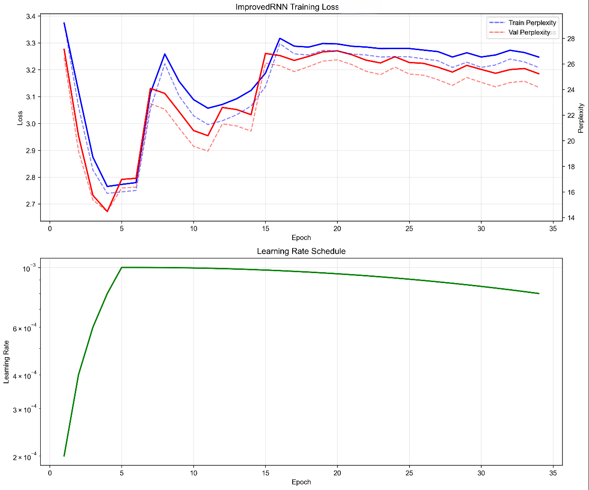
    <br>
    <div style="color:orange; border-bottom: 1px solid #d9d9d9;
    display: inline-block;
    color: #999;
    padding: 2px;">损失/困惑度/学习率 vs epoch</div>
</div>


本图中我们看到改进后RNN在初始阶段损失 / 困惑度快速下降，epoch=5 后开始波动，整体损失维持在2.7至3.3之间，困惑度维持在14至28之间，训练过程相对不稳定。
epoch 前5轮快速上升至约$10^{-3}$，之后缓慢衰减。


<div align="center">
    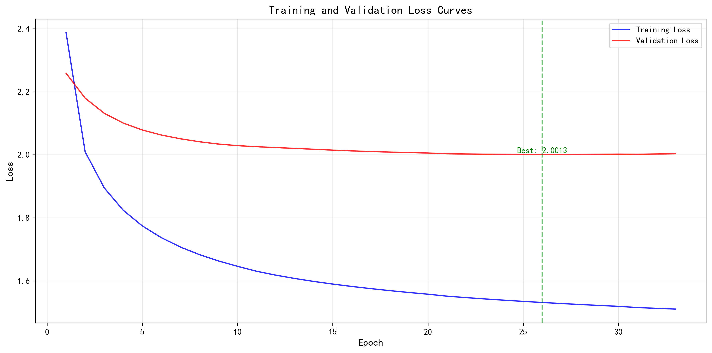
    <br>
    <div style="color:orange; border-bottom: 1px solid #d9d9d9;
    display: inline-block;
    color: #999;
    padding: 2px;">损失函数曲线</div>
</div>

训练损失持续下降（从 2.4 降至 1.5 左右）；验证损失前期下降后，在 epoch≈25 时稳定在2.0013，后续几乎无变化，说明模型在验证集上的泛化效果趋于稳定。


<div align="center">
    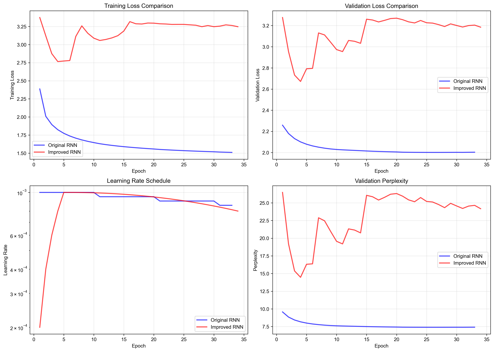
    <br>

</div>


从图中看Original RNN 损失快速下降并稳定在 1.5 左右；Improved RNN 损失高且波动大（维持在 2.75 以上），Original RNN 验证损失稳定在 2.0 左右；Improved RNN 验证损失波动大（维持在 2.6 以上）。Original RNN 学习率初始为$10^{-3}$，中间有小幅调整；Improved RNN 学习率在 epoch=5 后升至 $10^{-3}$ 左右，再缓慢下降。
Original RNN 困惑度快速降至 7.5 左右并稳定；Improved RNN 困惑度高且波动。

综合上述评估结果，我们发现了一些正面的和负面的消息：

好处在于：
改进后的RNN正确实现了时间步独立的Dropout mask，Warmup+余弦退火提供了更平滑的学习率变化，Top-k采样有效实现了限制采样空间的功能。

然而坏处在于：
改进版本的训练不稳定，ImprovedRNN过早触发早停（仅4个epoch）并且性能下降，改进版困惑度(14.15)比基础版(6.66)更高，生成质量上改进版生成的文本连贯性不如基础版。

我们要从这一现象中得到启示和学习，尽管Dropout 旨在防止过拟合，但在 RNN 这种参数高度共享、结构相对精简的模型中，过高的 Dropout 率可能干扰了隐藏状态的连续性，导致模型在处理简单的字符级依赖时反而“记不住”前文。而Xavier 初始化假设激活函数是线性的或关于原点对称的，虽然它改善了梯度流动，但如果配套的学习率和 Warmup 策略没有调整到最优，可能会导致模型在训练初期跳出局部最优解。此外，Improved-RNN 过早触发早停，说明其验证集损失波动较大。在实际工程中，“更复杂”往往意味着“更难调”。这也提醒我们，算法的改进绝不是各种技术的简单堆砌，而应是针对具体任务的精确“对症下药”。

##  六、总结与思考
在本章中，我们共同学习了循环神经网络这一强大模型，从分析Elman论文中的起源思想开始，通过逐步的数学推导和代码实现，理解了RNN是如何融合外部信息和先前记忆，而实现从空间到序列，从静态到动态的跨越的。我们认识到，传统的 CNN 等算法虽然在静态图像特征提取上表现卓越，但它们缺乏时间维度上的连贯性。RNN 通过引入隐藏状态（Hidden State），第一次让神经网络拥有了“记忆”，使其能够处理视频序列、动作捕捉以及文本等具有时序依赖性的任务。通过权值共享。无论序列多长，模型始终利用同一套参数来提取通用规律。这种设计极大地减少了参数量，并赋予了模型处理任意长度序列的潜力，这正是前四章所介绍的算法所欠缺的。在实验中，我们共同搭建了两种RNN模型并在莎士比亚数据集上运行，预测后续文本并分析比较两种模型的表现，为深度学习以及更复杂模型搭建提供了很多启示。

在计算机视觉的实际应用中，情况要比只应用单一算法复杂的多。举例来说，一种经典的应用案例是让单纯的卷积神经网络（CNN）负责提取每一帧的空间特征，而循环神经网络（RNN）则负责将这些离散的特征串联成有意义的逻辑线索。这种“感知+逻辑”的组合衍生出了以下几种主流的应用范式：

1. 动作识别与视频理解（Action Recognition）

这是 RNN 在 CV 领域最直观的应用。在监控安防、体育分析等场景中，单纯靠一张照片无法判断一个人是在“跌倒”还是在“俯卧撑”。通过 LRCN（长时循环卷积网络） 架构，CNN 提取连续视频帧的特征向量，随后 RNN（通常是 LSTM 或 GRU）对这些向量进行时序建模。只有当模型“记住”了手臂先弯曲、身体后下沉的顺序，它才能准确识别出动作的含义。

2. 图像描述生成（Image Captioning）

这是一项跨越“视觉”与“语言”的任务。系统首先利用在大型数据集上预训练的 CNN 作为编码器，将整张图片浓缩为一个语义特征向量。接着，RNN 作为解码器，将该向量作为初始状态，一步步“翻译”出描述图片的文字。例如，当 CNN 看到“狗、草地、飞盘”的特征时，RNN 能够利用其序列生成能力，有逻辑地输出：“一只狗正在草地上接飞盘。”

3. 视觉目标跟踪（Visual Tracking）

在自动驾驶和无人机航拍中，目标可能会因为遮挡（如车开进了隧道）而暂时消失。基于 RNN 的跟踪算法不仅记录目标的视觉特征，还学习目标的运动规律。即使图像信号中断，RNN 的隐藏状态依然保留着目标的运动惯性，帮助模型在目标重新出现时，通过“历史记忆”实现快速重锁定。

虽然 RNN 为视觉任务引入了时间维度，但在处理超长视频流时，它仍面临着计算效率低（无法并行化）和长程记忆丢失的挑战。如今，Vision Transformer (ViT) 及其变体 Video Swin Transformer 等正在吸收 RNN 的序列建模思想，利用自注意力机制（Self-Attention）在更广阔的时空维度上捕捉关联。

至此，我们共同从零开始，完成了五种计算机视觉中经典算法的原理学习、应用流程以及具体python实现。希望这些教学对读者们有所帮助，也希望与读者们共同进步！


