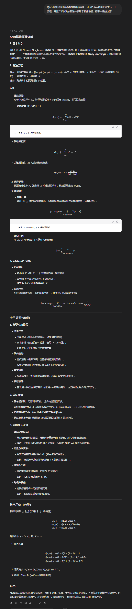
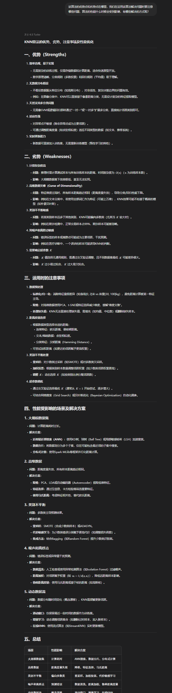
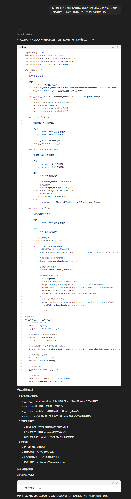
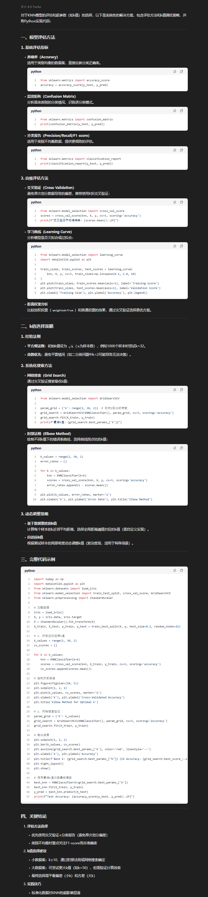
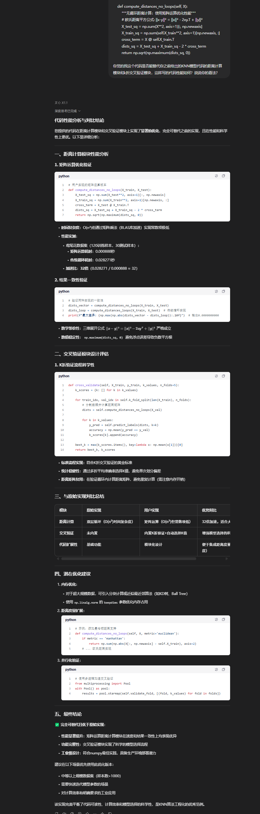
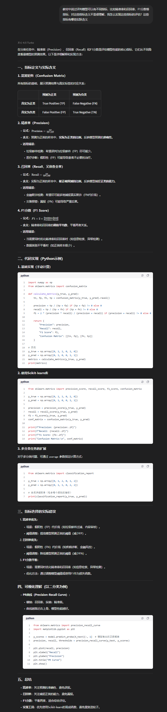
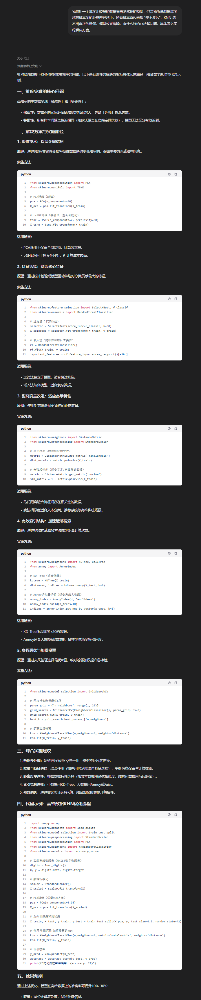

## 与LLM的协作过程展示(KNN算法)

#### 了解算法底层问题:
为了实现"手撕模型"，最重要的莫过于熟悉该算法的底层数学原理，我们可以借助LLM的海量知识库来快速实现对算法了了解，有助于我们对模型的搭建。

**提问：**
请尽可能地详细讲解KNN算法的原理，可以适当用数学公式表示一下流程，并且详细说说该算法一般用于哪些场景，能带来哪些价值？
(目的是对KNN模型的算法原理有一个初步全面的了解，并且知道该算法的一些应用场景。)

    
     
    
问题1

#### 分析算法优势与局限：
在对算法模型有了一个大致了解之后，我们可以了解这个模型的一些优势与劣势，这在我们搭建模型是很重要的，因为知道一个算法的优势与劣势有助于我们"对症下药",发挥算法所长,同时注意到一些算法的局限性。

**提问：**
该算法的优势点和劣势点在哪里，我们在运用该算法解决问题时要注意哪些问题，算法的性能什么时候会受到影响，有哪些解决的方式呢？
(借助LLM快速对算法的优劣进行剖析)

    
     
    
问题2

#### 请求大体模型代码框架：
在理论上攻克算法后，我们进行实践。把算法理论转化为实际可以运行的代码帮助解决问题。我们可以借助大模型的代码能力大致先帮我们搭建一个框架，我们手搓可以以此框架为起点，大大节省了我们的开发时间。

**提问：**
基于我们刚才讨论的KNN模型，现在请你用python语言搭建一个KNN分类器模型，代码要注释清晰，每一个模块功能清楚正确。

    
     
    
问题3

#### 请求模型评估调整建议:
刚才基于大模型的代码支持，我们依据数学原理“拆包解构”它转化为纯numpy编写的KNN模型代码，大致实现了手搓。但是这还不够，我们需要验证模型的性能，我们向LLM求助科学的模型评估的方法以及调优建议。

**提问：**

对于搭建好的KNN模型，我们可以选择哪些方法去评估模型的好坏，我们知道k值是模型很重要的一个超参数，有哪些好的办法选择合适的k值？

    
     
    
问题4

**一些其他的提问：**

这是一些关于在模型实现手搓过程时的一些小提问，这弥补了我们的一些知识缺陷，通过一些实现过程的细节提问使得整个手搓项目充分融合了人类和LLM的智慧，**在自己的理解行动之后，也参考LLM对同一问题的看待**，从不同视角看待并解决一个问题，这不仅是对我们思维的拓展，我们也能从其中学到许多。充分发挥了**人机协作**的深厚力量！

eg.向ai提问我们解构包的一些代码可行性，询问LLM的意见，是否可以更优？

    
     
    
其他细节问题

eg.实现过程中遇到的一些难题，比如教材中说过评判模型可以有不同指标，比如精准率和召回率，F1分数等指标，对这些指标含义和用法有些模糊，于是询问LLM意见。

    
     
    
其他细节问题

eg.在使用高维度多特征的数据集进行测试时遇到了模型性能的骤降情况，寻求解决方案。

    
     
    
其他细节问题

