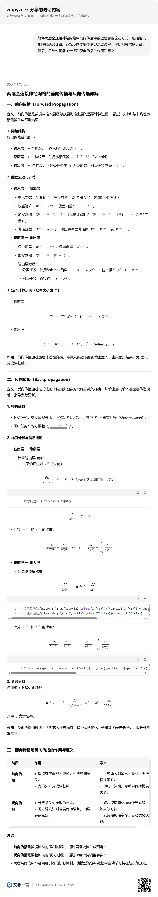
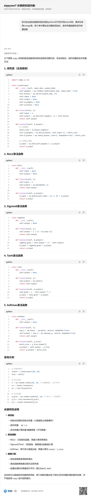
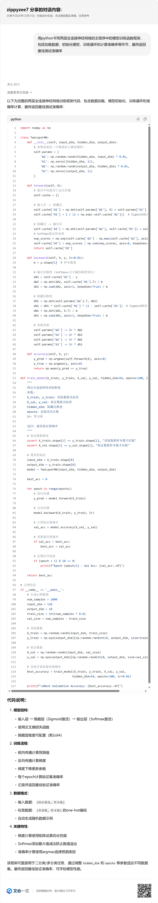
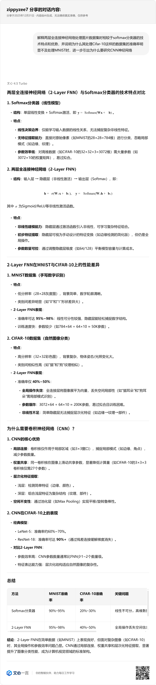

# 两层全连接神经网络

本文档记录了我们在理解多层神经网络的相关理论以及动手设计两层全连接神经网络模型，对模型进行训练的过程中与百度文心一言大模型的部分人机交互内容，仅供参考。

------

## 理论理解

### 问题1：依次解释感知机，神经元以及多层神经网络的定义和作用，并总结三者的涵盖/递进关系。要求解释信息的流动方向和节点处理方式
在正式开始学习多层神经网络前，我们需要先理解透彻神经网络的构成元素神经元的构造和由来，而为了在真正零基础的情况下有效学习神经元理论，我们首先需要了解神经元的前身感知机的基本结构和作用。在对每个概念的学习过程中，我们都有必要了解单元底层的数学原理和信息流动过程，将整个多层神经网络概念剖析到一个个小的进程，明白每个进程中正在进行的计算，清楚每个过程对数据的加工作用。

    
     
    
问题1

### 问题2：解释两层全连接神经网络中前向传播中数据信息的流动方式，包括相关矩阵和函数计算。解释反向传播中信息流动过程，包括相关梯度计算。最后，总结说明前向传播和反向传播的作用和意义。
多层神经网络为我们引入了前向传播和反向传播的重要概念，理解每个传播过程不可或缺的作用，以及两种传播方式是如何共同构成神经网络的"评估"和"学习"的完整统一体对我们对于神经网络整体的框架理解和理论研究有着至关重要的意义。我们在了解两种传播的过程中需要细致到清楚每种传播在每一个节点拿到的数据是什么，计算的数字有什么意义，以及接下来要将数据传递到哪里，以便于后续复杂的代码编写。

    
     
    
问题2

## 模型设计

### 问题3：依次给出激活函数和线性层的python对于的可用class代码，要求仅采用numpy库。每个类中要包含完整的初始化，前向传播函数和反向传播函数
参考并采用符合行业标准的单独分类和相关函数定义方式。利用文心大模型，编写可供参考的激活函数和线性层的传播函数，以便于在训练模型的主程序中进行调用，简化后续的程序编写内容，使代码精炼条理。

    
     
    
问题3

### 问题4：用python书写两层全连接神经网络的主程序中的模型训练函数框架，包括加载数据，初始化模型，训练循环和计算准确率等环节，最终返回最佳测试准确率
利用文心大模型，提供较为全面的数据初始化内容和训练循环框架，便于清楚地理解在实际设计并训练模型的过程中需要经历的必要环节，熟悉模型设计的基本工作，有效减少反复补齐缺失环节的工作量的同时为我们提供了模型设计的统一内容结构。

    
     
    
问题4

## 章节意义

### 问题5：解释两层全连接神经网络处理图片数据集时相较于softmax分类器的技术特点和优势，并说明为什么其处理Cifar-10这样的数据集的准确率明显不及处理MNIST时，进一步引出为什么要研究CNN神经网络
对本章节的阶段性成果进行承上启下，融入完整的项目体系。总结两层全连接神经网络相较于前阶段的分类器的优势以及引入的新技术，同时针对仍不够理想的训练结果分析两层全连接神经网络仍存在的技术上的不足之处，结合相关理论原理去理解为什么要从Softmax进一步引入本阶段模型内容，以及为什么要在接下来的环节中研究卷积神经网络。

    
     
    
问题5

